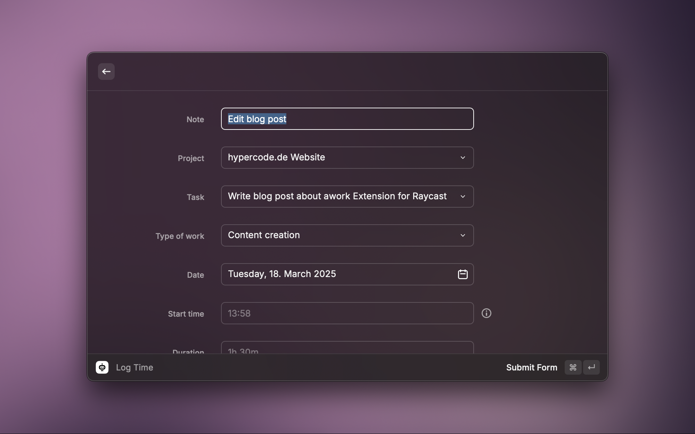
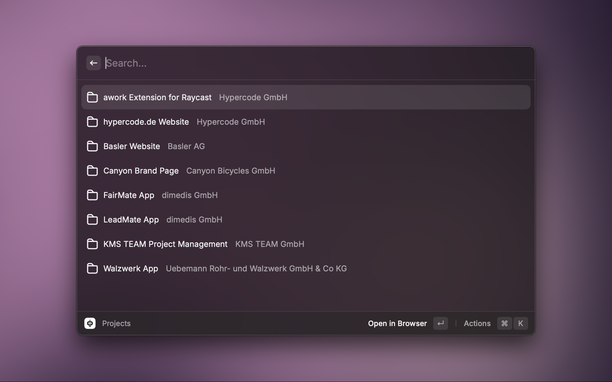
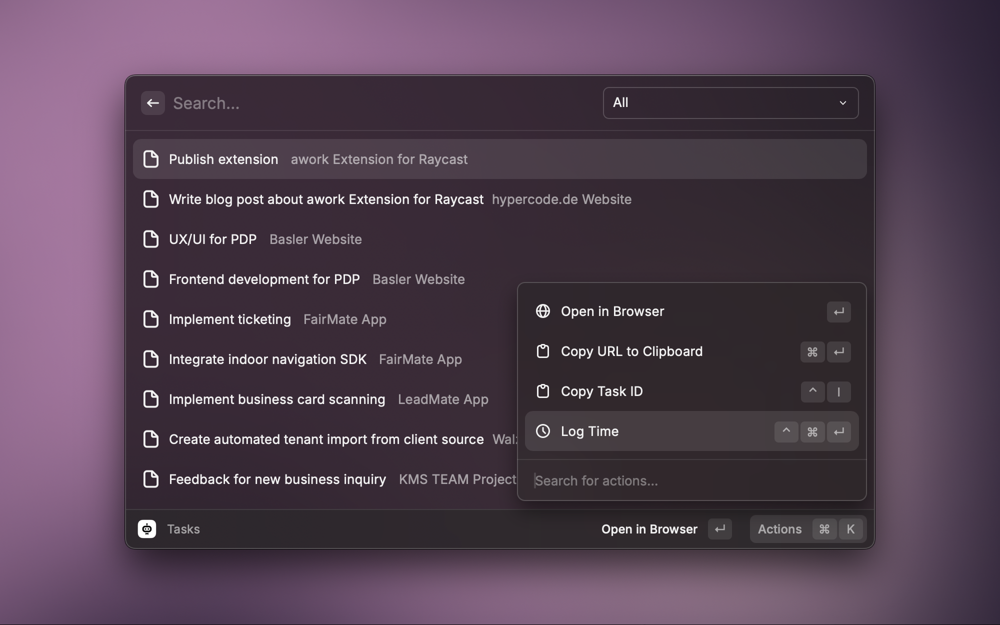

# awork for Raycast

This is a Raycast extension with commands for the work management platform [awork](https://www.awork.com/).

## Installation & Authorization

To use this extension you need to add an API client to awork. You can add this under "(Workspace) Settings / Integrations / API clients" and you may need admin rights. However, the users of the extension will only be able to see/access the projects that they are individually allowed to see in your workspace.

Please enter something like:

- Name: `awork Extension for Raycast`
- Client ID: `raycast-awork-extension`
- Redirect URI: `https://raycast.com/redirect?packageName=Extension` (hit the "+")

Then copy/save the generated new client secret.

After installing the extension from the Raycast store, you'll need to enter your *client ID* and *client secret*. You will be prompted to login on an awork login page, which will then redirect you back to Raycast. That's it.

## Commands

### Projects

Browse/search your projects by project or client name.

The following actions are available:
- Open in Browser `⏎`
- Copy to Clipboard `⌘⏎`
- Copy Project Mail Address `⌃E`
- Log Time `⌃⌘⏎`
- Show Tasks `⌃Space`

### Tasks

Browse/search your tasks and optionally filter them by project.

The following actions are available:
- Open in Browser `⏎`
- Copy to Clipboard `⌘⏎`
- Copy Task ID `⌃I`
- Log Time `⌃⌘⏎`

### Log Time

Log time for a task or project right in Raycast. Press `⌘⏎` to submit.

## Credits

The awork Extension for Raycast was developed by [Hypercode](https://hypercode.de/), a digital product studio based in Cologne, Germany. 

## Disclaimer

This project is not affiliated with, associated with, authorized by, endorsed by, or in any way officially related to awork. The official awork website can be found at https://www.awork.com/. "awork" and related names, marks, emblems and images are registered trademarks of their respective owners.
