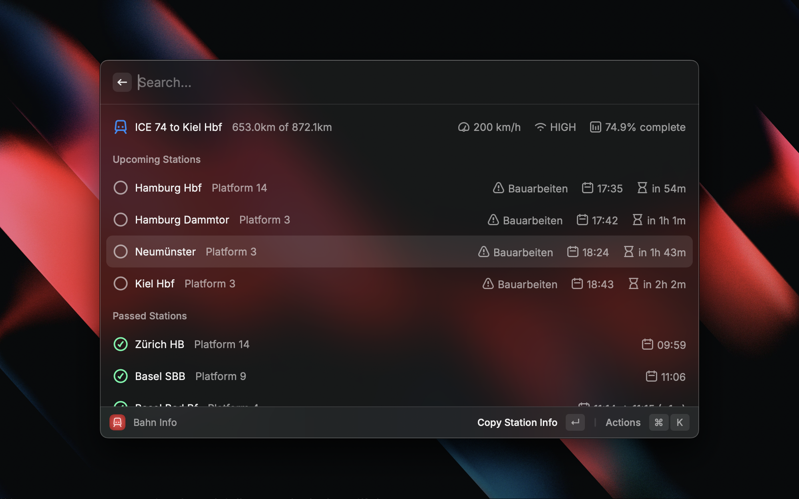

# Bahn Info

Real-time Deutsche Bahn ICE train information for Raycast.

## Features

- Real-time journey progress and train speed
- Upcoming and passed stations with delays
- Platform information and delay reasons
- GPS location with map integration
- Internet connectivity status
- Auto-refresh every 30 seconds

## API

Uses Deutsche Bahn's ICE Portal API:
- `/api1/rs/tripInfo/trip` - Trip information
- `/api1/rs/status` - Train status

