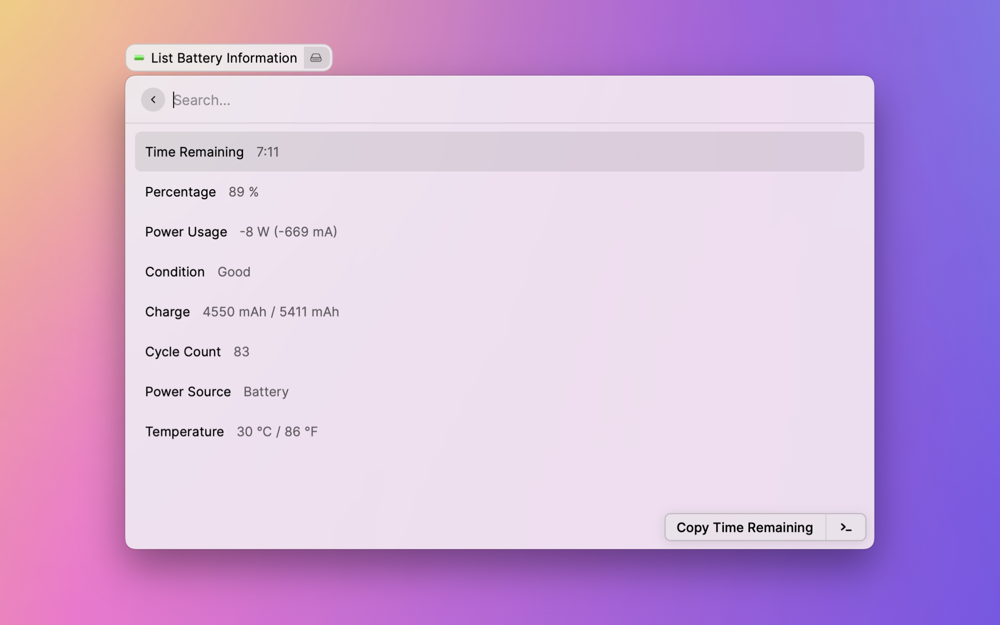

# Battery Health Check

A [Raycast](https://www.raycast.com/) Extension to show live information about the battery in your Mac.



## Contribution

Feel free to open an issue for a bug report or open a PR. Contribution is always welcome!

### Project setup

You can clone this project to make any changes to the code. You need Node, npm and Raycast.

```
npm install
```

### Start the development mode

To start the development mode with hot reloading simply run the dev script. Raycast will open and you are able to use the extension right away.

```
npm run dev
```

### Lint and prettify

If you would like to open a PR, please run the linter and prettify your code:

```
npm run lint
```