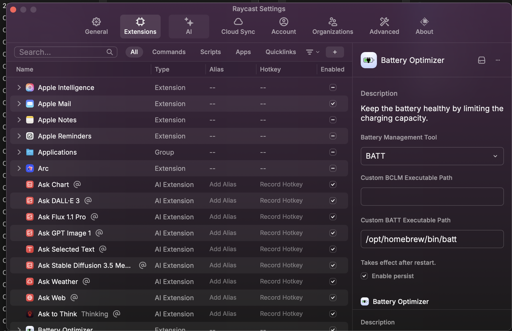

# Battery Optimizer

Protect battery healthy by limiting the charging capacity.

Use bclm command to read and write battery charge level max values to the System Management Controller (SMC) on Mac computers. It supports both Intel and Apple silicon.

The purpose of limiting the battery's max charge is to prolong battery health and to prevent damage to the battery. Various sources show that the optimal charge range for operation of lithium-ion batteries is between 40% and 80%, commonly referred to as the 40-80 rule. This project is especially helpful to people who leave their Macs on the charger all day, every day.

## Usage
 - `Battery Optimizer` command will limit charging above 80%.
 - `Reset Battery Optimizer` command allow charging to continue to 100%.
 - `Get Battery Threshold` command will check the current battery charging limit.
   
 - `Battery Optimizer Menu Bar` show the current battery charging threshold and enable/disable the Battery Optimizer in the menu bar.

## Preferences
 - Configure whether battery optimization settings persist through extension's preferences screen.

For Apple silicon machines, only the values 80 and 100 are supported and firmware >= 13.0 is required.

Note that in order to write values, the program must be run as root. This is not required for reading values.

For Intel machines, when writing values, macOS charges slightly beyond the set value (~3%). When charging while system is shut down or sleeping, the charging can go beyond set value more than average 3%.
# Acknowledgments
* macOS command-line utility to limit max battery charge - https://github.com/zackelia/bclm