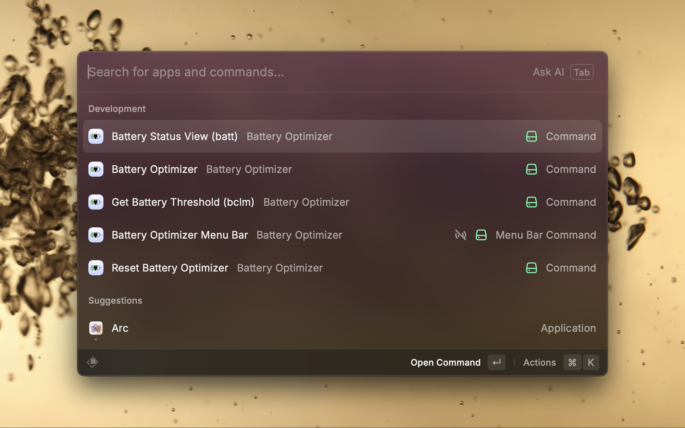

# Battery Optimizer

Protect battery health by limiting the charging capacity.

This extension supports both `bclm` and `batt` command-line tools to limit battery charging on Mac computers:

- `bclm`: For macOS versions before macOS 15 (Sequoia), using the System Management Controller (SMC)
- `batt`: For macOS 15+ (Sequoia) and newer, using the modern battery control API

The purpose of limiting the battery's max charge is to prolong battery health and to prevent damage to the battery. Various sources show that the optimal charge range for operation of lithium-ion batteries is between 40% and 80%, commonly referred to as the 40-80 rule. This project is especially helpful to people who leave their Macs on the charger all day, every day.

## Usage
 - `Battery Optimizer` command will limit charging above 80%.
 - `Reset Battery Optimizer` command will allow charging to continue to 100%.
 - `Get Battery Threshold` command will check the current battery charging limit.
   
 - `Battery Optimizer Menu Bar` shows the current battery charging threshold and enable/disable the Battery Optimizer in the menu bar.

## Preferences
 - Select your preferred battery management tool (BCLM or BATT) based on your macOS version
   - For macOS versions before 15.0 (Sequoia), use BCLM
   - For macOS 15.0 (Sequoia) and later, use BATT
 - Provide custom paths to the battery tool executables if needed
 - Configure whether battery optimization settings persist through extension's preferences screen

## Tool-Specific Notes

### BCLM
- For Apple silicon machines, only the values 80 and 100 are supported and firmware >= 13.0 is required
- For Intel machines, when writing values, macOS charges slightly beyond the set value (~3%)
- When charging while system is shut down or sleeping, the charging can go beyond set value more than average 3%
- Not compatible with macOS 15+ due to removal of the CHWA SMC key

### BATT
- Fully compatible with macOS 15+ (Sequoia)
- Supports limiting charging to any value between 0-100%
- Provides more detailed battery status information

Note that in order to write values, both tools require root/administrator privileges. This is not required for reading values.

## Installation Requirements

To use this extension, you'll need to install either BCLM or BATT based on your macOS version:

- BCLM: `brew install bclm` or visit [https://github.com/zackelia/bclm](https://github.com/zackelia/bclm)
- BATT: `brew install batt` or visit [https://github.com/charlie0129/batt](https://github.com/charlie0129/batt) for installation instructions

# Acknowledgments
- [BCLM](https://github.com/zackelia/bclm) - macOS command-line utility to limit max battery charge.
- [BATT](https://github.com/charlie0129/batt) - macOS utility for battery limit management.
- [battery-batt-optimizer](https://github.com/VatsalSy/battery-batt-control) - standalone Raycast extension that only supports Batt.
