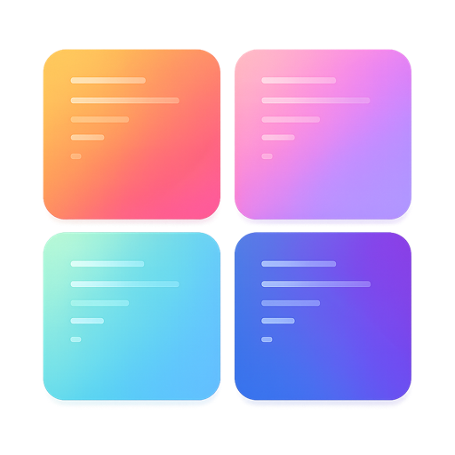
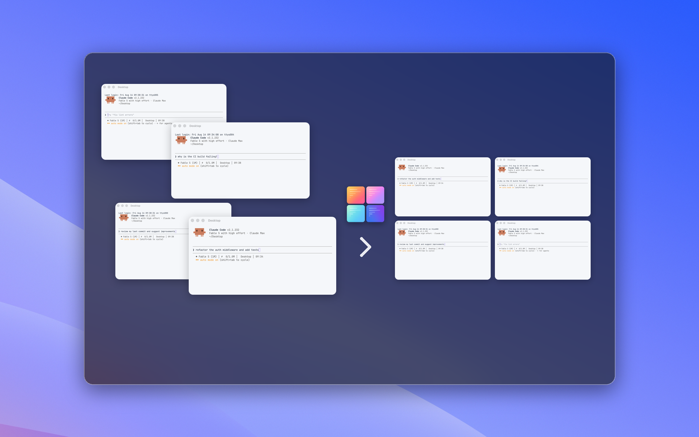
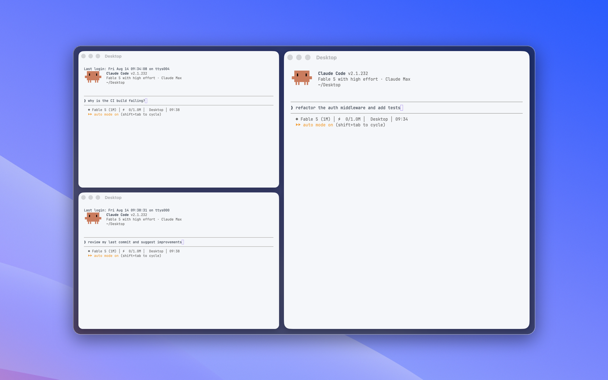

<p align="center">
  
</p>

<h1 align="center">Bento Window</h1>

<p align="center">A Raycast extension that tiles your windows into a bento-box grid — one app's windows, or every window on the desktop.</p>

<p align="center">
  <a href="https://www.raycast.com/Popo/bento-window"></a>
  <a href="https://github.com/ipopo/bento-window/blob/main/LICENSE"></a>
  
</p>

---

A Raycast extension that tiles your windows into a bento-box grid with one keystroke. The grid auto-adapts to how many windows you have open — 4 windows become 2×2, 6 become 3×2, 9 become 3×3, and so on. Press the same key again and every window returns to where it was: tiling is a **reversible gesture**, not a one-way operation. Windows are placed in creation order, so the same window always lands in the same slot.

Two commands, one keystroke each: **Auto Tile** tiles **a single app's windows** (great for the **vibe coding** workflow where you spin up several terminals — Ghostty, Terminal, iTerm2… — and want them snapped into place without dragging each one into a quarter), and **Auto Tile All** tiles every window on the active desktop instead.

<p align="center">
  
</p>

<p align="center">
  
</p>

## Acknowledgment

Bento Window is inspired by [Window Layouts](https://www.raycast.com/teemu_suvinen/window-layouts) by [@teemusuvinen](https://github.com/teemusuvinen). Window Layouts is a mature, full-featured window tiling extension — if you need fine-grained layout control across all your windows, go check it out.

## How Bento Window differs

Bento Window is intentionally **narrower and more opinionated**. It's built for one workflow: bind a hotkey, press it, and your app's windows snap into a grid. No menus, no views, no choices at runtime.

| | Window Layouts | Bento Window |
|---|---|---|
| **Scope** | All windows on the desktop | Single app's windows (or all, your choice) |
| **Auto-detect target app** | — | ✅ uses the focused window's app |
| **Layout philosophy** | Multiple commands for different layouts | Grid adapts to window count |
| **Own layout grids** | Shared grid definitions | Opinionated grids (e.g. 3 windows → 2 small + 1 big, not 3 equal columns) |
| **Interface** | Multiple commands | Two no-view commands (app / all windows), hotkey-optimized |
| **Reversible** | — | ✅ press the hotkey again to restore original positions |

## Layouts

The grid the extension picks based on the number of windows of the target app:

```text
1 window — fullscreen          2 windows — halves
┌──────────────┐               ┌──────┬──────┐
│              │               │      │      │
│      1       │               │  1   │  2   │
│              │               │      │      │
└──────────────┘               └──────┴──────┘

3 windows — small × 2 + big    4 windows — 2×2
┌──────┬──────┐                ┌──────┬──────┐
│  1   │      │                │  1   │  2   │
├──────┤  3   │                ├──────┼──────┤
│  2   │      │                │  3   │  4   │
└──────┴──────┘                └──────┴──────┘

5 windows — 2×2 small + big    6 windows — 3×2
┌───┬───┬────────┐             ┌────┬────┬────┐
│ 1 │ 2 │        │             │ 1  │ 2  │ 3  │
├───┼───┤   5    │             ├────┼────┼────┤
│ 3 │ 4 │        │             │ 4  │ 5  │ 6  │
└───┴───┴────────┘             └────┴────┴────┘

7 windows — 4×2 (last wide)    8 windows — 4×2
┌───┬───┬───┬───┐              ┌───┬───┬───┬───┐
│ 1 │ 2 │ 3 │ 4 │              │ 1 │ 2 │ 3 │ 4 │
├───┼───┼───┴───┤              ├───┼───┼───┼───┤
│ 5 │ 6 │   7   │              │ 5 │ 6 │ 7 │ 8 │
└───┴───┴───────┘              └───┴───┴───┴───┘

9 windows — 3×3                10+ windows — 5×2 (extras untouched)
┌────┬────┬────┐               ┌──┬──┬──┬──┬──┐
│ 1  │ 2  │ 3  │               │1 │2 │3 │4 │5 │
├────┼────┼────┤               ├──┼──┼──┼──┼──┤
│ 4  │ 5  │ 6  │               │6 │7 │8 │9 │10│
├────┼────┼────┤               └──┴──┴──┴──┴──┘
│ 7  │ 8  │ 9  │
└────┴────┴────┘
```

## Install

Install from the [Raycast Store](https://www.raycast.com/Popo/bento-window), or search **Bento Window** in Raycast's Store command.

<details>
<summary>Install from source (for development)</summary>

```bash
git clone https://github.com/ipopo/bento-window.git
cd bento-window
npm install
npm run dev
```

`npm run dev` registers the extension with Raycast and watches for code changes. You can `Ctrl+C` it once the extension shows up — the registration persists.

</details>

Then in Raycast:

1. Open a few windows of your target app (Ghostty, Terminal, etc.)
2. Run **Auto Tile** (or **Auto Tile All** to tile every window on the desktop)
3. Run it **again**: if the grid is untouched, every window returns to its original position; if you dragged windows around, they snap back into the grid first
4. Optional: assign a global hotkey per command (Raycast Settings → Extensions → Bento Window → record hotkey)

## Configuration

Raycast Settings → Extensions → **Bento Window**:

- **Target app names** — comma-separated list, tried in order. The first app with windows on the active desktop gets tiled. Used only by **Auto Tile** (Auto Tile All ignores it; Raycast's own windows are always skipped).
  - Default: `Ghostty, Terminal, iTerm2, Alacritty, WezTerm`
  - Leave **empty** for auto mode — the extension uses the currently focused window's app. Works for any app you're focused in.
- **Excluded app names** — comma-separated list of apps that are never tiled, even by **Auto Tile All**. Handy for media players, chat clients, or anything you want pinned in place.
- **Gap** — pixels between tiles and screen edges. `0` (default) for flush tiles.

On a multi-display setup the windows are tiled on the desktop they're already on, not moved to the built-in display.

## Requirements

- macOS
- Accessibility permission granted to Raycast (System Settings → Privacy & Security → Accessibility)

## License

MIT
