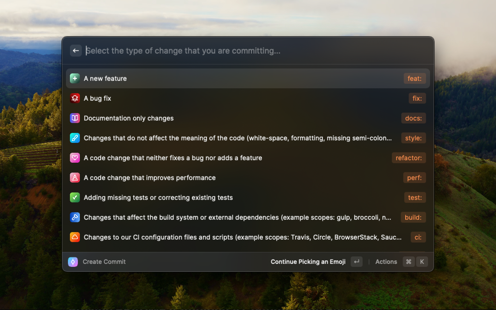
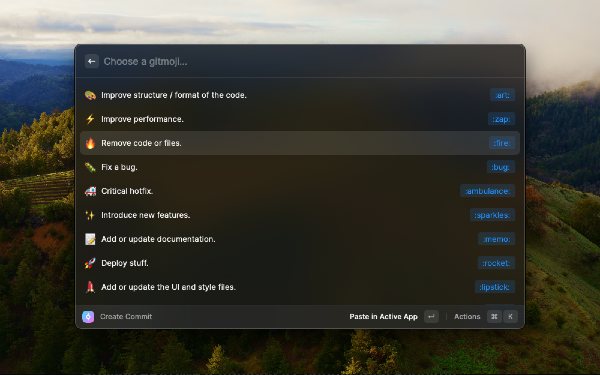

# Better Commit

Create better commit messages with prefixes and gitmojis.

Author: [Brieuc Caillot]("https://brieuc-caillot.com")

## Search for Better Commit

You can start searching for Better Commit in the command palette.
 
After creating a commit, you can execute the copy command to copy the commit message to your clipboard, or the paste it directly.

## Pick your desired prefix followed by your desired gitmoji

### Options

By default the extension will paste the prefix + gitmoji, but you can change the default behavior by changing it in the extension settings. Take a look at the options if needed.
