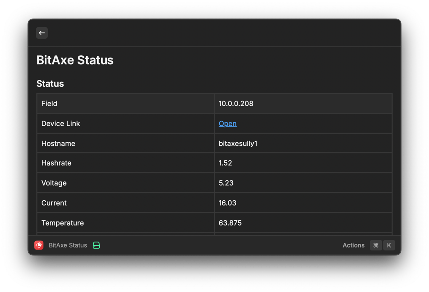
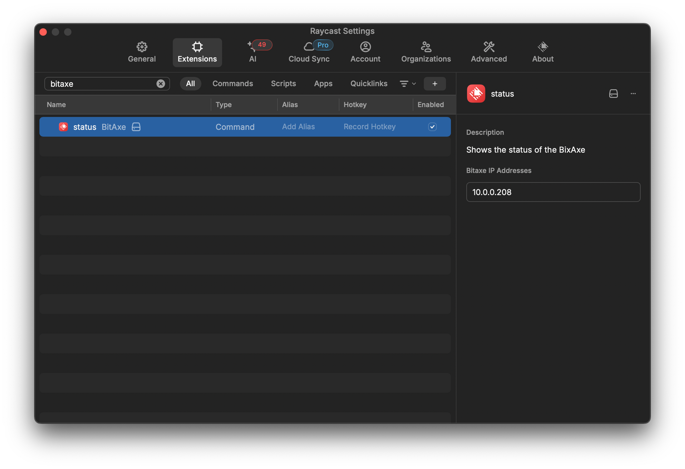

# BitAxe Status

Display the status of one or more locally managed BitAxe miners in a quick reference table:



## Configuration

To set the IP addresses of your miners, update the `bitaxe` extension and set the "BitAxe IP Addresses" field with a comma-separated list of IP addresses. For example:

```text
10.0.0.10,10.0.0.11
```


