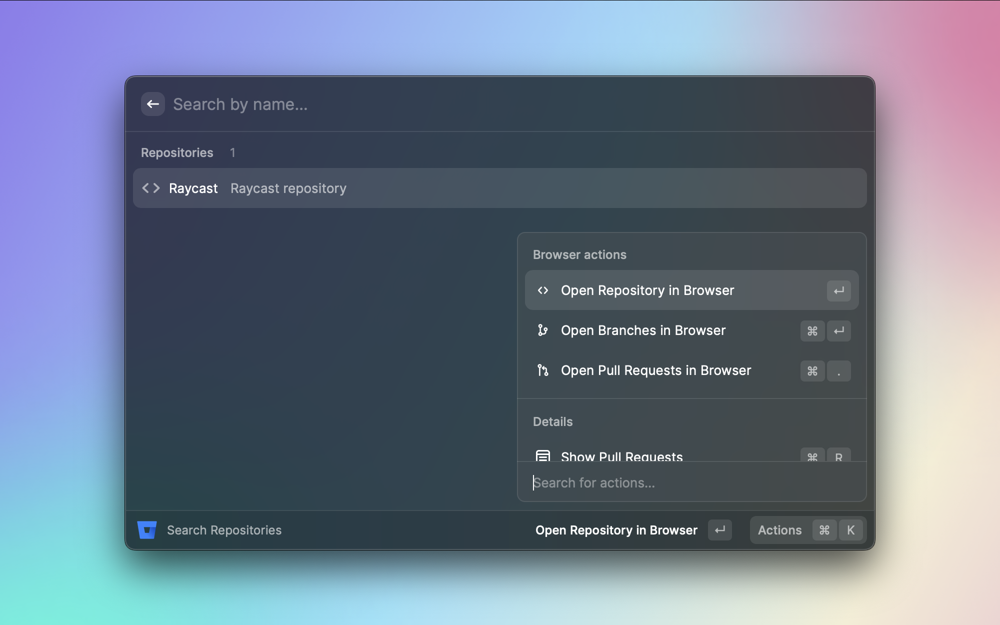
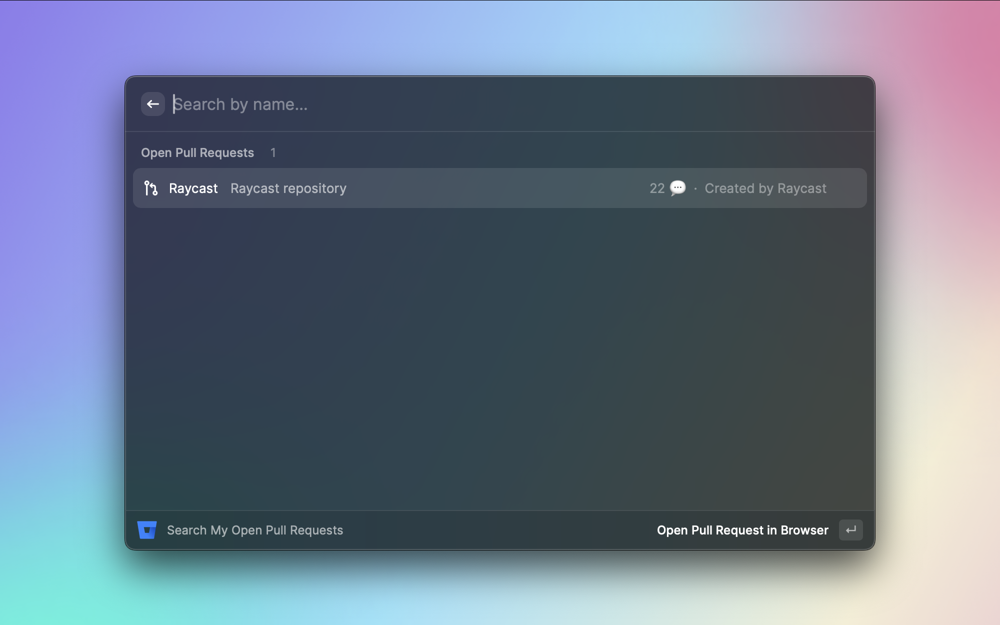

  

  <h1>
    Bitbucket Search (Self-Hosted)
  </h1>

Raycast extension to search repositories, open recent Pull Requests.

### Features

- Quick access to your repositories
- See your recent open pull requests

### Standing on the shoulders of giants

- [Raycast bitbucket extension](https://www.raycast.com/Francois/bitbucket)

### Snapshots

### Bitbucket API resource

- [api-latest-repos-get](https://developer.atlassian.com/server/bitbucket/rest/v805/api-group-repository/#api-api-latest-repos-get)
- [api-repositoryslug-pull-requests-get](https://developer.atlassian.com/server/bitbucket/rest/v805/api-group-pull-requests/#api-api-latest-projects-projectkey-repos-repositoryslug-pull-requests-get)
- [api-dashboard-pull-requests-get](https://developer.atlassian.com/server/bitbucket/rest/v805/api-group-dashboard/#api-api-latest-dashboard-pull-requests-get)
