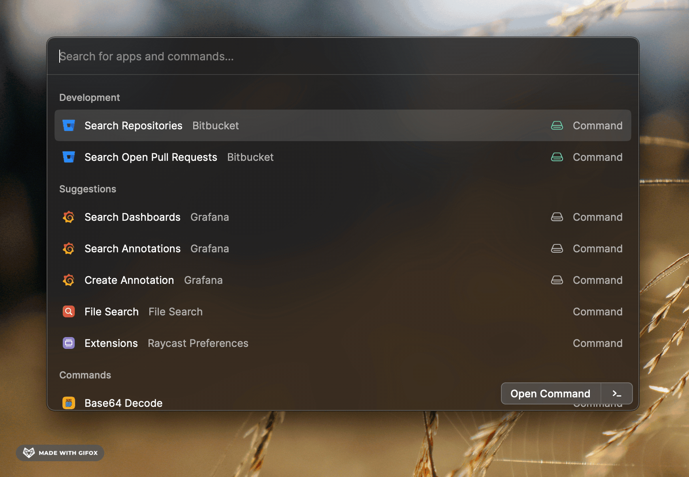

  

  <h1>
    Bitbucket
  </h1>

Raycast extension to search repositories, check pipelines status, open recent Pull Requests, and more to come.

  

    
    
    
    
  

## Features

- Quick access to your repositories
- Search your recent pipelines and see their status
- See your recent open pull requests

## Getting started

- [Generate a Bitbucket API token](https://id.atlassian.com/manage-profile/security/api-tokens) with `read:*` scopes, or narrow to:
  - read:workspace:bitbucket
  - read:user:bitbucket
  - read:repository:bitbucket
  - read:pullrequest:bitbucket
- Start a bitbucket command and fill the required fields:
  - Workspace: You can see your workspaces [here](https://bitbucket.org/account/workspaces/), and use the slug. You can find it in the URL of your workspace: `https://bitbucket.org/{organization}/`
  - Account email
  - API token

Now you should be able to run Bitbucket commands with Raycast 🚀.

## Roadmap

- [x] Use the Bitbucket Client NPM package instead of hardcoding the API
- [x] Show commit name in pipelines title
- [x] Addd pagination navigation to pipelines
- [ ] Dashboard with overview of differents queries (PRs, pipelines, etc)
- [ ] Extend pipelines capabilities to see logs & rerun a failed/stopped one
- [ ] Test performances with high number of repositories (only tested with 38 until now). And if bad performances, check:
  - [ ] Add pagination navigation to repositories
  - [ ] Load all repos in background and keep a cache of all of them (as repositories are quite static resources)
  - [ ] Only keep the field needed, to reduce JSON answer size

---

_Extension built & tested for Bitbucket Cloud_

Bitbucket API resource: https://developer.atlassian.com/cloud/bitbucket/rest/intro/

Bitbucket Client API resource: https://bitbucketjs.netlify.app/
