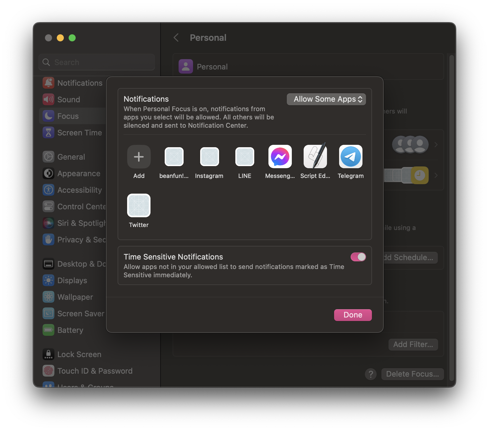

# Bitfinex Extension

This is a Bitfinex extension for managing and providing margin funding offers on Bitfinex.

## Configuration

1. Go to [Bitfinex API keys](https://setting.bitfinex.com/api#my-keys) and create a new API key with the following permission
   - **Account History**: `Get historical balances entries and trade information`
   - **Orders**: `Create and cancel orders`
   - **Margin Funding** permissions
   - **Wallets**: `Get wallet balances and addresses`
2. Open the extension command and paste your API key and secret into the fields.
3. Choose the currency you want to use.

### Set the App whitelist in Do Not Disturb mode

1. Open System Preference and select **Focus**
  
2. Edit each focus mode, and add the **Script Editor** App
  
