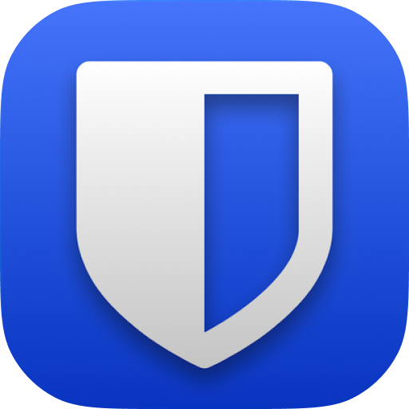
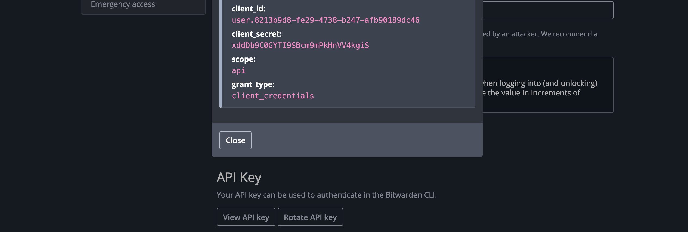
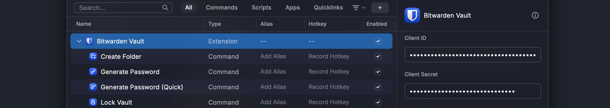

  

   

# Bitwarden Vault

Access your Bitwarden vault directly from Raycast

🔎 &nbsp; Search your vault &nbsp; 📋 &nbsp; Copy and paste any field &nbsp; 🔑 &nbsp; Generate passwords and TOTP codes &nbsp; ⭐ &nbsp; Mark items as favorites

 

## Setup

### Set your account's API secrets

> 1 - Get the secrets from your account [security settings](https://vault.bitwarden.com/#/settings/security/security-keys) (`View API Key` button). For more information check the official [documentation](https://bitwarden.com/help/personal-api-key/#get-your-personal-api-key)
>
> 

> 2 - Paste the secrets in the corresponding fields the **first time you use** the extension or in the **extension settings**.
>
> 
> 

You're all set! 🎉

### Local Installation

If you wish to use your own local Bitwarden CLI, you can do so by entering the corresponding path in the `Bitwarden CLI Path` field (tip: use the `which bw` command to find the path).

### Self-hosted Instance

This extension connects to Bitwarden-hosted servers by default, but can be configured to use a self-hosted Bitwarden instance instead. If the self-hosted Bitwarden server requires a self-signed TLS certificate, add the path to the extension settings.

## Security

The extension relies on the Bitwarden CLI, so every security consideration that applies to the CLI applies to the extension as well. See <https://bitwarden.com/help/article/cli-security/> for more information.

### Caching

Out of the box, the extension caches the **visible and non-sensitive** part of your vault to ensure faster access. Secrets like passwords, identity fields, credit card information, secret notes and others sensitive data are **never** saved. Even though the cache will never have any sensitive information, the data is also encrypted with a key derived from your master password.

If you wish to disable the caching feature, you can **always** do so in the extension preferences.
