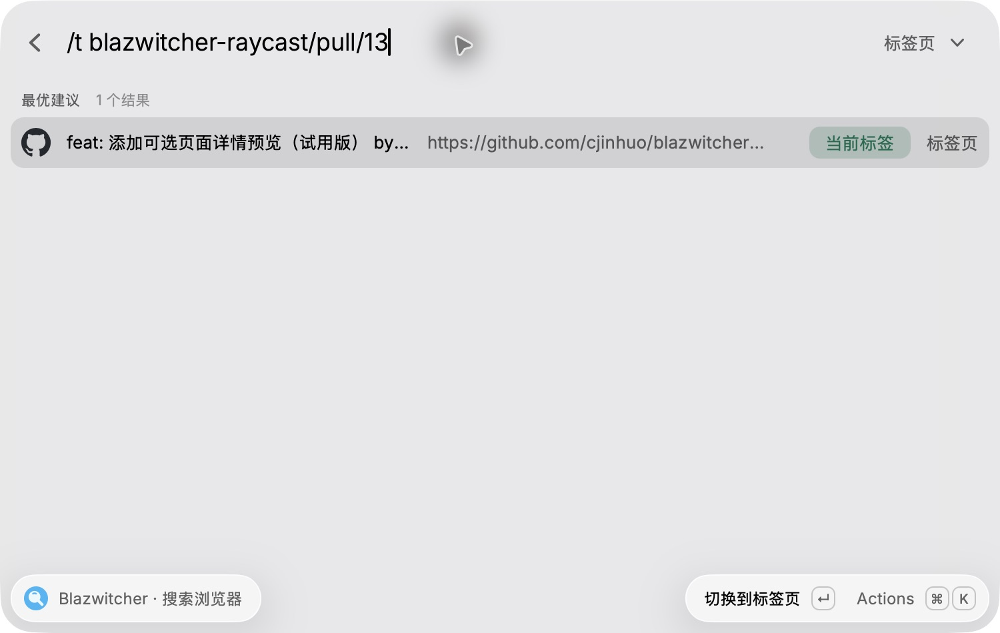
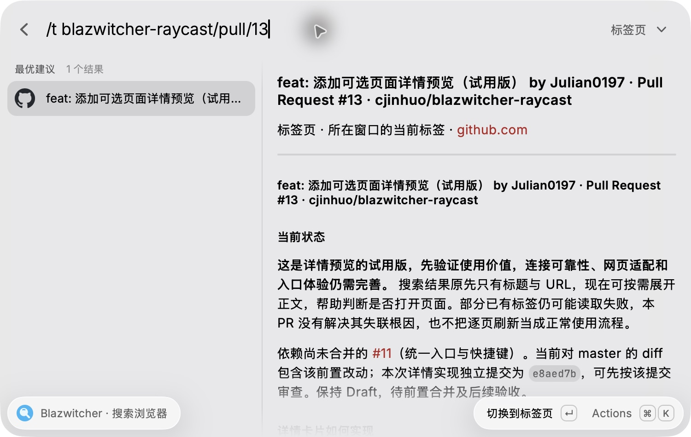

# 详情预览：试用说明与实现

当前版本用于试用和收集反馈，不代表正文连接、网页适配与交互入口已经完善。它让用户在搜索结果中快速判断页面内容，再决定是否打开；不替代浏览器，也不提供完整网页镜像。

## 实际效果

以下是同一个公开 GitHub PR 页面在真实 Raycast 中的截图。默认单栏展示结果，按 `⌘D` 后展开右侧详情并读取网页正文；截图中的 PR 内容是拍摄时的版本。

默认单栏：



展开详情：



## 当前入口

搜索命令默认保持单栏。选中结果后按 `⌘D`，或在 `⌘K` 动作菜单选择“显示详情”，展开原生右侧面板；再次操作收起，保留查询和选中项。开关只在本次命令有效，下次重新进入仍默认收起。

“快捷键设置”支持改绑或停用额外绑定。如果旧配置已经占用 `⌘D`，保留旧绑定，详情通过动作菜单打开。展开标签页详情后，菜单提供“刷新预览”，只重读当前正文，不刷新 Chrome 页面。

当前入口依赖快捷键和菜单，可发现性不足。列表常驻提示、菜单前移、记住开关状态是后续方案，尚未实现。

## 数据与渲染

```text
SearchBrowser：查询、选中项、详情开关
  ├─ BrowserResultItem：原生列表行
  └─ usePagePreview：延迟读取、缓存、忽略过期响应
       └─ readPagePreview：检查标签、调用 BrowserExtension
            └─ PagePreview → ResultDetail → List.Item.Detail
```

| API / 模块                                                   | 用途                                                   |
| ------------------------------------------------------------ | ------------------------------------------------------ |
| `List.isShowingDetail`                                       | 控制 Raycast 列表与详情的布局切换                      |
| `List.Item.Detail` 的 `markdown` / `isLoading`               | 由 Raycast 渲染 Markdown 与加载状态                    |
| `environment.canAccess(BrowserExtension)`                    | 调用前检查 API 可用性，未安装时显示提示                |
| `BrowserExtension.getTabs()`                                 | 正文读取前后，核对目标标签 ID 唯一且 URL 未变化        |
| `BrowserExtension.getContent({ tabId, format: "markdown" })` | 通过官方浏览器扩展读取指定标签正文，不依赖当前活动标签 |
| `preview-markdown`                                           | 拼接基础信息并整理适合窄面板的 Markdown                |

正文来自官方扩展的阅读模式提取。我们不自行抓取已登录网页，不引入 HTML 渲染器、WebView 或自定义 CSS。列表和详情都是 Raycast 原生组件，窗口宽度、分栏比例、主题及滚动行为由宿主管理。

普通 HTTP(S) 标签可读取正文；书签、历史、无痕和特殊协议页面仅显示已有基础信息，不为预览自动打开页面。正文读取失败不阻止搜索、复制地址和打开页面。

## 窄窗口适配

- 展开详情后，左侧隐藏 URL 和附件，只留标题。清理标题开头的不可见格式字符只影响显示，保留原始记录用于搜索和操作。
- 右侧将标题、来源、域名链接及正文放入同一个可滚动区域，移除固定底部 Metadata，避免正文只剩很小空间。域名链接仍指向完整 URL，`⌘C` 复制原始地址。
- 顶部使用较小标题，正文的常见 ATX 标题收为四级标题；普通及引用式 Markdown 图片转为链接，避免大图占满窗口。
- 这是轻量 Markdown 整理，不是完整语法解析器。已有代码示例保护，但复杂嵌套、HTML、表格及其他标题语法仍需继续验证，不能保证所有网页都适配。

## 读取与缓存边界

仅在详情展开且选中项稳定 250ms 后读取。切换选择、收起或退出时，清除定时任务并忽略旧响应；底层 `getContent` 没有在此接入真正的请求取消，不能将此描述为取消了浏览器端工作。

每次读取最多等待 6 秒，展示前 8000 字符。仅缓存成功正文，当前命令内最多 10 份、30 秒内复用；缓存键包含数据版本及标签身份，手动刷新删除当前缓存。正文不写入磁盘或搜索索引，也不提交给 AI 服务。

## 已验证与未解决的问题

- 本地回归覆盖目标标签匹配、导航变化、超时、空正文、错误提示、过期响应、缓存与刷新，以及紧凑 Markdown 和快捷键冲突。
- 原生窗口已经观察到 `⌘D` 展开/收起、公开页面正文、基础信息和图片链接。重新导入后，也验证过停止开发进程仍可使用详情面板。
- 部分已有标签返回官方扩展的 `Access to this page is restricted. Try to reload the page`。已安装的 Companion 将“找不到内容脚本接收端”映射为此错误；同地址新开标签曾成功读取，但已有标签失联的原因尚未查清。
- Companion 已有安装/更新时向已有匹配标签注入脚本的逻辑，因此不能把“所有旧标签必须刷新”当成正常设计。当前恢复提示不是连接问题的根因修复。
- 动态文档正文完整性、全部 Markdown 语法、跨窗口尺寸，以及刷新动作和改绑快捷键的完整原生流程还未完成验收。不能将自动化逻辑测试等同于这些场景的真实验证。

本轮具体测试数量、重启和复测结果统一记录在 [验证记录](验证记录.md)，避免将未完成操作写成通过。

## 下一步

1. **连接可靠性**：先比较重启前后同一批原标签与新标签，区分内容脚本接收端、网站权限、休眠标签和浏览器连接问题；确认根因后再决定恢复机制，避免自动刷新用户页面。
2. **入口可发现性**：显示与实际绑定一致的预览提示，将菜单入口前移；评估由用户选择是否记住开关，保留首次默认单栏。
3. **渲染质量**：验证长标题、代码、表格、列表及动态文档；按实际失败样本改进，必要时再引入 Markdown 解析，而非提前增加通用渲染框架。
4. **正文操作**：连接和提取稳定后，再考虑复制 Markdown、组合标题/URL/正文。正文搜索、摘要和 AI 功能是更后续的方向，本版没有实现。

参考：[Raycast List](https://developers.raycast.com/api-reference/user-interface/list)、[Browser Extension API](https://developers.raycast.com/api-reference/browser-extension)。
