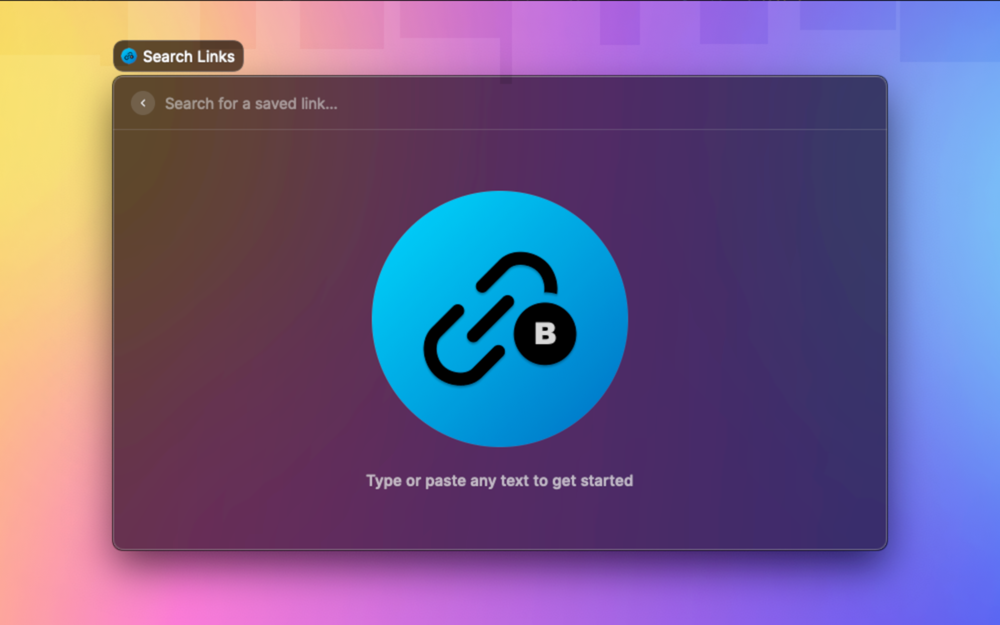
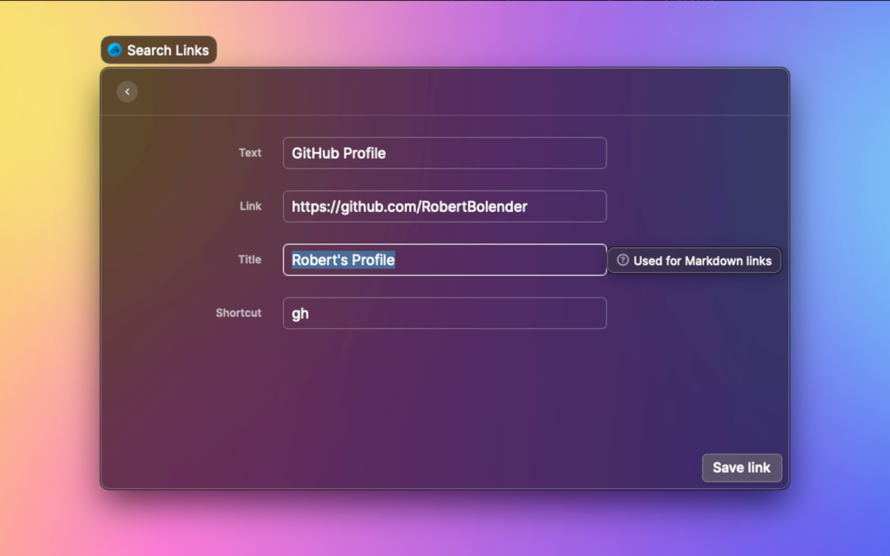
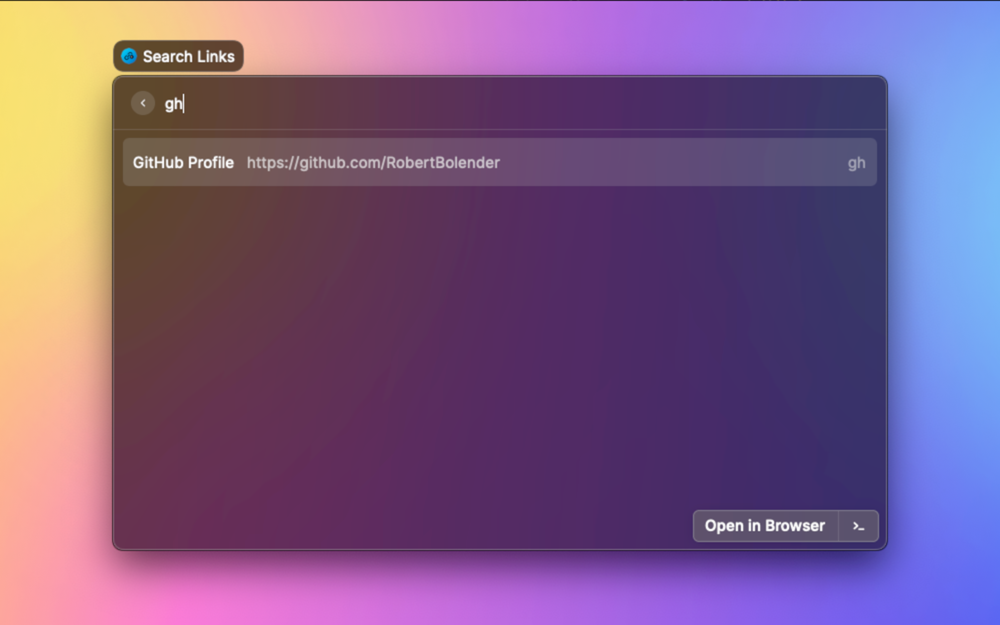

# BlitLink (Raycast Extension)

Quickly store and retrieve links for future reference.  
Be the fastest to respond in Slack with the perfect relevant link or reaction GIF.

Reasons to use this extension instead of the built-in Quicklinks:

- You can copy links as either plain URLs or as markdown links (e.g.: `[title](url)`)
  - `cmd+u` to copy the plain URL
  - `cmd+l` to copy the Markdown link
  - `cmd+p` to paste the plain URL to the frontmost active app
  - `cmd+o` to past the Markdown link to the frontmost active app
- You can preview images (memes) within Raycast before sharing
  - `enter` to preview the image and copy the plain URL to the clipboard
  - `enter` again from the preview to paste the plain URL to the frontmost active app
  - `cmd+enter` from the preview to paste the Markdown link to the frontmost active app
  - The above copy/paste shortcuts also work from this view

Notes:

- Uses a local SQLite database.
- Assumes a copy of `sqlite3` is present in the PATH.
- `sqlite3` is installed by default on modern versions of MacOS.

