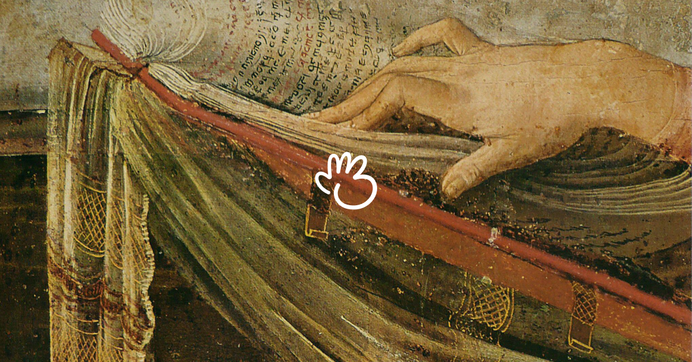

   
 

Companion bookmarking utility for [(Basic) Bookmarks](bmrks.com).

## Commands

### Bookmark

Captures the current URL, title, and favicon from the browser currently in focus and active, and saves to a selected remote group on bmrks.com.

Currently supports Chrome, Safari, Brave, Arc.

---

In order to use this extension, you'll need to have an account on bmrks.com, and log in after installing.
