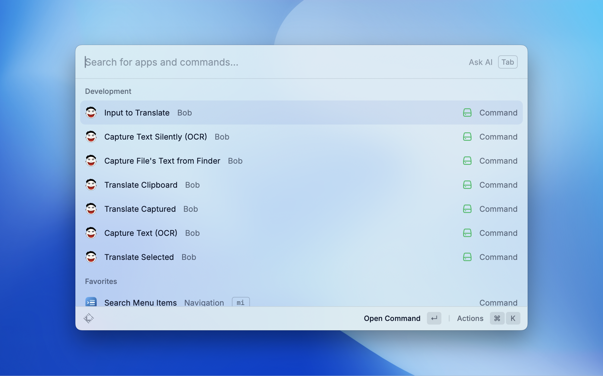

# Bob Extension User Guide

Control the [Bob](https://bobtranslate.com/) macOS app from Raycast.

## Features

### Translate Features

- Show input window
- Translate from clipboard
- Translate from seleted
- Translate from capture
- Translate input text

### OCR Features

- Capture text (OCR): Use OCR to capture text from your screen.
- Capture text without Bob's main window (OCR): Use OCR to capture text to your clipboard.
- Capture text from Finder files: Use OCR to capture text from files of your Finder.

## Screenshot

## Troubleshooting

If you encounter issues:

- Make sure your Bob Version has been updated to `1.5.0` or higher.

## Acknowledge

This code is referred to [qq-music-controls](https://github.com/raycast/extensions/tree/main/extensions/qq-music-controls) and ChatGPT. We are not familiar with nodejs these techs, so the code sucks. Please feel free to create a PR.