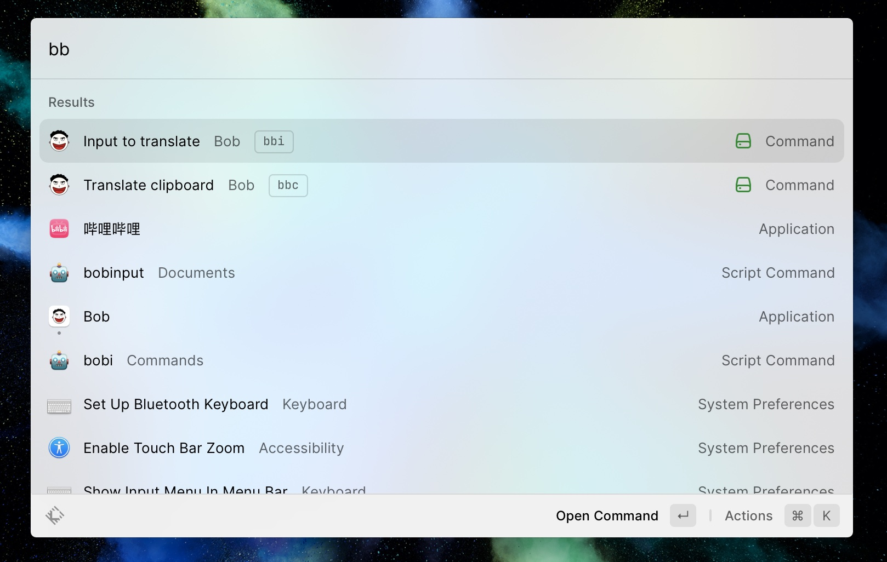

# Bob

Control the [Bob](https://bobtranslate.com/) macOS app from Raycast.

## Features

Controls:
- Show input window
- Translate from clipboard

## Screenshot

## Acknowledge

This code is heavily referred to [qq-music-controls](https://github.com/raycast/extensions/tree/main/extensions/qq-music-controls).
I am not familiar with nodejs these techs, so the code sucks.
Please feel free to create a PR.