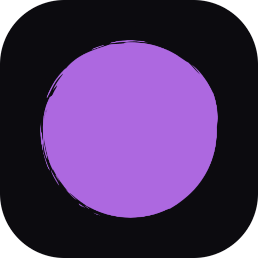

    

# Brand.dev

This is a Raycast extension to get a company's brand logos, colors, slogan, socials, and more via the [Brand.dev](https://brand.dev/) API.

## 🚀 Getting Started

1. **Install extension**: Click the `Install Extension` button in the top right of [this page](https://www.raycast.com/xmok/brand-dev) OR via Raycast Store

2. **Get your API Key**: The first time you use the extension, you'll need to enter your 'Brand.dev' API Key:

    a. `Sign in` to your Account at [this link](https://developer.brand.dev/login)

    (if you don't have an account, `Sign up` at [this link](https://developer.brand.dev/))

    b. `Copy` the "API Key"
  
    c. `Enter` this key in Preferences OR at first prompt

## ⚙️ Configuration

By default the secondary `Action` performs "Deletion" but if you prefer, you can change this in Preferences to be "New".

## 🗒️ NOTE

The Free Plan of Brand.dev includes 100 API Calls per month so to reduce usage of API Calls, when you retrieve a Brand, it is stored locally in `LocalStorage`.