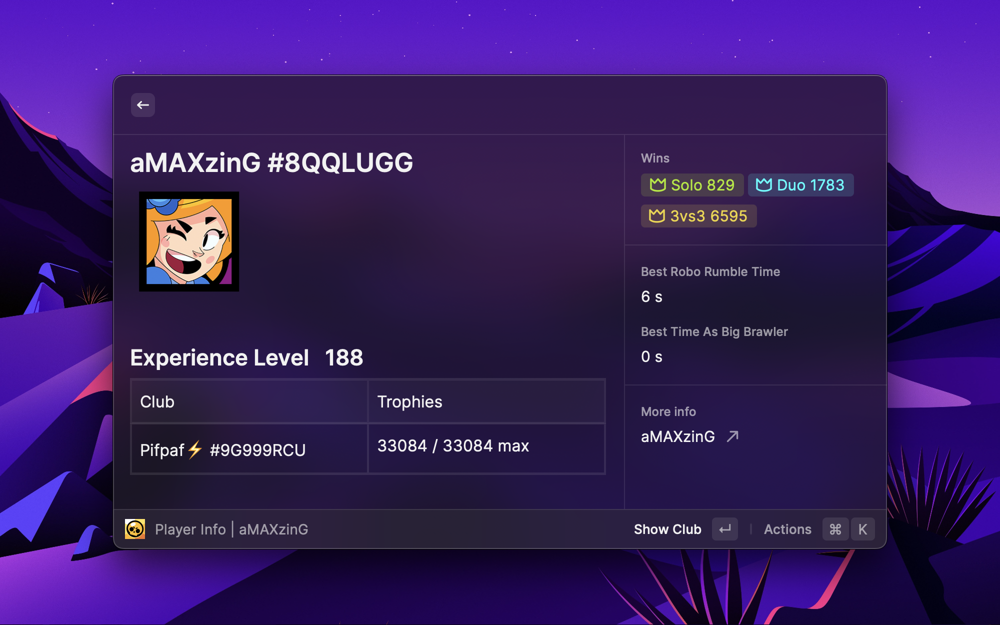
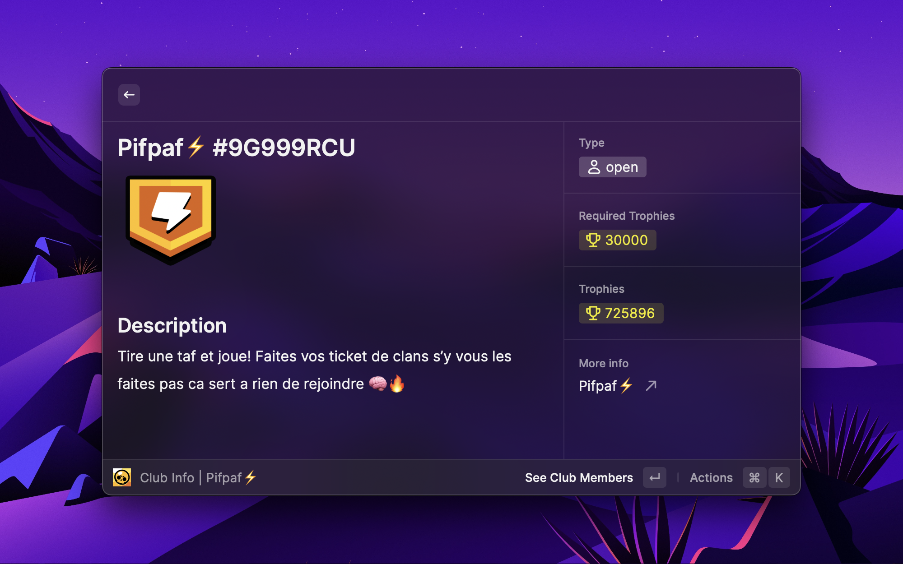
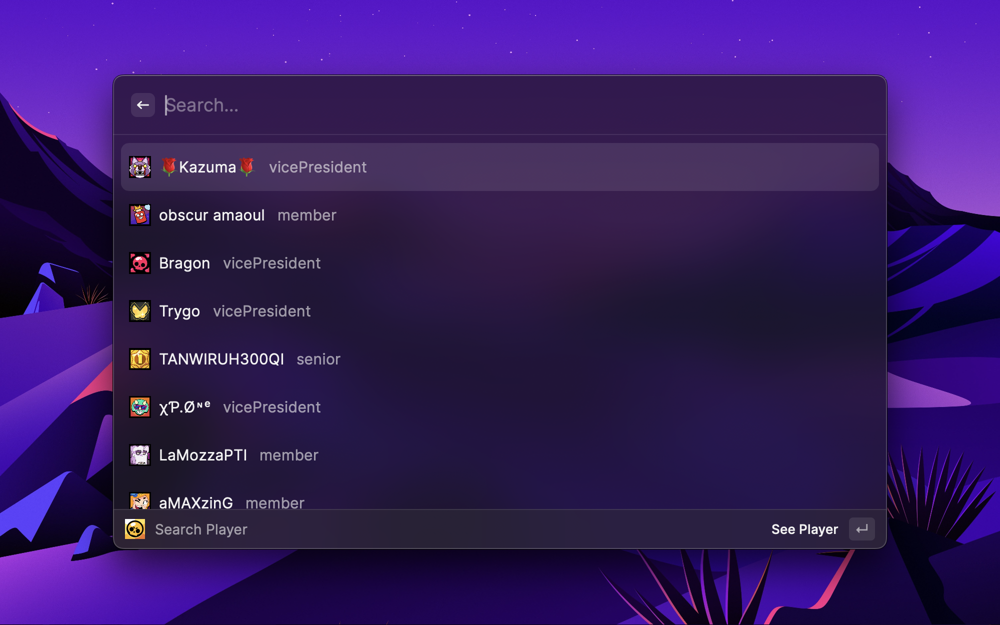
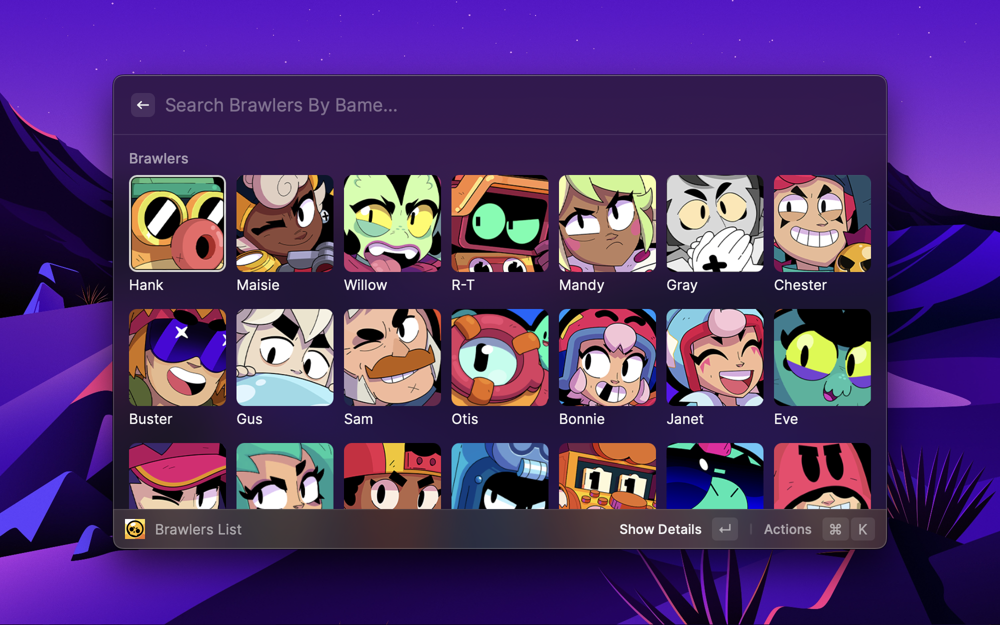
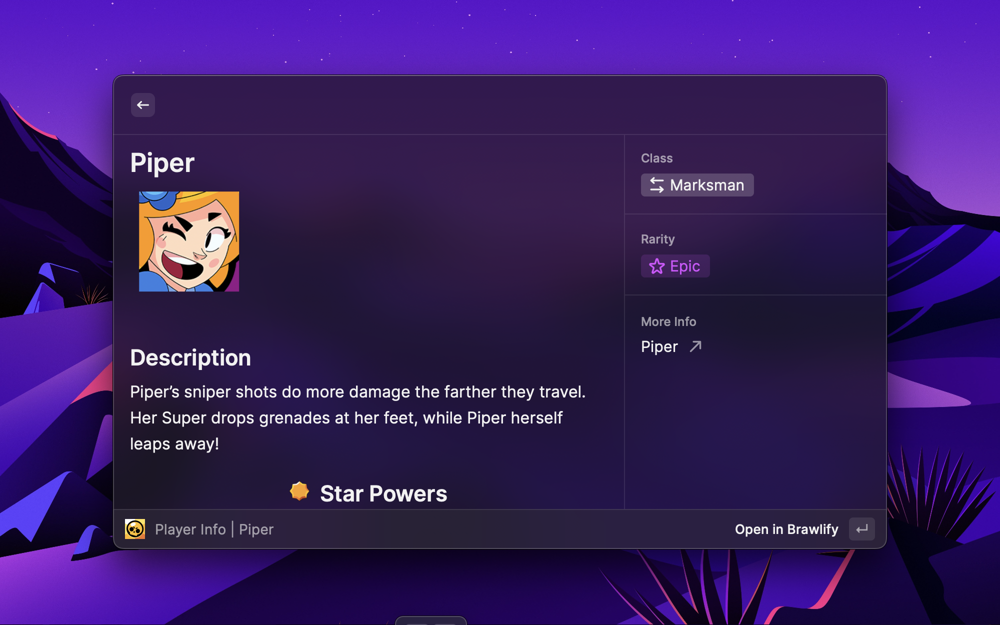

# Brawl Stars Search

## **API Key**

You must get an API key from [Brawl Stars API](https://developer.brawlstars.com/#/).

## **Introduction**

This is a simple search engine for Brawl Stars. It is based on the [Brawl Stars API](https://developer.brawlstars.com/#/).

And also use the [Brawlify API](https://brawlapi.com/) to get info on brawlers and icons.

## **How to use**

### **Search**

You can search for players, clubs, and brawlers. The search result will be displayed in the table below.

### **Players**

You can search for players by player tag. The player tag is a string of 9 characters, starting with a hash character (# Optional). You can find your player tag in the game. The player tag is unique for each player.

### **Clubs**

You can search for clubs by club tag. The club tag is a string of 9 characters, starting with a hash character (# Optional). You can find your club tag in the game. The club tag is unique for each club.

# **List Of Players From A Club**

### **Brawlers**

You can search for brawlers by brawler name. The brawler's name is a string of characters. You can find your brawler name in the game. The brawler's name is unique for each brawler.

# **Brawler LIST**

# **Brawler INFO**

# About Me

Hey, I'm Maxime I'm 22. I'm a student in software development.

You will find in this repository my first Raycast extension for my current favorite game: BRAWL STARS.

# Utils

This code was produced thanks to the following:

- [Raycast API](https://developers.raycast.com/)
- [Brawl Stars API](https://developer.brawlstars.com/#/)
- [Brawlify API](https://brawlapi.com/)

## TODO :

- Player brawlers list
- battle log
- sort brawlers by rarity and recentness
