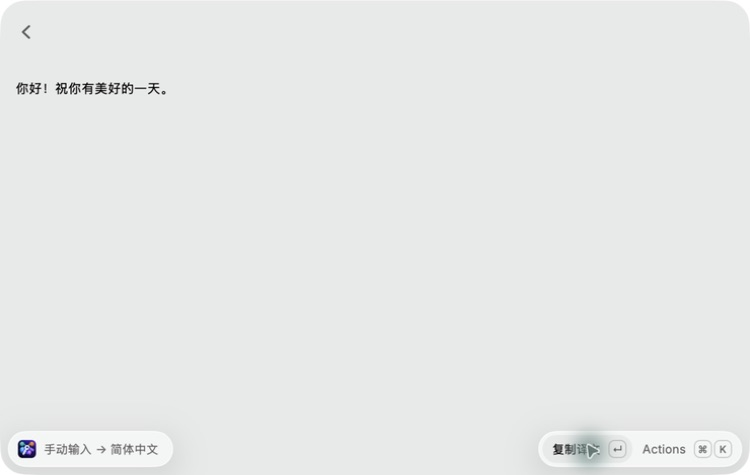

# BYOK Translator

Translate selected text with your own API endpoint, model, and API key. Supports OpenAI-compatible Chat Completions and Anthropic-compatible Messages APIs without a Raycast AI subscription.

[简体中文说明](README.zh-CN.md)



## Setup

1. Configure **Provider**, **API URL**, **API Key**, and **Model** in Raycast Settings → Extensions → BYOK Translator.
2. Choose a target language. Simplified Chinese is the default; the list includes 184 ISO 639-1 languages with separate Simplified and Traditional Chinese options.
3. Assign a global hotkey to **Translate Text**. Keep **Translation View** enabled: it displays results and handles manual input.
4. Optionally open **Edit System Prompt** to edit and save a multiline prompt. Use `{{target}}` to insert the selected target language.

Supply the complete endpoint URL, including the request path:

| Protocol | Example URL |
| --- | --- |
| OpenAI / OpenAI Compatible | `https://api.openai.com/v1/chat/completions` |
| Anthropic / Anthropic Compatible | `https://api.anthropic.com/v1/messages` |

For another service, use its documented endpoint and exact model ID. API keys and usage billing are provided by your chosen service. Local services can omit the API key and use HTTP on localhost; remote endpoints require HTTPS. URLs must not contain embedded credentials, query parameters, or fragments.

## Usage

Select text in another app and press your hotkey. Each invocation starts a new translation session:

1. Use the selected text if the app exposes a non-empty text selection.
2. Otherwise, use non-empty text from the current clipboard. Copied files are ignored.
3. If neither is available, show a manual input form. Enter text and press Return to translate.

Selection access depends on the source app and Raycast's macOS Accessibility permission. Images are not processed with OCR. Manual input is single-line; use the clipboard for multiline source text.

The result offers **Copy Translation**, **Paste Translation**, and **View Source** actions (currently displayed in Chinese). In the manual form, press Cmd+O to adjust the target language and prompt for the current session. The saved prompt from **Edit System Prompt** takes precedence over the initial prompt in Raycast preferences; before the first save, the existing preference is used. Saving an empty prompt restores the built-in translation instructions.

Inputs are stripped of leading and trailing whitespace and accidental invisible control characters. Internal whitespace, line breaks, and punctuation are preserved. Requests time out after 60 seconds. Anthropic responses have an 8192-token output limit; truncated responses produce an error asking you to split the text.

## Privacy

The extension sends source text, the configured prompt, and model ID directly to the endpoint you choose. Selection and clipboard text are sent automatically when you invoke **Translate Text**. There is no intermediary server, analytics, or translation history. API keys use Raycast password preferences; saved prompts use Raycast LocalStorage. Redirects are not followed, and upstream response bodies are not displayed in HTTP error messages.

## Development

Use Node.js 22.14 or newer:

```sh
npm ci
npm run dev
```

Validation:

```sh
npm run build
npm run lint
npm run typecheck
npm test
```

Tests mock providers and Raycast APIs. They cover request formats, input cleanup, source selection, fresh A-to-B launch sessions, language consistency, and prompt precedence. Live provider calls and actual Raycast interactions need separate manual verification.
