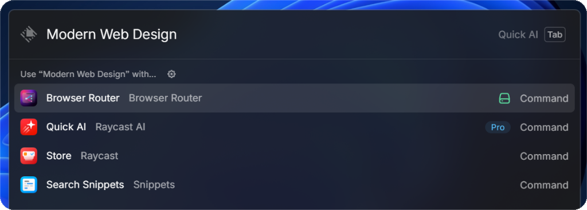
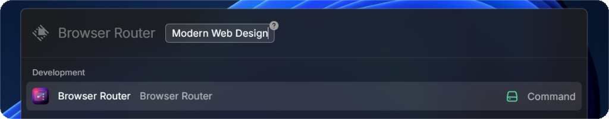
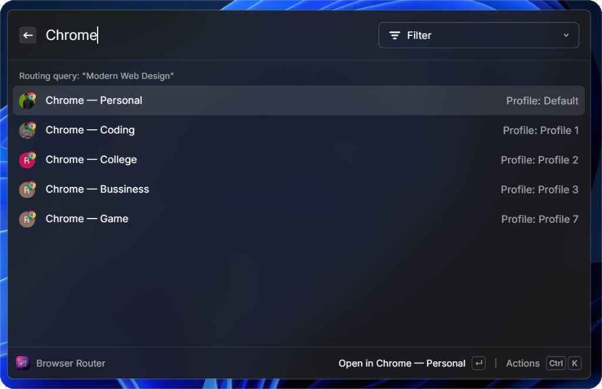
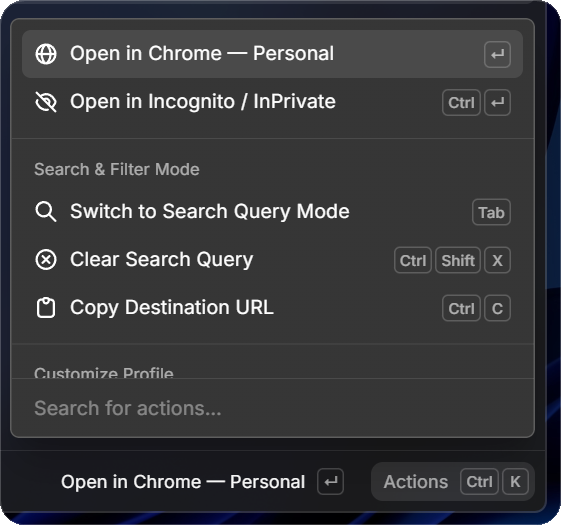
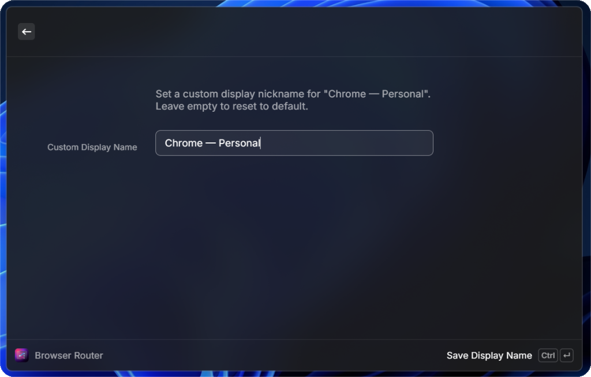
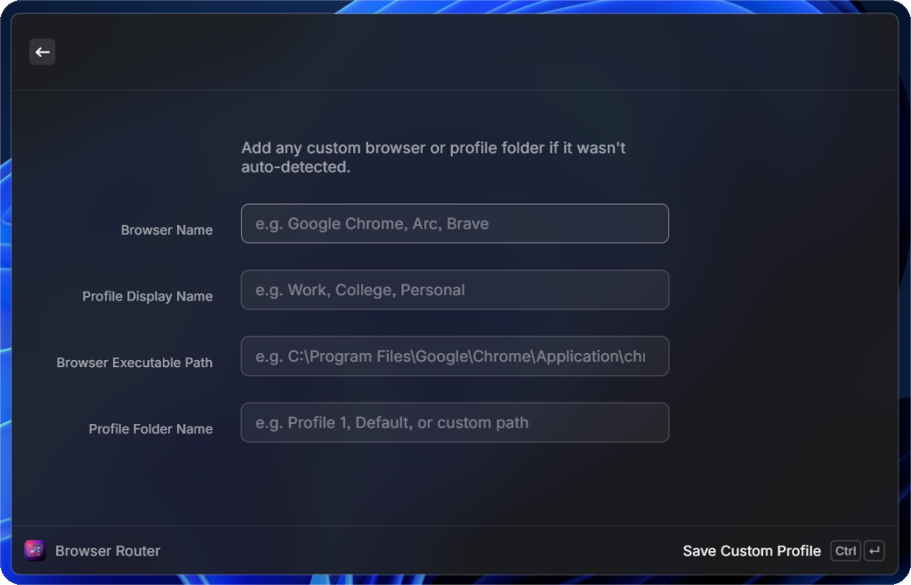
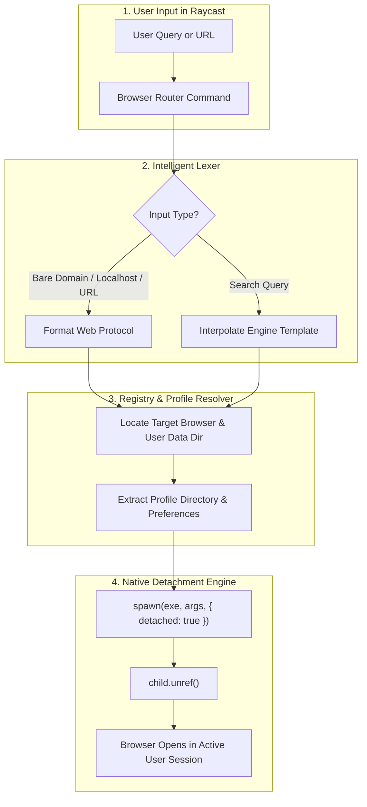

<div align="center">

  <a href="https://github.com/raghavg02/browser-router">
    
  </a>

  # Browser Router

  <p>
    <b>Intelligent, profile-aware browser & search engine router engineered for Windows desktop workflows in Raycast.</b>
  </p>

  <p>
    <a href="https://raycast.com"></a>
    <a href="https://microsoft.com/windows"></a>
    <a href="LICENSE"></a>
    <a href="https://www.typescriptlang.org/"></a>
    <a href="PRIVACY.md"></a>
  </p>

  <p>
    <a href="#about-the-project">About</a> •
    <a href="#key-features">Features</a> •
    <a href="#visual-showcase">Visual Tour</a> •
    <a href="#how-it-works-architecture">Architecture</a> •
    <a href="#keyboard-shortcuts">Shortcuts</a> •
    <a href="#getting-started">Getting Started</a> •
    <a href="#license">License</a>
  </p>

</div>

<br />

<details>
  <summary><b>📑 Table of Contents (Click to expand)</b></summary>
  <ol>
    <li><a href="#about-the-project">About The Project</a></li>
    <li><a href="#built-with">Built With</a></li>
    <li><a href="#key-features">Key Features</a></li>
    <li><a href="#visual-showcase">Visual Showcase</a></li>
    <li><a href="#how-it-works-architecture">How It Works (Architecture)</a>
      <ul>
        <li><a href="#1-escaping-the-windows-job-object-sandbox">Windows Job Object Detachment</a></li>
        <li><a href="#2-chromium-dual-argument-directory-targeting">Dual-Argument Directory Targeting</a></li>
        <li><a href="#3-registry--local-state-metadata-discovery">Registry & Local State Discovery</a></li>
        <li><a href="#4-zero-overhead-url--query-classification">Zero-Overhead Input Classification</a></li>
      </ul>
    </li>
    <li><a href="#supported-browsers">Supported Browsers</a></li>
    <li><a href="#keyboard-shortcuts">Keyboard Shortcuts</a></li>
    <li><a href="#getting-started">Getting Started</a></li>
    <li><a href="#privacy--security">Privacy & Security</a></li>
    <li><a href="#license">License</a></li>
  </ol>
</details>

<br />

---

## About The Project

On macOS, Raycast power users easily route links to specific browser profiles. On **Windows**, however, users face frustrating roadblocks:

* **System Default Lock-in**: Windows delegates all links strictly to your default browser, forcing you to manually copy-paste URLs across profiles.
* **Multi-Profile Chaos**: Developers, founders, and students juggle distinct profiles (*Personal*, *Work*, *Client Staging*, *College*). Switching between them requires opening the browser first, clicking the avatar menu, and navigating to the target account.
* **The Windows Sandbox / Isolation Bug**: Naive attempts to launch Chromium browsers with `--profile-directory` from within packaged Windows apps or node child processes run into Windows Job Object / AppContainer isolation. This opens browsers in **phantom/guest sessions where cookies, active logins, and sessions are lost**.

**Browser Router** solves all three problems with a **sub-35ms native detachment engine**, deep registry-driven profile detection, and an intelligent URL/query classification lexer.

<br />

---

## Built With

Browser Router is built with modern, lightweight, and type-safe technologies:

* [](https://developers.raycast.com/) — Native Windows desktop UI and action system
* [](https://www.typescriptlang.org/) — Type safety and robust data structures
* [](https://react.dev/) — Declarative component architecture
* [](https://nodejs.org/) — Libuv detached process spawning
* [](https://workers.cloudflare.com/) — Encrypted serverless edge relay for feedback

<br />

---

## Key Features

* ⚡ **Instant Native Dispatch (< 35ms)**  
  Launches browser profiles directly into the interactive Windows desktop session with zero perceptible delay.

* 🎯 **Dual-Mode Input Routing**  
  Seamlessly accepts queries from **Raycast Root Search** (press <kbd>Tab</kbd>) or acts as an automatic **Fallback Command**.

* 🔍 **Deep Profile & Avatar Auto-Discovery**  
  Scans the Windows Registry and parses browser metadata (`Local State`, `Preferences`) to discover profiles, display names, and profile pictures.

* 🌐 **Smart URL vs. Query Classification**  
  Differentiates between plain text searches, bare domains (`github.com`), and local dev servers (`localhost:3000`, `127.0.0.1:8080`).

* 🏷️ **Custom Profile Names & Portable Setups**  
  Assign custom nicknames (*"Stripe Staging"*, *"Personal"*) or connect custom browser executables and portable folders.

* 🎨 **Configurable Search Engines**  
  Switch between Google, DuckDuckGo, Brave Search, Bing, Perplexity, Ecosia, or specify a custom URL template with `%s`.

* 🔒 **100% Offline & Private**  
  No tracking, no analytics, no background services. Only voluntary in-app feedback uses an encrypted HTTPS edge relay.

<br />

---

## Visual Showcase

<table align="center" width="100%">
  <tr>
    <td align="center" width="50%">
      <h3>1. Root Search Fast Routing</h3>
      <p><i>Type your search query directly from Raycast Root Search with Tab-completion.</i></p>
      
    </td>
    <td align="center" width="50%">
      <h3>2. Intelligent Query & URL Lexing</h3>
      <p><i>Auto-detects localhost, dev ports, bare domains, and search queries.</i></p>
      
    </td>
  </tr>
  <tr>
    <td align="center" width="50%">
      <h3>3. Real-Time Profile Filtering</h3>
      <p><i>Filter profiles instantly by browser brand, account email, or nickname.</i></p>
      
    </td>
    <td align="center" width="50%">
      <h3>4. Power Action Panel</h3>
      <p><i>Instant access to profile renaming, custom setups, link copying, and feedback.</i></p>
      
    </td>
  </tr>
  <tr>
    <td align="center" width="50%">
      <h3>5. In-Place Profile Renaming</h3>
      <p><i>Assign clean labels without modifying browser preferences on disk.</i></p>
      
    </td>
    <td align="center" width="50%">
      <h3>6. Custom & Portable Setups</h3>
      <p><i>Add portable installations, custom directories, or Canary builds.</i></p>
      
    </td>
  </tr>
</table>

<br />

---

## How It Works (Architecture)

Browser Router is engineered specifically to overcome the constraints of Windows packaged desktop applications.



<br />

### 1. Escaping the Windows Job Object Sandbox
When an extension executes inside Raycast on Windows, child processes spawned via conventional APIs (`child_process.exec`, `open`, or `shell.openExternal`) inherit Raycast's parent process group and Windows Job Object boundaries.

Because modern Chromium browsers enforce single-instance IPC checks and DPAPI master key encryption based on interactive user desktop security tokens, running inside an inherited job container causes Chromium to fail to acquire write locks on profile SQLite databases (`Cookies`, `Web Data`, `Login Data`), opening a blank, unauthenticated session.

**The Solution:**
Browser Router uses low-level Libuv process detachment:
```typescript
const child = spawn(browserExePath, launchArgs, {
  detached: true,
  stdio: "ignore",
  windowsHide: false,
});
child.unref();
```
`detached: true` instructs Windows' `CreateProcessW` API to detach from the parent job tree. `child.unref()` immediately removes the child from Node's event loop. The Windows kernel attaches the browser process directly to the user's interactive Desktop session (Session ID 1), ensuring 100% authentic login persistence.

<br />

### 2. Chromium Dual-Argument Directory Targeting
Passing `--profile-directory="Profile 1"` alone is fragile on Windows. If Chromium is launched outside native shell associations, it defaults to the generic default user data root.

Browser Router dynamically detects and pairs the root user data directory with the profile folder:
```typescript
const launchArgs = [
  `--user-data-dir=${browser.userDataDir}`,
  `--profile-directory=${profile.directoryName}`,
  targetUrl,
];
```
This guarantees deterministic profile targeting across Chrome, Edge, Brave, Vivaldi, and Arc.

<br />

### 3. Registry & Local State Metadata Discovery
Rather than hardcoding filesystem paths, Browser Router inspects both Windows Registry hives:
* `HKCU\Software\Clients\StartMenuInternet` (Per-user installations)
* `HKLM\Software\Clients\StartMenuInternet` (System-wide installations)

It reads the registered shell command, extracts the executable binary, and parses:
* **`Local State`**: Extracts profile avatars, high-resolution badge icons, and Google/Microsoft account emails.
* **`Preferences`**: Inspects profile-level settings for custom user nicknames.

<br />

### 4. Zero-Overhead URL & Query Classification
An instantaneous regex-free tokenizer classifies user input in real time:
* **Full URLs**: Matches valid schemas (`https://`, `http://`, `raycast://`, `file://`).
* **Localhost & Ports**: Matches `localhost`, `127.0.0.1`, `::1`, and custom port bindings (`:3000`, `:8080`).
* **Bare Domains**: Identifies valid top-level domains (`.com`, `.dev`, `.ai`, `.org`, etc.) and automatically prepends `https://`.
* **Search Queries**: Cleanly URL-encodes multi-word queries into your chosen engine template.

<br />

---

## Supported Browsers

| Browser | Auto-Discovery | Multi-Profile | Custom Avatars | Windows Support |
| :--- | :---: | :---: | :---: | :---: |
| **Google Chrome** | ✅ | ✅ | ✅ | Win 10 / 11 |
| **Microsoft Edge** | ✅ | ✅ | ✅ | Win 10 / 11 |
| **Brave Browser** | ✅ | ✅ | ✅ | Win 10 / 11 |
| **Vivaldi** | ✅ | ✅ | ✅ | Win 10 / 11 |
| **Arc for Windows** | ✅ | ✅ | ✅ | Win 11 |
| **Mozilla Firefox** | ✅ | ✅ | ❌ | Win 10 / 11 |
| **Opera & Opera GX** | ✅ | ⚠️ | ❌ | Win 10 / 11 |
| **Custom / Portable** | ✅ | ✅ | ✅ | Win 10 / 11 |

<br />

---

## Keyboard Shortcuts

| Shortcut | Action | Scope |
| :--- | :--- | :--- |
| <kbd>↵ Enter</kbd> | **Launch in Selected Browser & Profile** | Profile List |
| <kbd>Ctrl</kbd> + <kbd>↵ Enter</kbd> | **Open in Incognito / InPrivate** | Profile List |
| <kbd>Tab</kbd> | **Toggle Filter / Search Query Mode** | Profile List |
| <kbd>Ctrl</kbd> + <kbd>F</kbd> | **Pin / Unpin Favorite Profile** | Profile Item |
| <kbd>Ctrl</kbd> + <kbd>E</kbd> | **Rename Profile (Local Nickname)** | Profile Item |
| <kbd>Ctrl</kbd> + <kbd>N</kbd> | **Add Custom Profile / Portable Browser** | Profile List |
| <kbd>Ctrl</kbd> + <kbd>Backspace</kbd> | **Delete Custom Profile** | Custom Item |
| <kbd>Ctrl</kbd> + <kbd>H</kbd> | **Open User Manual & Guide** | Global |
| <kbd>Ctrl</kbd> + <kbd>Shift</kbd> + <kbd>F</kbd> | **Send Feedback / Report Bug** | Global |
| <kbd>Ctrl</kbd> + <kbd>Shift</kbd> + <kbd>X</kbd> | **Clear Active Search Query** | Profile List |
| <kbd>Ctrl</kbd> + <kbd>C</kbd> | **Copy Target Destination URL** | Profile Item |
| <kbd>Ctrl</kbd> + <kbd>R</kbd> | **Refresh Browsers & Profiles** | Global |
| <kbd>Ctrl</kbd> + <kbd>,</kbd> | **Open Extension Preferences** | Global |

<br />

---

## Getting Started

### Installation via Raycast Store
Search for **Browser Router** in the Raycast Store and click **Install Extension**.

### Local Development Setup
1. **Clone the repository:**
   ```bash
   git clone https://github.com/raghavg02/browser-router.git
   cd browser-router
   ```

2. **Install dependencies:**
   ```bash
   npm install
   ```

3. **Start developer mode:**
   ```bash
   npm run dev
   ```

4. **Verify quality & linting:**
   ```bash
   npm run lint        # Validates package.json, icons, metadata, ESLint, Prettier
   npm run fix-lint    # Auto-fixes any formatting inconsistencies
   npm run build       # Creates production bundle
   ```

<br />

---

## Privacy & Security

* **Zero Telemetry**: Browser Router collects no telemetry, metrics, or analytics.
* **No Access to Sensitive Data**: Never accesses browsing history, saved passwords, cookies, or DPAPI master keys.
* **100% On-Device Operation**: All detection and routing occur strictly on your local PC.
* Read our full [Privacy Policy](PRIVACY.md) and [Security Policy](SECURITY.md).

<br />

---

## License

Distributed under the MIT License. See [LICENSE](LICENSE) for more information.

Copyright (c) 2026 **Raghav Gupta**. All rights reserved.
