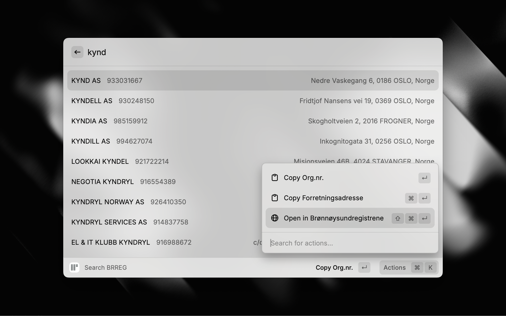

# Brreg (Norwegian Company Register) Raycast Extension

Search and retrieve information about Norwegian companies (Enhetsregisteret) directly from the Raycast command bar. The extension uses the official [Brønnøysund Register Center (Brreg)](https://www.brreg.no) API to find companies by name or organisation number.

## Features

- **Search by Name**: Type any part of a company's name to view matching results from Brreg.
- **Search by Organisasjonsnummer**: Type a 9-digit organisation number to retrieve an exact match.
- **Partial Numeric Search**: If you type fewer than 9 digits, the extension can optionally use Brreg's full-text search (`q` param) to show partial matches.
- **Copy Data**: Copy the organisation number or address with a single action.
- **Open in Browser**: Quickly jump to the company's details page in the Brønnøysund Register website.
- **Favorites**: Save companies to a favorites list that appears above your search results. Revisit them instantly, copy details, or open them in the browser. Favorites are stored locally and persist across sessions.
- **Detailed Company View**: View comprehensive company information including contact details, financial data, and location information.
- **Financial Data**: Access key financial metrics including revenue, EBITDA, operating result, net result, total assets, equity, total debt, and depreciation.
- **Interactive Tabs**: Navigate between Overview, Financials, and Map tabs in the company details view.
- **Map Integration**: View company location on OpenStreetMap tiles with directions to Google Maps.
- **Proff Integration**: Quick access to Proff.no company profiles for additional business information.
- **Favicon Support**: Automatic favicon detection and display for company websites in favorites.
- **Custom Emojis**: Personalize favorites with custom emojis or choose from predefined categories.
- **Favorites Reordering**: Move favorites up and down to organize them in your preferred order.
- **Keyboard Shortcuts**: Quick actions with keyboard shortcuts for common operations.
- **Address Formatting**: Clean, formatted display of business addresses.
- **VAT and Audit Status**: Quick indicators for VAT registration and audit status.
- **Employee Count**: View company size information when available.
- **Industry Classification**: NACE codes and industry categorization.
- **Company Description**: View stated business purpose and activities.
- **Financial History**: Access to historical financial data across multiple years.
- **Last Filing Date**: Track when companies last submitted their accounts.
- **Welcome Messages**: Helpful onboarding messages and instructions for new users.
- **User Settings**: Customizable preferences including welcome message display and performance monitoring.
- **Keyboard Shortcuts Help**: Comprehensive guide to all available keyboard shortcuts.
- **Performance Monitoring**: Development tools for monitoring component performance.

## Favorites

- **Add a favorite**: Select a company in the results and choose "Add to Favorites" from the action panel.
- **Remove a favorite**: Select it from the Favorites section and choose "Remove from Favorites" (shortcut: `⌘⇧F`).
- **Customize with emojis**: Choose from predefined emoji categories (⭐ Star, 🏦 Bank, 📈 Growth, 🧪 Test, 🛍️ Retail, 🧑‍💻 Tech, 🏗️ Construction, 🏥 Health, 🍽️ Food, ⚙️ Industry) or set custom emojis.
- **Reorder favorites**: Move favorites up and down to organize them in your preferred order using the "Move Up" (⌘↑) and "Move Down" (⌘↓) actions.
- **Automatic favicon detection**: Company website favicons are automatically detected and displayed for visual identification.
- **Refresh favicons**: Update favicon information for companies whose websites may have changed.
- **Emoji management**: Reset to favicon, clear custom emojis, or set new ones at any time.
- Favorites appear in a dedicated section above the search results and are stored locally on your device.

## User Experience Features

- **Welcome Messages**: When you first open the extension with no favorites, you'll see helpful welcome messages and quick tips to get started.
- **User Settings**: Access settings by clicking on the welcome message to customize your experience:
  - Toggle welcome message display
  - Set default search type preferences
  - Configure maximum search results
  - Enable/disable move indicators
  - Toggle performance monitoring
- **Keyboard Shortcuts Help**: Comprehensive guide accessible from the welcome section showing all available shortcuts.

## Company Details View

The extension provides a comprehensive company details view with three interactive tabs:

- **Overview Tab**: Company description, contact information, key KPIs, employee count, and basic business details.
- **Financials Tab**: Detailed financial metrics including revenue, EBITDA, operating result, net result, total assets, equity, total debt, and depreciation.
- **Map Tab**: Company location visualization using OpenStreetMap tiles with quick access to Google Maps directions.

## Keyboard Shortcuts

- **⌘F**: Add company to favorites
- **⌘⇧F**: Remove company from favorites  
- **⌘O**: Copy organization number
- **⌘⇧Enter**: Open company in Brønnøysundregistrene
- **⌘⇧↑**: Move favorite up in list
- **⌘⇧↓**: Move favorite down in list
- **⌘1**: Switch to Overview tab
- **⌘2**: Switch to Financials tab
- **⌘3**: Switch to Map tab
- **⌘←**: Go back from company details
- **Backspace**: Navigate to previous tab
- **⌘⇧M**: Toggle move mode for favorites
- **⌘⇧**: Hold to show move indicators (for favorites reordering)

## Requirements

- **No credentials or API keys** are required. Brreg provides open, free access to its Enhetsregisteret endpoints.
- **Map functionality** uses free OpenStreetMap services (Nominatim for geocoding, tiles for map display).
- **Directions** link to Google Maps without requiring an API key.

## Privacy & Data Usage

- No user credentials or passwords are required by this extension.
- The extension sends your search query (name or number) to the public Brreg API to retrieve matching entities.
- All information collected from the user is used solely to connect to Brreg and improve the extension’s response.
- We do not store, share, or process personal data outside of fulfilling these requests.

Made with 🫶 by [kynd](https://kynd.no)
