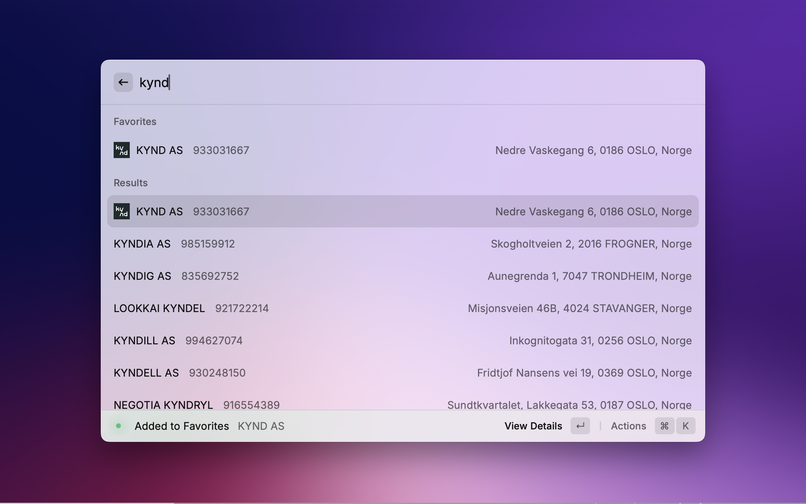

# Brreg (Norwegian Company Register) Raycast Extension

Search and retrieve information about Norwegian companies (Enhetsregisteret) directly from the Raycast command bar. The extension uses the official [Brønnøysund Register Center (Brreg)](https://www.brreg.no) API to find companies by name or organisation number.

## Features

- **Search & Retrieval**
  - Search by company name or 9-digit organisation number
  - Partial numeric search with full-text fallback
  - Copy organisation number or address with single actions
  - Open companies directly in Brønnøysund Register website

- **Favorites Management**
  - Save companies to a persistent local favorites list
  - Customize with emojis from predefined categories or custom options
  - Reorder favorites to organize them in preferred order
  - Automatic favicon detection for company websites
  - Favorites appear above search results and are hidden while typing

- **Company Details View**
  - **Overview Tab**: Company description, contact information, key KPIs, employee count, and basic business details
  - **Financials Tab**: Revenue, EBITDA, operating result, net result, total assets, equity, total debt, and depreciation
  - **Map Tab**: Company location visualization using OpenStreetMap tiles with Google Maps directions

- **Business Intelligence**
  - VAT and audit status indicators
  - Industry classification with NACE codes
  - Financial history across multiple years
  - Last filing date tracking
  - Employee count and company size information

- **User Experience**
  - Welcome messages for new users
  - Comprehensive keyboard shortcuts guide
  - Interactive tab navigation
  - Proff.no integration for additional business information

## Favorites

Favorites provide quick access to your most-used companies. They appear above search results and are stored locally on your device.

### Managing Favorites
- **Add/Remove**: Use `⌘F` to add a company to favorites, `⌘⇧F` to remove it. Works from both search results and detailed company view.
- **Customize with Emojis**: Choose from predefined categories (⭐ Star, 🏦 Bank, 📈 Growth, 🧪 Test, 🛍️ Retail, 🧑‍💻 Tech, 🏗️ Construction, 🏥 Health, 🍽️ Food, ⚙️ Industry) or set custom emojis.
- **Reorder**: Move favorites up and down using `⌘⇧↑` and `⌘⇧↓` to organize them in your preferred order.
- **Automatic Favicon Detection**: Company website favicons are automatically detected and displayed for visual identification.
- **Refresh Favicons**: Update favicon information for companies whose websites may have changed.

## User Experience Features

- **Welcome Messages**: When you first open the extension with no favorites, you'll see helpful welcome messages and quick tips to get started.
- **Keyboard Shortcuts Help**: Comprehensive guide accessible from any view via the action menu and from the welcome screen.

## Company Details View

The extension provides a comprehensive company details view with three interactive tabs:

- **Overview Tab**: Company description, contact information, key KPIs, employee count, and basic business details.
- **Financials Tab**: Detailed financial metrics including revenue, EBITDA, operating result, net result, total assets, equity, total debt, and depreciation.
- **Map Tab**: Company location visualization using OpenStreetMap tiles with quick access to Google Maps directions.

## Keyboard Shortcuts

- **⌘F**: Add/Remove company from favorites
- **⌘O**: Copy organization number
- **⌘B**: Copy business address
- **⌘⇧R**: Copy revenue
- **⌘⇧N**: Copy net result
- **⌘⇧Enter**: Open company in Brønnøysundregistrene
- **⌘⇧↑**: Move favorite up in list
- **⌘⇧↓**: Move favorite down in list
- **⌘1**: Switch to Overview tab
- **⌘2**: Switch to Financials tab
- **⌘3**: Switch to Map tab
- **⌘←**: Go back from company details
- **⌘⇧M**: Toggle move mode for favorites
- **⌘⇧**: Hold to show move indicators (for favorites reordering)

## Feedback

- Feature requests and issues: https://github.com/kyndig/brreg-search

## Requirements

- **No credentials or API keys** are required. Brreg provides open, free access to its Enhetsregisteret endpoints.
- **Map functionality** uses free OpenStreetMap services (Nominatim for geocoding, tiles for map display).
- **Directions** link to Google Maps without requiring an API key.

## Privacy & Data Usage

- No user credentials or passwords are required by this extension.
- The extension sends your search query (name or number) to the public Brreg API to retrieve matching entities.
- All information collected from the user is used solely to connect to Brreg and improve the extension's response.
- We do not store, share, or process personal data outside of fulfilling these requests.

Made with 🫶 by [kynd](https://kynd.no)
