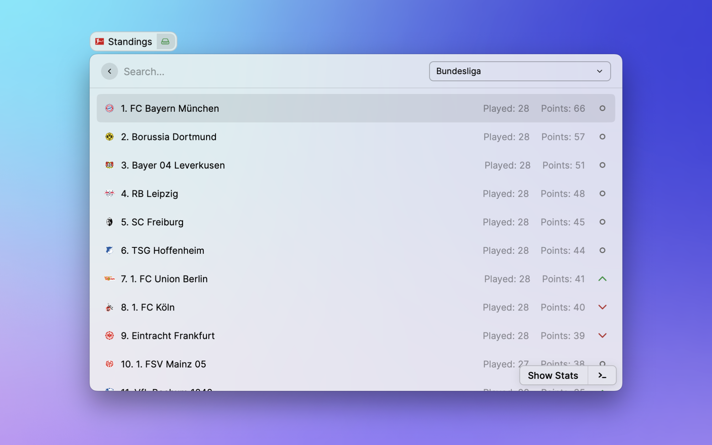

  

  
</p

The latest news, info and stats for clubs in 2021-2022 can be found in [Raycast](https://raycast.com/)

## Issues

[Track here](https://github.com/anhthang/raycast-bundesliga/issues) or create an issue.
