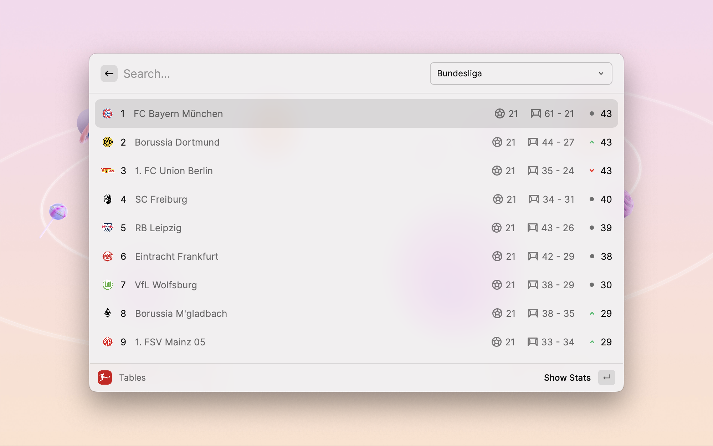

  <h1 align="center">Bundesliga</h1>

Stay up-to-date with the latest news, fixtures, results, and standings from the Bundesliga.

**Bundesliga** is an extension designed to provide a comprehensive and convenient experience for Bundesliga fans. It offers a range of features, including:

* **Club Information:** Detailed profiles of Bundesliga clubs, including their history, recent results, and key players.
* **Fixtures & Results:** Up-to-date schedules and results for all Bundesliga matches.
* **Standings:** Live standings of the Bundesliga table.
* **Broadcast Information:** Details on where to watch Bundesliga matches in your region.
* **Buy Ticket Feature:** Direct access to purchase tickets for upcoming matches.

With the Bundesliga Extension, you can easily stay informed about your favorite teams and never miss a match.

## Issues

Report bugs or suggest improvements by creating an issue [here](https://github.com/anhthang/raycast-bundesliga/issues).
