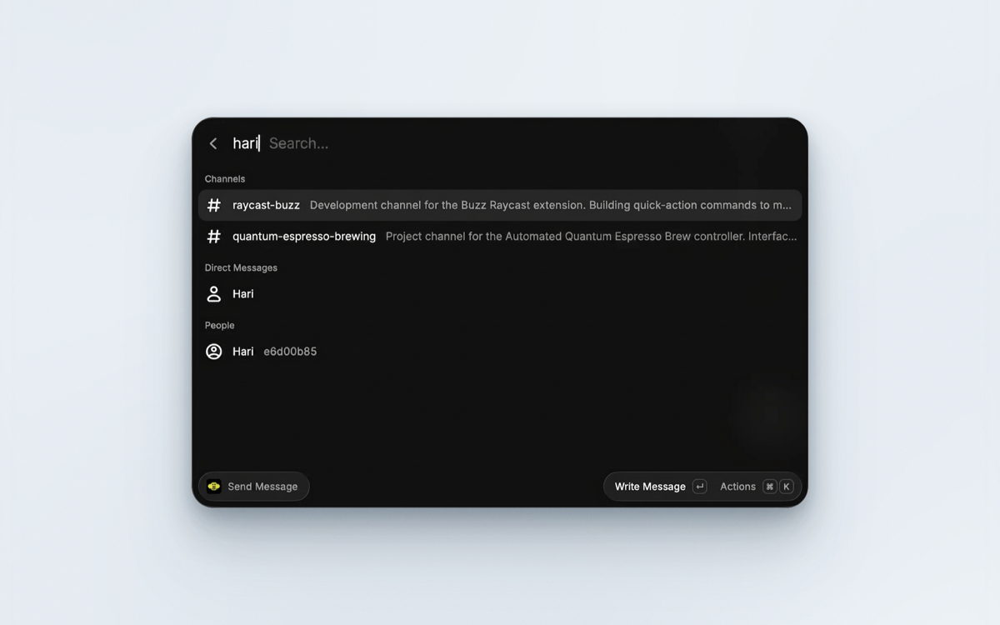
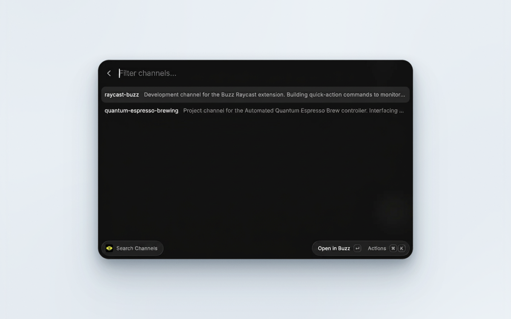
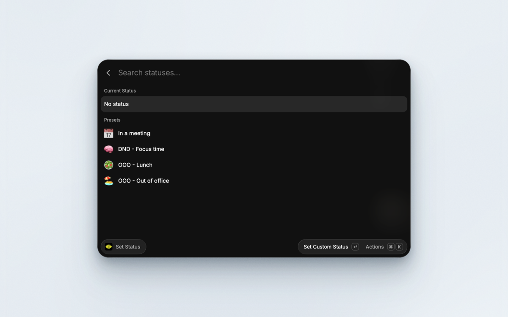

# Buzz for Raycast


Browse channels, search messages, post, send direct messages, react, and set your status in [Buzz](https://buzz.xyz/) directly from your command bar.



Buzz is a self-hostable workspace where humans and agents build together, on a relay you own. It is architecturally a Nostr relay, so every action is a cryptographically signed event. This extension signs each request locally and talks to your relay over its authenticated HTTP bridge, so it needs no CLI or other binary installed to reach the relay. Opening a message or channel in the Buzz app, naturally, does require the Buzz desktop app to be installed.

## Features

- Browse every channel on your relay and drill into its recent messages
- Full-text search across the channels you can access
- Open a message or a channel straight in the Buzz app
- Post a message to any channel, an existing direct-message conversation, or a person or agent you find by name, without leaving Raycast
- React to a message with a NIP-25 like
- Set your user status from a list of reusable presets, or type a custom one, with an optional emoji
- Requests signed locally with NIP-98; your private key never leaves your machine

## Commands

| Command           | Description                                                                                                                                                 |
| ----------------- | ----------------------------------------------------------------------------------------------------------------------------------------------------------- |
| `Search Channels` | Open a channel in Buzz, drill into its messages (root messages only, each showing its reply count, matching the Buzz app) to read and react, or copy its id |
| `Search Messages` | Full-text search across the channels you can access, and open a hit in Buzz                                                                                 |
| `Send Message`    | Post a message to a channel, an existing conversation, or a person or agent found by name                                                                   |
| `Set Status`      | View your current status, apply or manage reusable presets, or set a custom one                                                                             |

### Search Channels

Every channel on your relay, with Open in Buzz on Enter.



### Set Status

Your current status, and reusable presets you can apply in two keystrokes.



## Setup

You need a Buzz relay you can reach and a Nostr private key authorized on it. Both are configured once, in the extension's preferences.

| Preference    | Value                                                                                             |
| ------------- | ------------------------------------------------------------------------------------------------- |
| `Relay URL`   | Your relay's base URL, e.g. `https://relay.example.com`. A `wss://` URL is accepted and converted |
| `Private Key` | Your Nostr secret key, either `nsec1...` or 64-character hex. Same value as `BUZZ_PRIVATE_KEY`    |

If either is missing or malformed, every command says so and offers a shortcut straight to the preferences screen.

## About your private key

Your key is stored by Raycast as a password preference and is never transmitted anywhere except as a signature.

- The extension signs each request locally (NIP-98) and sends only the resulting signature. The key itself never leaves your machine.
- No error message produced by the extension includes your key or the body of a request, so a toast or a copied error cannot leak it.
- There is no telemetry and no third-party service. The only host contacted is the relay URL you configure.

## Requirements and limits

This version speaks to the relay over HTTP only, which covers everything the commands above need, including direct messages: on Buzz a direct message is a private channel rather than an end-to-end encrypted envelope, so opening one and sending into it both work over the same authenticated HTTP bridge as everything else. Privacy for a direct message is enforced by the relay's access control, not by encryption, so the relay itself can read the content of your messages.

The following require an authenticated WebSocket connection (NIP-42) and are not available yet:

- Presence, which the relay accepts only over WebSocket
- A live or menu bar feed, and unread tracking

## Getting Started

### Raycast Store

Install directly from the [Raycast Store](https://www.raycast.com/caasols/buzz).

### Manual

```bash
git clone https://github.com/caasols/raycast-buzz.git
cd raycast-buzz
npm install && npm run dev
```

### Development

Other useful scripts:

```bash
npm test               # unit and component tests
npm run test:coverage  # the same, with a coverage report
npm run typecheck      # extension and test projects
npm run lint
npm run build
```

There is also an end-to-end smoke test that runs against a real relay. It lists channels, posts a marker message, reads it back, reacts to it, and round-trips a status (with an emoji) through set/get/clear, so point it at a workspace where that is acceptable:

```bash
BUZZ_RELAY_URL=https://relay.example.com BUZZ_PRIVATE_KEY=nsec1... npm run smoke
```

Set `BUZZ_SMOKE_DM_PUBKEY` as well to also exercise the direct-message path (opening a conversation, confirming it is idempotent, and confirming it is listed). That publishes a real event the other party will see, so it is opt-in rather than automatic. Use somebody else's pubkey, or one belonging to an agent you own: pointing it at your own pubkey makes the relay answer with a 500, since a conversation whose only participant is yourself is a case it does not handle.

## Contributing

Issues and pull requests are welcome. Please open a discussion if you plan to work on a larger change so we can align on the approach.

## Support

If this extension saves you time:

- Star the [GitHub repository](https://github.com/caasols/raycast-buzz)
- Share it with coworkers who live in their command bar
- Report bugs or enhancements via GitHub issues

## License

Released under the [MIT License](./LICENSE).
