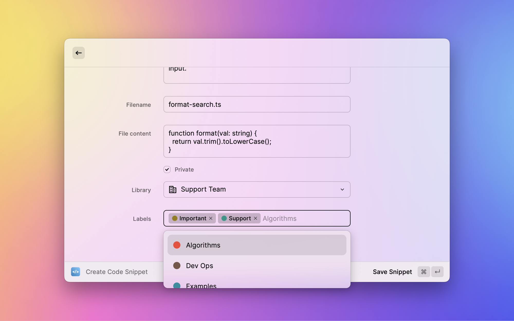

  
  <h1 align="center">Cacher Extension for Raycast</h1>

## About Cacher

[Cacher](https://cacher.io) is a cross-platform, cloud-based app used to curate a snippet library for you and your team. This extension lets you quickly create and insert personal/team snippets using the [Raycast](https://www.raycast.com) launcher.

## Getting Started

1. [Click here](https://app.cacher.io/enter?action=view_api_creds) to view your Cacher API credentials.
2. Fill in the **API Key** and **API Token** fields for the Cacher Raycast extension.
3. Once you're signed into Cacher, you can trigger the **Search Code Snippets** and **Create Code Snippet** commands from Raycast.

## Extension Commands

### 🔍 Search Code Snippets

Search Cacher snippets across your personal and team libraries with support for filtering by labels. Easily copy/paste or insert code into your editor.

### ✏️ Create Code Snippet

Quickly create snippets for personal or team use.

## Support

Need help? Send us a [support request](https://support.cacher.io/hc/en-us/requests/new?subject=Raycast).
