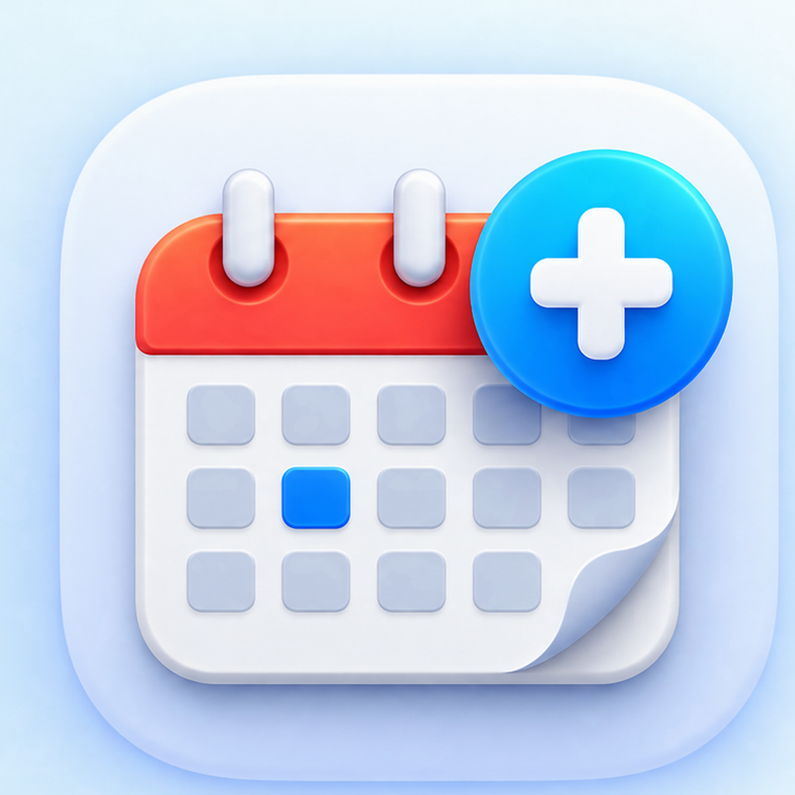

# DayCal

<p align="center">
  
</p>

**DayCal** is a Google Calendar extension for [Raycast](https://www.raycast.com/) with a fast Schedule view, a persistent menu-bar calendar, natural-language Quick Add, event editing, calendar routing, and account-aware setup.

> **Beta:** DayCal is under active testing and is not yet published in the Raycast Store.

**Official website:** [DayCal](https://daycal.co.uk/) is the new public website and product name. The repository and extension identifiers are unchanged. See [website maintenance and domain setup](WEBSITE.md).

**Privacy & security:** [Privacy Policy](PRIVACY.md) · [Security Policy](SECURITY.md)

**Support:** [support@daycal.co.uk](mailto:support@daycal.co.uk)

## Highlights

- **Schedule** — browse upcoming Google Calendar events without Apple Calendar.
- **Menu Bar** — keep current and upcoming events one click away.
- **Quick Add** — create Personal, Work, and Shared / Partner events with compact natural-language input.
- **Event management** — edit, move, copy, delete, join meetings, and open locations when permissions allow.
- **True all-day events** — create and edit Google all-day events without converting them into fake midnight events.
- **Independent calendar sets** — choose different calendars for Schedule and the Menu Bar.
- **Guided setup** — map Personal, Work, Shared / Partner, and Family roles after signing in.
- **Multiple Google accounts** — role mappings and calendar selections stay scoped to the connected account.
- **Native Google sign-in** — no downloaded client-secret file or Terminal OAuth helper is required.
- **Smart Status** — the menu-bar headline describes the events DayCal is currently showing without claiming visibility into calendars you excluded.

DayCal reads and writes Google Calendar directly. **Apple Calendar is not used.**

## Beta installation

### Requirements

- macOS
- Raycast
- Node.js / npm
- a Google account with Google Calendar

### Install from source

```bash
git clone https://github.com/JonahTweed/CalFlow.git
cd CalFlow
npm install
npm run dev
```

Raycast will load the local extension.

Open **Schedule** or explicitly launch **Calendar Menu Bar**. On first use:

1. sign in to Google through Raycast;
2. DayCal opens **Set Up Calendars** for the connected account if setup is incomplete;
3. complete the three-step setup, including choosing independent calendar sets for Schedule and the Menu Bar.

Automatic/background Menu Bar launches stay quiet when setup is incomplete. The dropdown keeps a **Set Up Calendars** action so you can finish when ready; background refreshes do not open the setup wizard.

If Google sign-in fails during the beta, please report it through GitHub Issues. DayCal’s Google OAuth verification is approved for the requested sensitive Calendar scope, so new users should not see Google’s unverified-app warning.

## Main commands

| Command | Purpose |
| --- | --- |
| **Schedule** | View and manage upcoming events |
| **Calendar Menu Bar** | Show current/upcoming events in the macOS menu bar |
| **Enabled Calendars** | Choose independent Schedule and Menu Bar calendar sets |
| **Calendar Settings** | Configure filtering, event count, date format, and row layout |
| **Set up Calendars** | Assign Personal, Work, Shared / Partner, and Family roles |
| **Add Personal Event** | Quick Add to the Personal role |
| **Add Work Event** | Quick Add to the Work role |
| **Add Shared Event** | Quick Add to the Shared / Partner role |
| **Disconnect Google Account** | Sign out locally and choose whether to keep or delete that account’s saved DayCal setup |


## Suggested hotkeys

These are optional Raycast hotkeys:

| Command | Suggested hotkey |
| --- | --- |
| Schedule | `⌃⌥S` |
| Add Personal Event | `⌃⌥P` |
| Add Work Event | `⌃⌥W` |
| Add Shared Event | `⌃⌥J` |

Configure them in **Raycast Settings → Extensions → DayCal**.

## Quick Add examples

```text
tomorrow 7pm
Friday 12pm
next Friday
15/09 7pm
45m @ Home
Friday 3d
Zoom
https://example.com/meeting
```

DayCal supports UK (`DD/MM/YYYY`) and US (`MM/DD/YYYY`) date modes from Calendar Settings.

## Opening events and calendars

**Open Event / Open in Google Calendar** opens the exact event in your default browser for the connected Google account, including secondary accounts, from Schedule, Next Up, Edit Event, and the menu bar. Sign in to that account in your browser if prompted. If Google supplies no event link, the existing fallback opens the event day rather than a specific event.

**Open Calendar** in the menu bar also uses your default browser, opening the calendar view for the currently connected Google account. It resolves the account when clicked, even if no events are visible.

## Event permissions

DayCal deliberately treats owned events and invitations differently.

Owned events can expose actions such as Edit, Move, and Delete. Guest/invited events use safer actions such as Copy to Calendar and do not receive destructive owner-style actions where Google does not indicate ownership.

In the Menu Bar event submenu, ordinary writable one-off events keep **Move to Calendar…** where supported. Ordinary writable recurring events offer **Copy to Calendar…** in that slot instead. Existing **Join Meeting** and **Open Location** shortcuts take precedence when present. When Copy is promoted, it is omitted from that submenu’s **More Actions…** view; other entry points retain it. Read-only, guest, and special events expose only their supported actions.

## Privacy and authentication

See the full [Privacy Policy](PRIVACY.md) and [Security Policy](SECURITY.md).

DayCal uses Raycast's native Google OAuth support and requests:

- `calendar.events` — read and manage calendar events;
- `calendar.calendarlist.readonly` — read the user's calendar list, colours, and access roles.

OAuth tokens are managed by Raycast. The repository contains the OAuth **client ID**, which is public by design, but contains no client secret, refresh token, or access token.

DayCal stores extension preferences and account-scoped calendar configuration locally through Raycast. The persistent Menu Bar also uses a local Raycast cache of upcoming event data so it can render quickly without contacting Google on every click. DayCal does not operate a backend server that receives this calendar data.

DayCal does not use calendar data for advertising, tracking, analytics, data brokerage, or training generalized AI/ML models.

## Known beta limitations

- Raycast's native DatePicker free-text suggestion parser can reject or inconsistently interpret some abbreviated phrases. DayCal validates Start/End relationships and preserves event duration when Start moves past End, but does not replace Raycast's DatePicker parser.
- Timed events and all-day events can both be edited in Raycast, but DayCal intentionally does **not** convert timed events into all-day events or vice versa yet.
- Moving recurring events is not supported; use **Copy to Calendar…** where offered.
- DayCal is currently macOS-only.

## Internal compatibility note

The Raycast manifest `name` and some local-storage/cache namespaces still use the legacy `calendar-shortcuts` identifier. That is intentional for this beta so existing tested installations keep their local state while the public-facing product is branded **DayCal**.

## Testing

```bash
npm test
npx tsc --noEmit
```

The `npm test` suite covers parsing, calendar routing, refresh wiring, onboarding and setup persistence, Smart Status, menu-row compaction/truncation, event opening, DayCal branding, disconnect/reset behaviour, and Edit Event saving. Onboarding coverage distinguishes explicit and background Menu Bar launches, completed setup, stale snapshots, failed redirects, and routing-keyword normalization. Disconnect coverage checks Keep Settings versus Delete Settings, fresh reconnect behaviour, and account isolation. Edit coverage protects the Save flow used from Schedule and Menu Bar entry points. Menu submenu coverage checks Move/Copy placement, recurring and restricted events, existing meeting/location shortcuts, and duplicate Copy suppression. Event-opening coverage checks account-aware event and calendar-view URLs, default-browser routing, and account lookup failures.

These checks include source contracts and executed UI logic with mocked Raycast boundaries; they do not replace local Raycast runtime verification.


## Reporting beta issues

Please use [GitHub Issues](https://github.com/JonahTweed/CalFlow/issues).

Useful bug reports include:

- what you expected;
- what happened instead;
- which DayCal command you were using;
- whether the event was timed or all-day;
- whether the calendar was owned, shared, or read-only;
- screenshots or a short screen recording where helpful.

**Do not post OAuth tokens, client-secret files, private calendar links, or other credentials in an issue.**

## Development principles

The project currently follows a deliberately conservative workflow:

1. one logical change at a time;
2. runtime-test the affected Raycast surface;
3. run `npm test`;
4. run `npx tsc --noEmit`;
5. checkpoint known-good builds before the next change.

This is intentional: calendar data and long-running menu-bar workers deserve cautious changes.

## License

MIT
