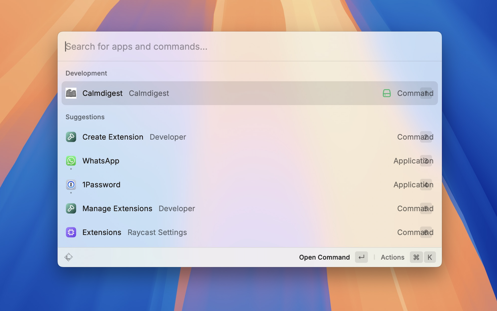
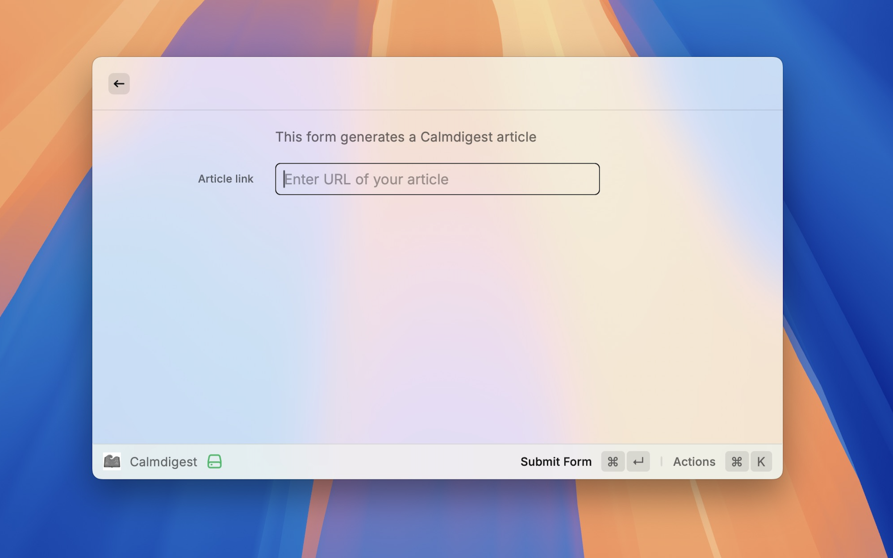
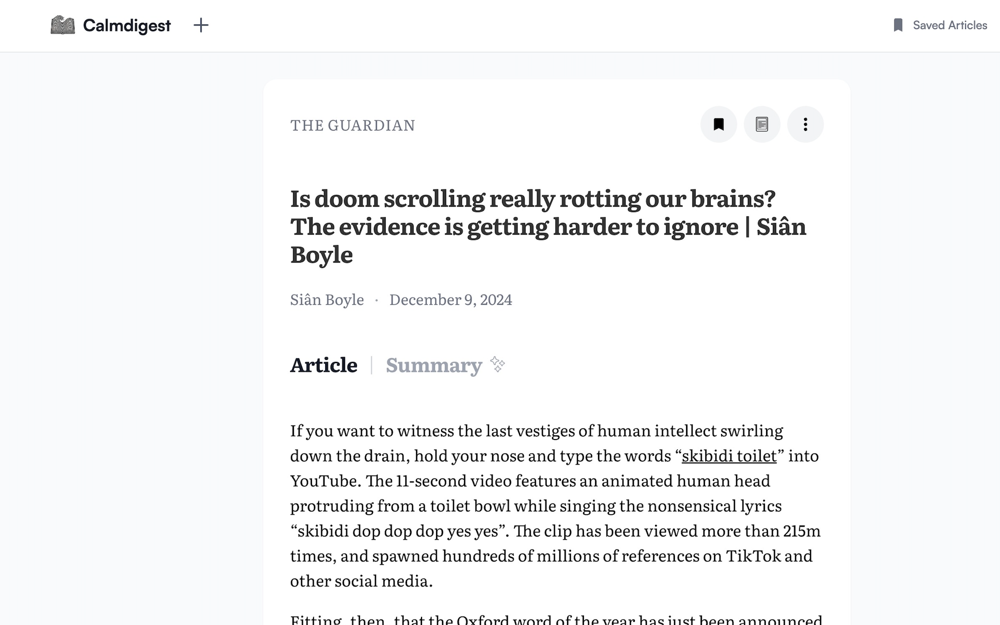

# Calmdigest

Calmdigest is a [Raycast](https://www.raycast.com/) extension that generates a Calmdigest article ready to be sent to your Kindle. This extension allows you to quickly access the [Calmdigest](https://calmdigest.com/) site which converts any article link into a format suitable for reading on your Kindle device.

## Features

### Generate a Calmdigest article from a given URL

Straight from your command bar, generate a Calmdigest article from a given URL you can send to your kindle in seconds.





## Installation

1. Clone the repository or download the source code.
2. Navigate to the project directory.
3. Install the dependencies using `npm`:

   ```sh
   npm install
   ```

## Development

To start developing the extension, run the following command:

```sh
npm run dev
```

This will start the development mode, allowing you to make changes and see them in real-time.

## Usage

1. Open Raycast.
2. Search for the calmdigest command.
3. Enter the URL of the article you want to convert.
4. Submit the form to generate the Calmdigest article.
