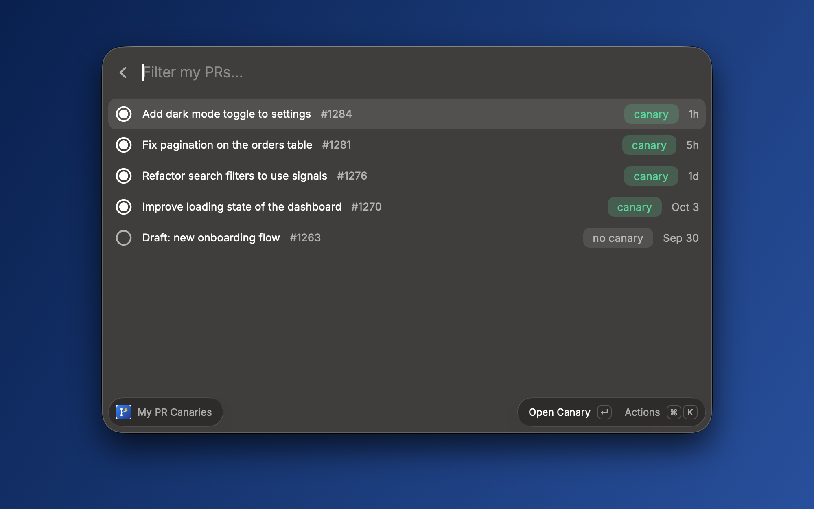
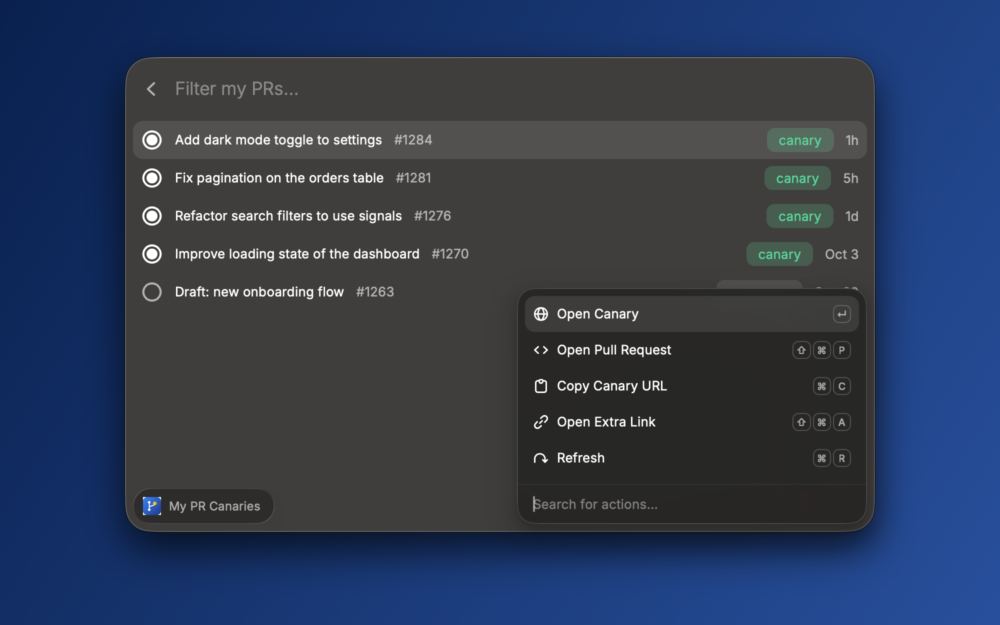

# PR Canary

Lists your open GitHub pull requests and opens the preview environment ("canary") that your CI posts as a PR comment, with the arrow keys and Enter.

## Requirements

- A GitHub account with access to the repository.
- A CI job that comments the preview URL on the pull request.

The extension reads your pull requests and their comments through the GitHub API. On first run it asks you to sign in with GitHub (`repo` and `read:org` scopes). If your organization restricts third-party OAuth apps, set a **Personal Access Token** instead (see below).

## Setup

| Preference                | Description                                                                                                                                                                   |
| ------------------------- | ----------------------------------------------------------------------------------------------------------------------------------------------------------------------------- |
| **Repository**            | The GitHub repository, as `owner/name`.                                                                                                                                       |
| **Canary URL Prefix**     | Opens the newest URL in a PR comment that starts with this prefix, e.g. `https://dashboard.`. Leave empty to use the URL that follows a label such as `Canary available at:`. |
| **Extra Link URL Prefix** | Optional. A second link to pull from the same comments, e.g. your deploy dashboard.                                                                                           |
| **Personal Access Token** | Optional. Used instead of the GitHub sign-in. Needs read access to pull requests (classic tokens: `repo`). Stored in Raycast's preferences.                                   |

## Actions

Press ⌘K on a pull request to see them all.

| Action            | Shortcut |
| ----------------- | -------- |
| Open Canary       | ↵        |
| Open Pull Request | ⌘⇧P      |
| Copy Canary URL   | ⌘C       |
| Open Extra Link   | ⌘⇧A      |
| Refresh           | ⌘R       |

## Troubleshooting

- **"…is not visible" error:** the token can't see the repository. Check the repository name. If GitHub's message mentions SAML enforcement, authorize the token for your organization (GitHub → Settings → Tokens → Configure SSO). If you signed in with OAuth, an organization owner may need to approve Raycast for the organization, or you can use a Personal Access Token instead.
- **A pull request shows "no canary":** no comment on it contains a matching URL yet. Check that your CI has posted it and that **Canary URL Prefix** matches.
- **Empty list:** only open pull requests authored by you in the configured repository are shown.
