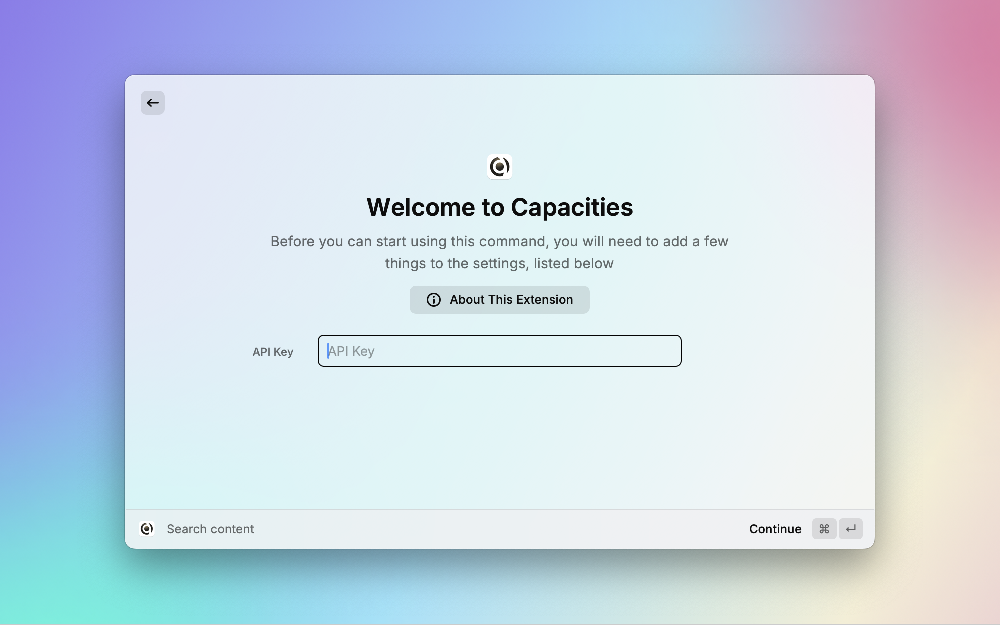
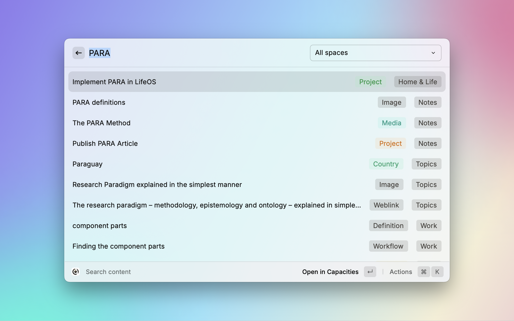
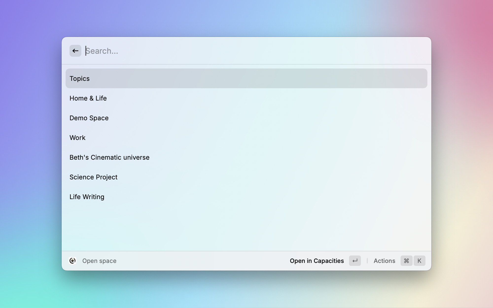
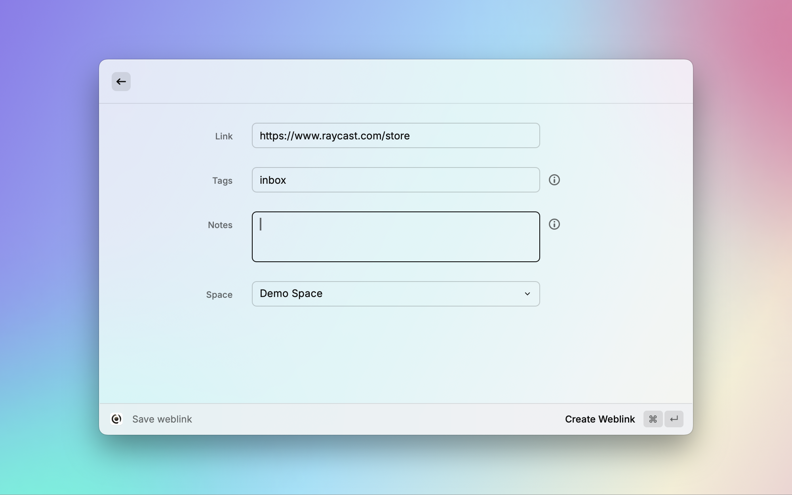
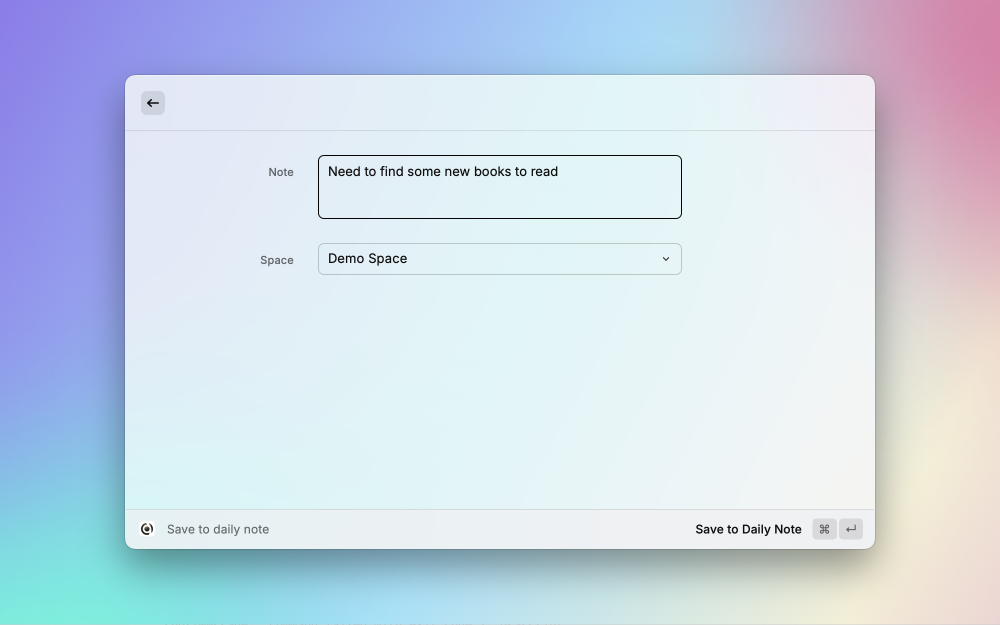

# Capacities for Raycast

The Capacities extension for Raycast offers quick access to your Capacities data, improving productivity and reducing context switching. 

## Setup

Before you get started, you need to add an API to the Raycast extension. 

_ℹ️ The Capacities API is currently a feature of Capacities Pro._

After install, select a command. You need to paste an access token into the Raycast window when prompted. To get an access token, follow these steps:

* Open the Settings in the Capacities app
* Go to "Capacities API" (Paid feature)
* Enter a Token Name (such as 'Raycast')
* Click "Generate Token"
* Copy this token into the Raycast Window 
* Press `Enter`

The integration is now ready to use. 

## Commands

### Search Content

This integration brings you a global search of all your Capacities data. 

Run the `Search content` command and enter your search term in the search bar. 

This will search all spaces by default. 

Your results will be labeled with their type, and the space they are found in. 

Navigate to the result you wish to load, press `enter`, and it'll be opened in Capacities.

If you wish to filter the search from Raycast, you can do so with the drop down menu in the top right.

### Open Space

If you use several spaces, you can open any of them via the "Open Space" command. 

* Type "Open Space" and press `Enter` 
* Type the name of the space you want and press `Enter` to load it

### Save Weblink

Save any weblink to any space with this command. 

_For full functionality, you will need to have the correct Raycast permissions loaded first. [See this section](README#weblinks-not-working) for more information._

* Open Raycast from any webpage
* Run `Save Weblink`
* This pulls the link into Raycast automatically
* Add any tags or notes to the weblink, and choose which space to send it to
* `Cmd Enter` to create the weblink
* After a couple of seconds, it'll arrive in Capacities as a weblink object

You will see it in the 'Created today' section in your calendar and with your other weblinks. 

### Save to Daily Note

Similar to Weblinks, you can save any text to your daily note.

* Run `Save to Daily Note`
* Enter your note into the text box
* Choose which space to send it to

It will arrive in your daily note with an icon to show it's from Raycast. 

**Note**

You can use markdown, add tags, create content and more, all from Raycast. See more [here](https://docs.capacities.io/reference/integrations/email#how-it-works).

## Troubleshooting

#### Changes you've made not appearing in Raycast?

Run the `Reload space info` command, then try again. 

#### Weblinks not working?

Go to Mac System Settings > Privacy and Security > Automation > Raycast > make sure **system events** is toggled on.

If you don't toggle this on, you will need to paste the link manually.