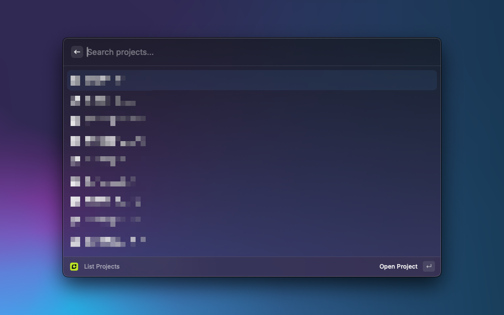

  
  <h1>
    Capmo
  </h1>
Easily manage and interact with projects and tickets from Capmo directly in Raycast. List tickets, update their status, filter projects, and more – all with quick keystrokes.

    
    
    
  

 <h2>
Commands
  </h2>
 <h3>
List Tickets
  </h3>
- Display all tickets from non-archived projects.
- Filter by project and search tickets by name, type, category, company, and more.
- Quickly open tickets or associated projects in the browser.
- Update the status of tickets using quick actions (e.g., "In Progress", "Closed").
 <h3>
List Projects
  </h3>
- Display all non-archived projects.
- Open projects directly in the browser.

 <h2>
Actions
  </h2>
- Open Ticket: Open a specific ticket in the browser.
- Open Project: Open the associated project for a ticket.
- Update Ticket Status: Change the status of tickets to: In Progress (Cmd + B), Closed (Cmd + G), Open (Cmd + O), Signed Off (Cmd + F)

 <h1>
 Settings
  </h1>
When starting the extension for the first time it will ask you for two IDs: The **Capmo API TOken** and the **Excluded projects**.

1. Retriving Capmo API Token
- Please open [Accountmanagement](https://app.capmo.de/account/general)
- Create an API Key in the Api-Key Settings
- Copy the Secret Value and store it somewhere safe

2. Excluding Projects
- If you want to exclude projects from the Application to make it faster, you can do so by including them in the settings
- Retrive the project ID by opening a project in Campo and Copy the Project ID from the Url
- Example: https://app.capmo.de/projects/**cdced67e-1cce-11ef-bc14-fb2698a5c2b6**/tickets
- Copy the Value in the settings. Example: Project 1,Project 2
- Copy the Secret Value and store it somewhere safe

Happy ticket management! 🎉
