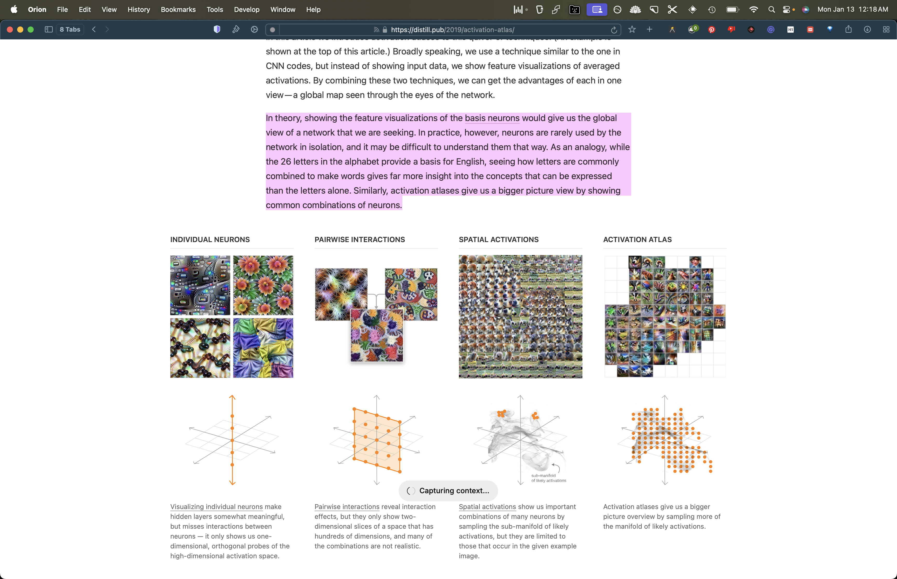
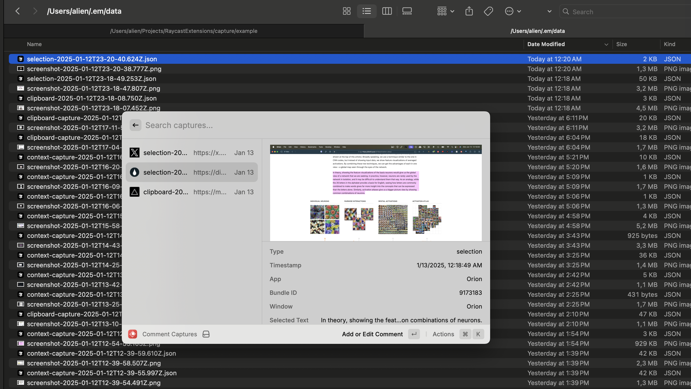

# Raycast Context Capture

Capture content with extra screen and app context, including

- selected text
- an automatic screenshot
- source
- frontmost app
- IF using browser: url, markdown/html of the active tab

Plus, the option to add comments to captures and screenshots. Personally, I use this as a workflow to save and comment points of interest for an AI to analyze.

## Commands

I recommend using `Capture` and `Clipboard Capture` via hotkey.

All captures are saved to the capture directory and have metadata and automatic screenshot added.

1. **Capture**: Capture selection in any app.
2. **Clipboard Capture**: Capture clipboard text .
3. **Comment Captures**: Add/edit capture comments.
4. **Comment Screenshots**: Comment on recent screenshots -- once a screenshot is commented it moves to the capture directory.
5. **Manage Directories**: Set capture directory (where to save) and your screenshot directory (where to interact with screenshots from).

## Example

Say I'm on a website and want to capture it + some selected text (bookmark+).

`Capture` will produce these two files:



And the context in json\*:

```json
{
  "id": "ae3919f5-d84d-491f-990f-ef98a692434d",
  "type": "selection",
  "timestamp": "2025-01-12T23:18:49.253Z",
  "selectedText": "In theory, showing the feature visualizations of the basis neurons would give us the global view of a network that we are seeking. In practice, however, neurons are rarely used by the network in isolation, and it may be difficult to understand them that way. As an analogy, while the 26 letters in the alphabet provide a basis for English, seeing how letters are commonly combined to make words gives far more insight into the concepts that can be expressed than the letters alone. Similarly, activation atlases give us a bigger picture view by showing common combinations of neurons.",
  "screenshotPath": "file:///Users/alien/.em/data/screenshot-2025-01-12T23-18-47.807Z.png",
  "activeViewContent": "...{markdown of website...very long}",
  "app": "Orion",
  "bundleId": "9173183",
  "url": "https://distill.pub/2019/activation-atlas/",
  "window": "Orion",
  "title": "Activation Atlas"
}
```

If I then want to add a comment to the capture I can use the `Comment Captures` command. Comments are added to the metdata JSON for that capture in the capture directory



## Configuration

- **Screenshots Directory**: Default `~/Desktop/`
- **Capture Directory**: Default `~/Downloads/`

## Troubleshooting

- Make sure to double check your directories are correct and rerun the manage directories command.
- For extra metadata browser captures (url, markdown) you need to have the raycast browser extension installed.
