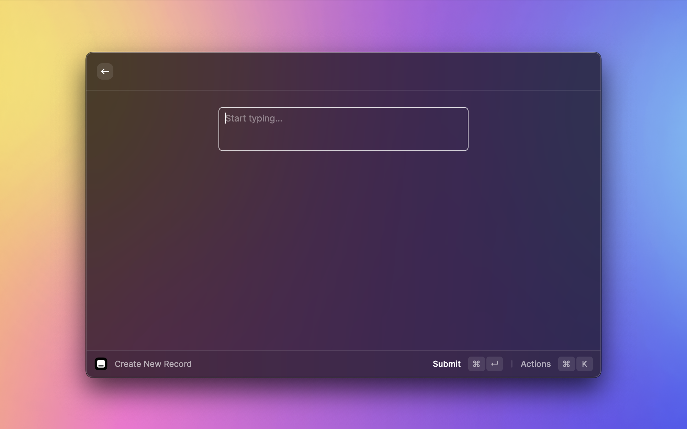
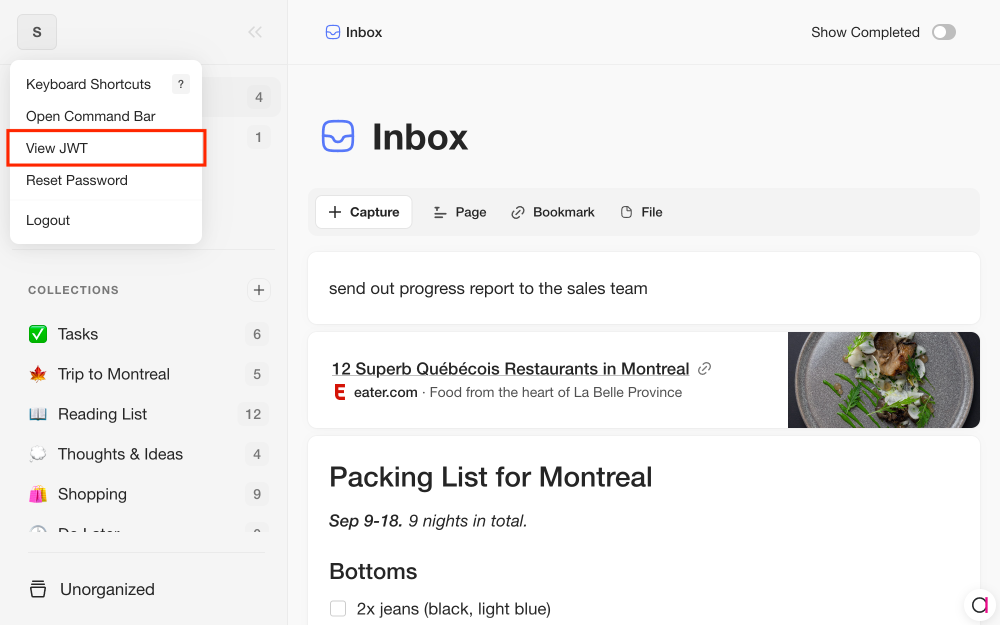
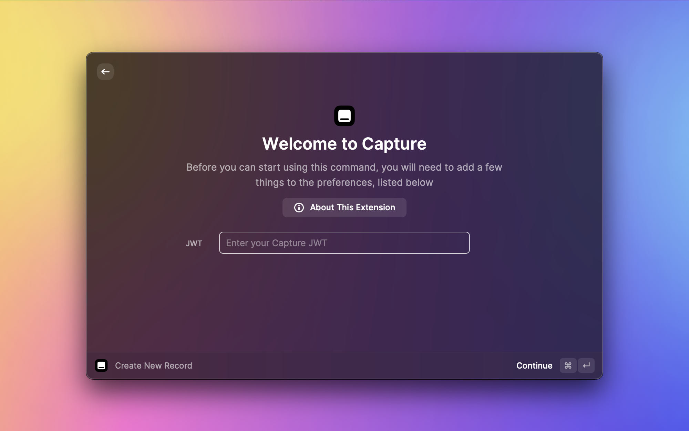

# Capture

Quickly create records in Capture with Raycast.

## Getting started

To start using this extension, you will need to:

1. **Get your Capture JWT.** Sign in to [capture.so](https://capture.so) then select "View JWT" in the options menu. You will see a prompt with a long piece of text. Copy this text to your clipboard.

2. **Configure Raycast.** When you use this extension for the first time, Raycast will ask you for your Capture JWT. Paste the text from Step 1 into the text input labeled "JWT", then select `Continue`.

3. **That's it!** You're ready to start using the Capture extension for Raycast. :tada:
