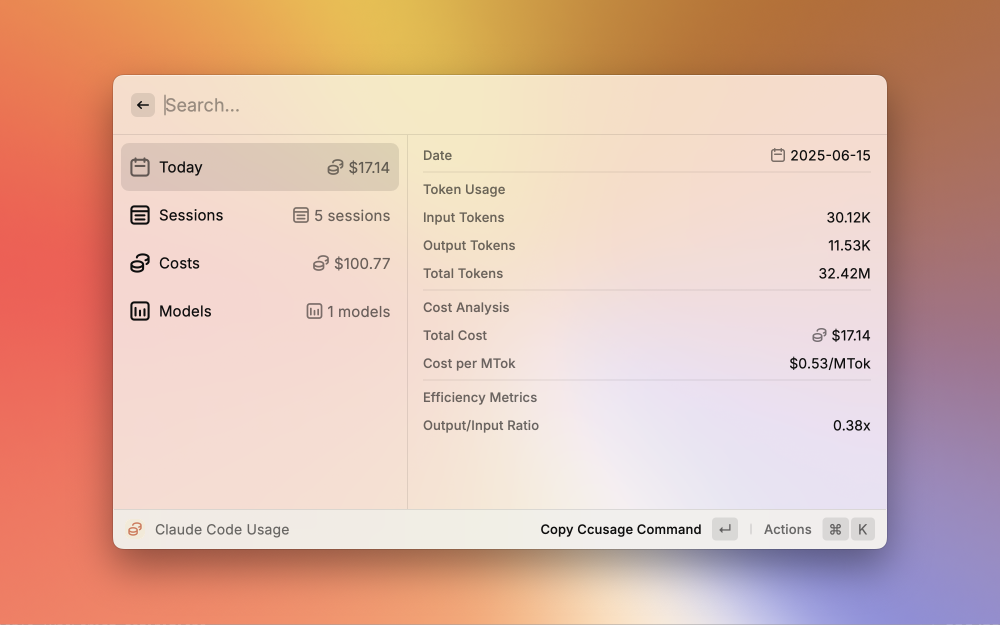

# Claude Code Usage (ccusage)

  
  
  A Raycast extension that provides real-time monitoring of Claude Code usage statistics using the [ccusage](https://github.com/ryoppippi/ccusage) CLI tool.
  
  
  

## Features

Monitor your Claude Code usage with comprehensive real-time statistics:

- **Today Usage**: Track input/output tokens and costs for today with visual intensity indicators
- **Session History**: View recent usage sessions with model-specific breakdown and icons
- **Cost Analysis**: Detailed cost tracking with monthly projections and spending insights
- **Model Statistics**: Usage analytics by Claude model (Opus, Sonnet, Haiku) with tier grouping
- **Menu Bar Integration**: Quick access to usage stats directly from your system menu bar
- **AI Extension Support**: Comprehensive integration with Raycast AI Extensions for Claude models
- **Default View Preference**: Choose which section to display first when opening the extension
- **Custom npx Path**: Support for custom npx installations and non-standard Node.js setups

## Screenshots

### Main Usage View

## Requirements

This extension requires the [ccusage](https://github.com/ryoppippi/ccusage) CLI tool to function properly. The extension automatically installs and runs ccusage using **npx** (Node Package Execute).

### System Requirements

- **Node.js** with npm/npx installed
- **Claude Code** usage history (the extension reads local ccusage data)
- **Internet connection** for downloading ccusage when first run

## Setup

1. Install the extension from the Raycast Store
2. Open the extension - it will automatically download ccusage using npx
3. The extension will immediately start displaying your Claude Code usage data

### Configuration (Optional)

- **Default View**: Set which section appears first (Today Usage, Session History, Cost Analysis, or Model Breakdown)
- **Custom npx Path**: If npx is installed in a non-standard location, specify the full path to npx

Access preferences with **Cmd+Shift+,** when the extension is open.

## Important Notes

- **Unofficial Extension**: This extension is not an official product of Anthropic or the ccusage developers
- **Data Privacy**: All usage data is processed locally using the ccusage CLI tool
- **Performance**: The extension uses optimized refresh intervals to balance real-time updates with system performance

## Support

If you encounter any issues or have suggestions, please [create an issue](https://github.com/raycast/extensions/issues/new?title=%5BClaude+Code+Usage+(ccusage)%5D+...&template=extension_bug_report.yml&labels=extension,bug&extension-url=https://www.raycast.com/nyatinte/ccusage&body=%0A%3C!--%0APlease+update+the+title+above+to+consisely+describe+the+issue%0A--%3E%0A%0A%23%23%23+Extension%0A%0Ahttps://raycast.com/%23%7Bextension_path(extension)%7D%0A%0A%23%23%23+Description%0A%0A%3C!--%0APlease+provide+a+clear+and+concise+description+of+what+the+bug+is.+Include+screenshots+if+needed.+Please+test+using+the+latest+version+of+the+extension,+Raycast+and+API.%0A--%3E%0A%0A%23%23%23+Steps+To+Reproduce%0A%0A%3C!--%0AYour+bug+will+get+fixed+much+faster+if+the+extension+author+can+easily+reproduce+it.+Issues+without+reproduction+steps+may+be+immediately+closed+as+not+actionable.%0A--%3E%0A%0A1.+In+this+environment...%0A2.+With+this+config...%0A3.+Run+'...'%0A4.+See+error...%0A%0A%23%23%23+Current+Behavior%0A%0A%23%23%23+Expected+Behavior%0A%0A) in the repository.

## Credits

The Raycast layout of this extension was inspired by the [System Monitor](https://www.raycast.com/hossammourad/raycast-system-monitor) extension.

Special thanks to [@ryoppippi](https://github.com/ryoppippi) for creating the [ccusage](https://github.com/ryoppippi/ccusage) tool that makes this extension possible.

## License

MIT
