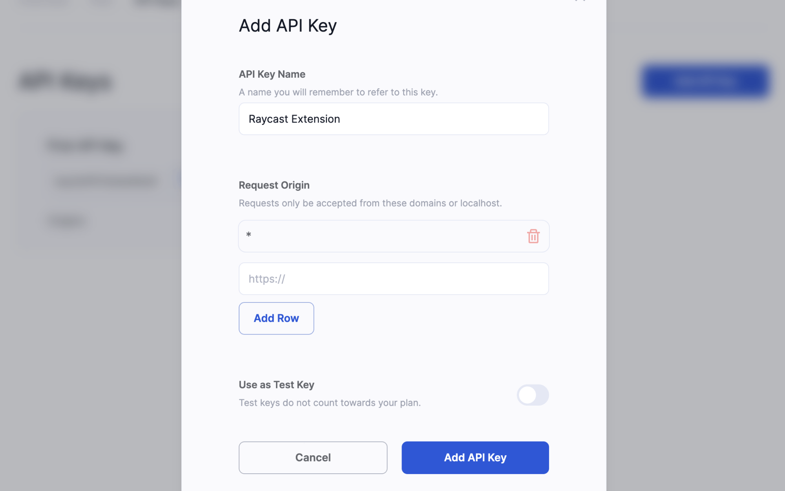

# Center Raycast Extension

Center Raycast Extension allows you to interact with any NFT collections or assets in any blockchain, right in your command line, powered by [Center](https://center.app/)'s NFT API

## ✨ Features

- Search assets or collections
- See assets of owner with ENS or wallet address.
- See NFT details (metadata, tags, owner, transfer history, etc.)
- See NFT collection details (metadata, tags, floor price, transfer history, etc.)

## 🔑 Create API Key

To start using Center Raycast Extension, you'll need to create an API Key. You can create it in a few steps. It's free.

- Visit [Center > Projects](https://center.app/api/projects)
- Create new project or use the initialized one.
- In project details page, go to **API Keys** section.
- Click `Add API Key` button
- Type a **API Key Name** > "Raycast Extension" _(or whatever you want)_
- Type **Request Origin** > "\*" _(just asterix, without quoutes)_ and click `Add Row` button.
- Click `Add API Key` button in modal
- Done! Copy your API key ✅

You can see how the API Key modal will look like below.

API Key Modal

Now, time to go back Raycast and paste your API Key to start using Center Extension and browse NFTS!

## 🏗️ In Progress

- Show more numerics about collections (volume, market cap, etc.)
- Show listings and offerings for all NFTs in collection.
- Collection filtering with attributes

## Authors

- [Enes O.](https://twitter.com/enesozt_)

## About Center

Center indexes every non-fungible token on every blockchain and make them available to creators and builders, with 99.999% uptime. Learn more about [Center API](https://center.app/api/)
