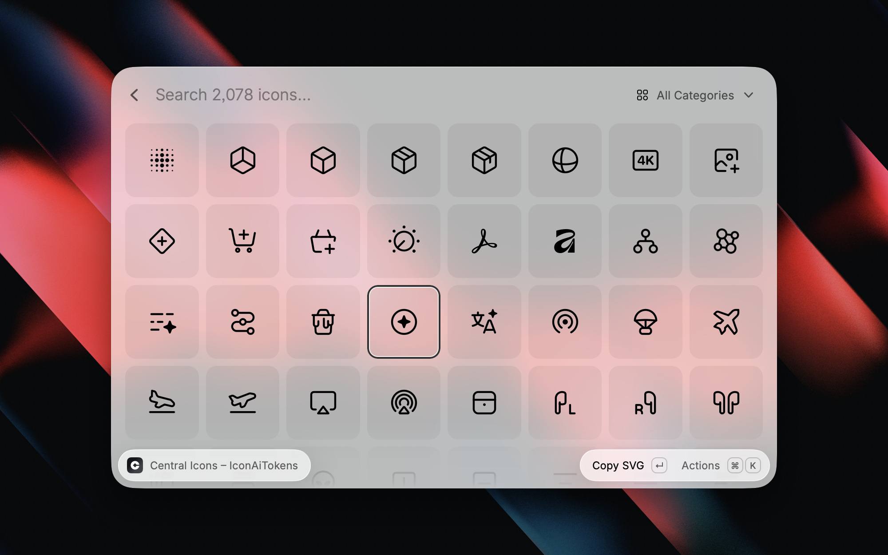

# Central Icon System for Raycast

<div align="center">
  <a href="https://github.com/chrismessina">
    
  </a>
  <a href="https://github.com/chrismessina/raycast-central-icon-system/stargazers">
    
  </a>
  <a href="https://www.raycast.com/chrismessina/central-icon-system">
    
  </a>
</div>



Search, copy, and export the [Central Icon System](https://centralicons.com/) — 2,078 icons
across 38 categories — without leaving Raycast.

- Grid search over icon names and their search aliases, ranked by relevance
- Outlined and filled variants side by side, or filtered to one
- Copy or paste SVG, name, JSX, or a style-aware import statement
- Export PNG at 16–512px (copy, paste, or save to Downloads)
- Quick Look previews, preview backdrops, pins and recents
- **Update Icon Data** command to pull the latest upstream release

## Installing icon data

The icons themselves aren't bundled — they're downloaded from the
[`@central-icons-react`](https://www.npmjs.com/package/@central-icons-react/all) packages your
licence covers, straight from the extension. Pick any style from the action panel and choose
**Install This Style**; it takes a couple of seconds and roughly 5 MB per style.

Installed data lives in the extension's support directory, so it survives extension updates.
**Update Icon Data** re-downloads installed styles against the latest release.

### Development

```bash
npm install
npm run dev
```

Optionally pre-build styles into `assets/` instead of installing them at runtime — useful when
working offline:

```bash
npm run build:icons:list                              # all 30 style ids
npm run build:icons square-filled-radius-0-stroke-2   # one or more ids
```

## Styles

The set ships 30 styles across three axes:

| Axis   | Values                                                 |
| ------ | ------------------------------------------------------ |
| Corner | 0px Sharp, 0px Round, 1px Small, 2px Medium, 3px Large |
| Stroke | 1px, 1.5px, 2px                                        |
| Style  | Line, Solid                                            |

Corner is a single axis of five options — matching centralicons.com — because join and radius are
not independent: `square` ships at radius-0 only. Five corners × three strokes × two fills is
exactly the 30 published styles.

Every axis bakes distinct path geometry — stroke weight and corner radius are not CSS parameters
over a shared path — so each style is a separate download. Two are installed by default
(`round-outlined-radius-2-stroke-1.5` and its filled counterpart); the rest install on demand from
the action panel.

Corner and stroke are set from the action panel and persist across launches. Style is a grid
filter: "All" shows Line and Solid side by side.

## Development

```bash
npm test          # vitest (src) + node:test (build scripts)
npm run lint
npx tsc --noEmit
```

The build scripts are documented in `docs/extraction.md`.

## Licensing

**The Central Icon System is a commercial icon set. This extension does not include the icons and
does not grant a license to them.** This extension builds its icon data locally, from [npm packages](https://www.npmjs.com/package/@central-icons-react/all) you are licensed to use. If you don't hold a license, buy one at [iconists.co/central](https://iconists.co/central).

## Credits

Icons by [the iconists](https://iconists.co).
