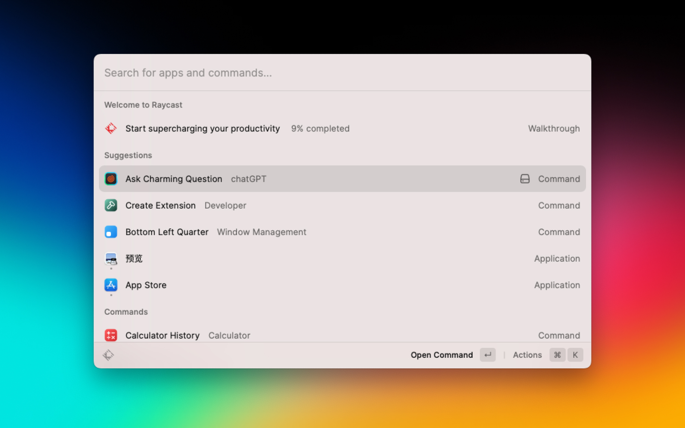
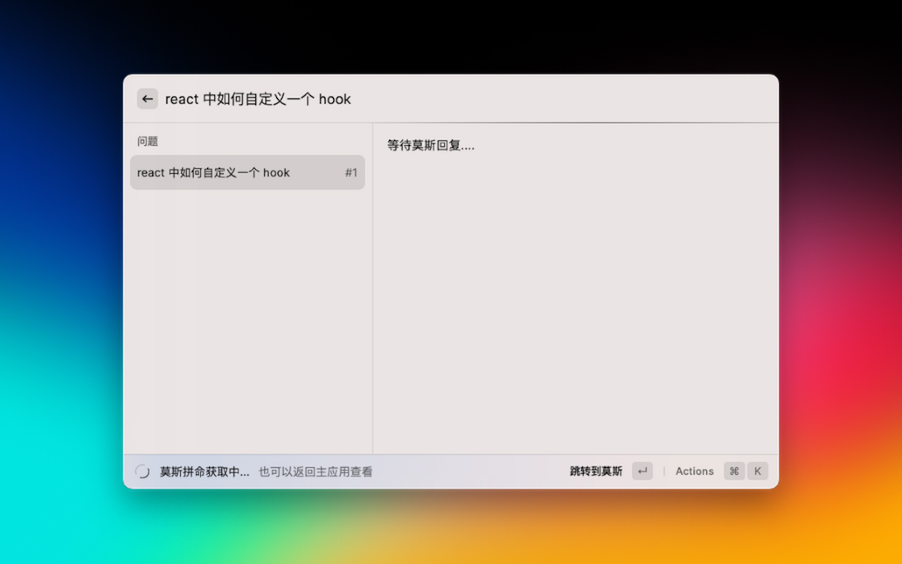
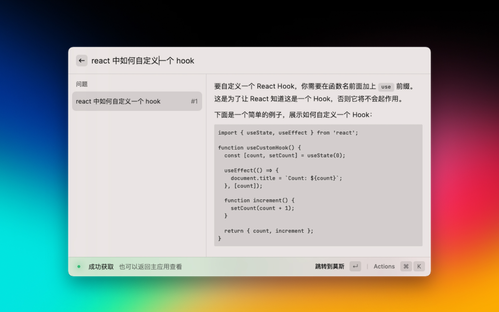
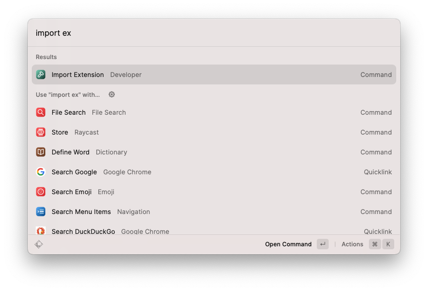
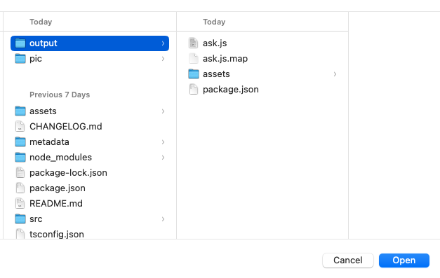

<h1 align="center">Charming ChatGPT</h1>

<h3 align="center">Make chatGPT x charming x Raycast all together</h3>

# Features

### Deeper combined with Charming, a powerful cross-platform chatGPT client on iPhone/iPad/Mac

Hit `space+cmd`, select `Ask Charming Question`,then it will automatically sync all conversation to charming. For sure you can also view the response just on raycast.

### Worry about missing the conversaions?

Take it easy. It all stored in charming, just hit the `return key` and here waits for you.

# Import locally
1. `git clone https://github.com/KittenYang/charming-chatgpt.git`

2. The extension store is slow to approve a public extension, so you can use `Import Extension` command just install a local extension.For this situation, you can import the `output` folder.

# Bonus

## !NO NEED FOR API KEY!

YES. We offers the tokens inside the app, Check it out and you will get rid of the worries about bans of API Key. Life is short！

🎉 Checkout Charming on [Mac App Store](https://apps.apple.com/cn/app/charming-%E8%8E%AB%E6%96%AF/id6446066593)
