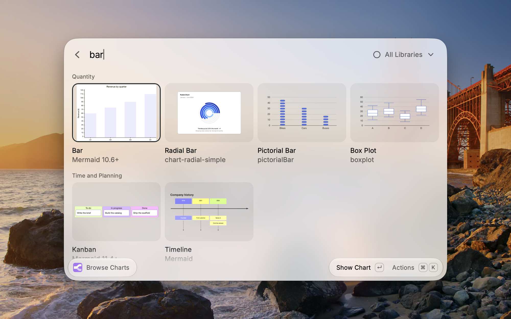
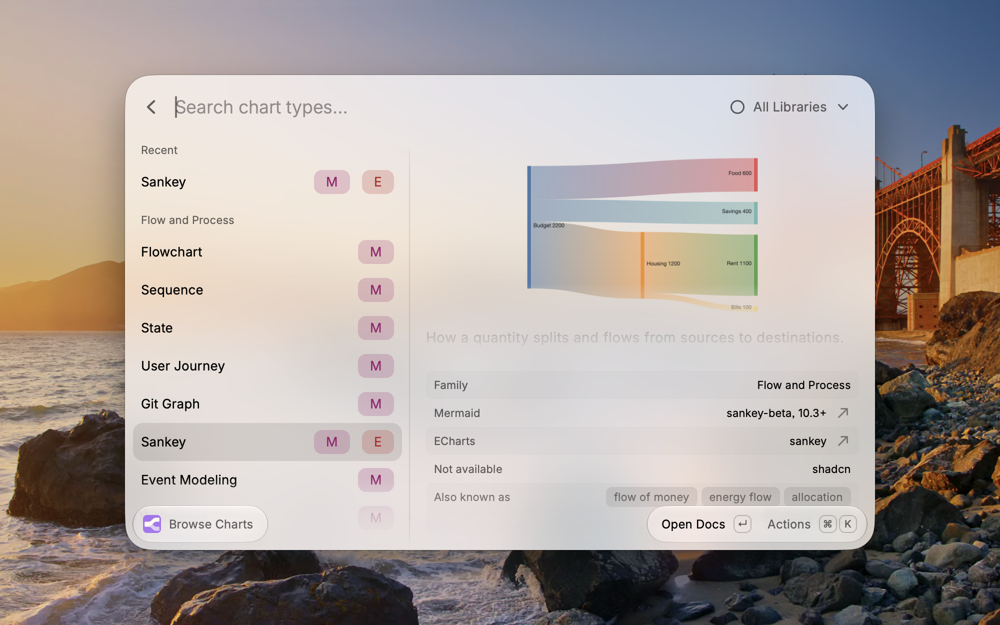
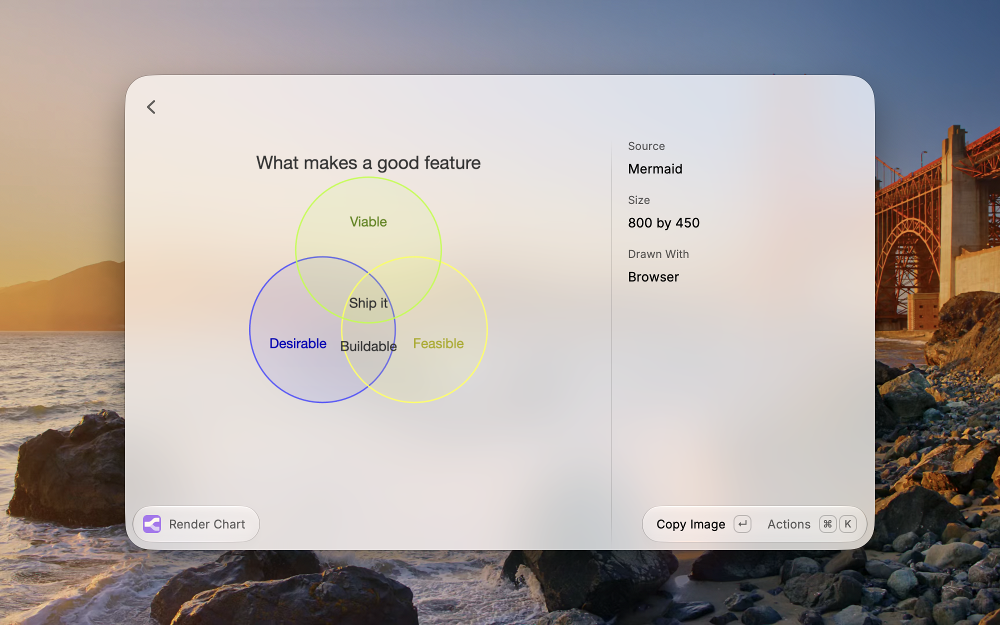

# Charter

A catalog of chart and diagram types for Raycast. Browse by family, pick the library you are working in, and copy the docs link, a complete example or a prompt snippet for it without leaving the keyboard. Charter also draws Mermaid diagrams and ECharts options on your machine.







## Commands

- **Browse Charts** lists every type, grouped by family, with your favorites and the five types you last opened or copied from at the top. The dropdown in the search bar is the lens: **All** shows every type with Mermaid first, and **Mermaid**, **shadcn** or **ECharts** narrows the catalog to what that library can draw and shows that library's picture, example and docs on every type. `cmd+shift+l` switches between a grid of thumbnails and a list with a detail panel; `cmd+=` and `cmd+-` change the tile size. Search matches names and synonyms, so "spider" finds Radar and "flow of money" finds Sankey.
- **Render Chart** draws whatever Mermaid diagram or Apache ECharts option it finds, looking at the selected text first, then the clipboard, and offering a form when neither holds one. The picture opens in Raycast with Copy Image, Save to Downloads and Open Image; a ```mermaid fence around the source is fine. Other extensions and scripts can hand a chart over through a deeplink, with the JSON URL-encoded: `raycast://extensions/aic/charter/render-chart?context=%7B%22source%22%3A%22...%22%7D`.

## What each lens shows

- **Mermaid**: the first-line keyword, a complete example and the docs page. Types added since Mermaid 10 carry the release that added them, as `Mermaid 11.6+`, because whether a type renders in a given app depends on the Mermaid version that app bundles.
- **shadcn**: the chart block from the shadcn registry with its component source and install command, plus every variant in that family (stacked, horizontal, interactive and so on) with its own install command. shadcn charts are built on Recharts, so there is no separate Recharts lens. Thumbnails are the real cards from ui.shadcn.com.
- **ECharts**: the series type and a complete option as JSON, ready to paste or render. A world map ships with the extension, so the map types work offline.

## Actions

- **Open Docs** opens the current lens's page for the type. It is the Enter action on the chart page and in the list when the detail panel is open; elsewhere Enter opens the chart page.
- **Render Template** draws the type's Mermaid or ECharts example in Raycast; under the shadcn lens, **Open Preview** opens the block on ui.shadcn.com instead.
- **Copy Docs Link**, **Copy Template** and **Copy Prompt Snippet** put the link, the example, or a ready-to-paste instruction for a model on the clipboard, for the current lens. The template comes inside a fence (```mermaid, ```json or ```tsx) so it drops straight into a chat or a note; **Copy Raw Template** gives the bare text.
- **Copy Install Command** copies `npx shadcn@latest add <block>`; **Copy Variant Install Command** and **Copy Variant Component** offer every block in the family.
- Under **Libraries**, the other libraries' docs, examples and renders stay one action away whatever the lens.
- **Add to Favorites** pins a type to the top of the catalog, and **Clear Recent** empties the Recent section.

## Drawing

Charts are drawn by a Chromium-based browser installed on your Mac (Google Chrome, Chromium, Brave, Arc or Microsoft Edge, or the one you choose under **Browser** in the preferences), from copies of Mermaid and ECharts that ship with the extension, so nothing leaves the machine. When no browser is installed, Mermaid diagrams can be sent to Kroki instead, and the **Kroki Server** preference can point at your own instance.

## Development

`npm run dev` serves the extension; `npm run lint` and `npm run build` must pass before a commit. Three scripts refresh the content that ships with the extension: `npm run vendor` copies Mermaid, ECharts and the world map into `assets/vendor` from `node_modules`; `npm run shadcn` pulls the chart blocks and their source from ui.shadcn.com into `src/data/shadcn.ts`; `npm run thumbnails` redraws every thumbnail in `assets/charts` (Mermaid and ECharts locally, shadcn from the previews on ui.shadcn.com). Only the last two need the network.

## Licenses

Charter is MIT. It ships copies of [Mermaid](https://github.com/mermaid-js/mermaid) (MIT) and [Apache ECharts](https://github.com/apache/echarts) (Apache 2.0) for drawing, the chart block sources from [shadcn/ui](https://github.com/shadcn-ui/ui) (MIT) as examples, and country outlines from [world-atlas](https://github.com/topojson/world-atlas) (ISC, derived from Natural Earth, public domain).
