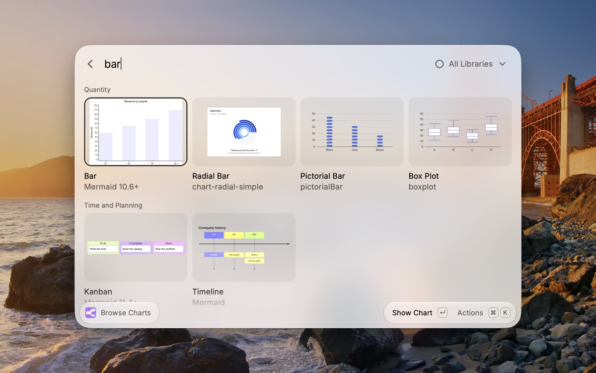
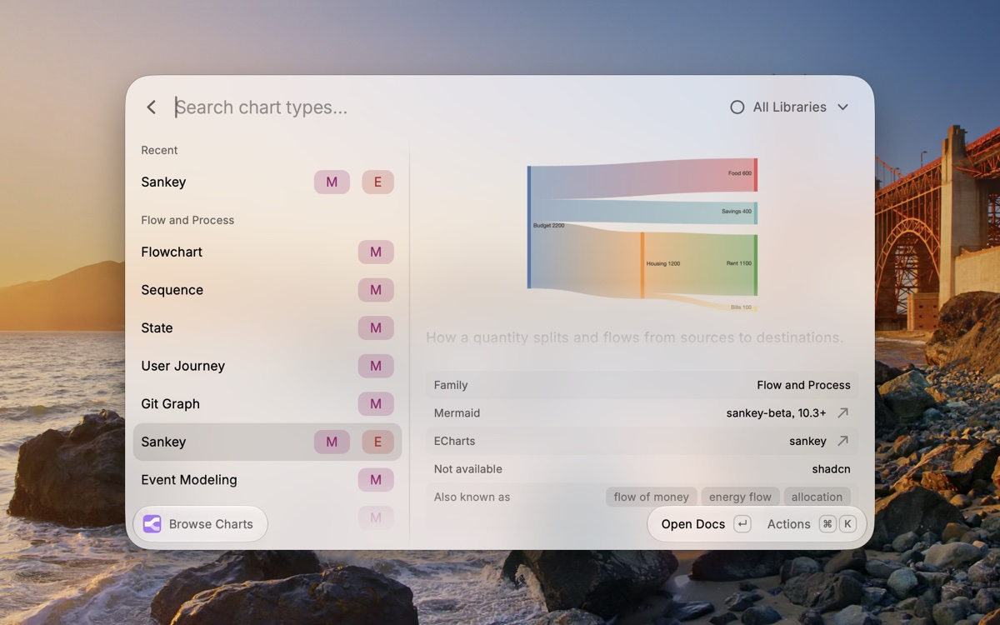

# Charter

A catalog of chart and diagram types for Raycast. Browse by family, pick the library you are working in, and copy the docs link, a complete example or a prompt snippet for it without leaving the keyboard.





## Commands

- **Browse Charts** lists every type, grouped by family, with your favorites and the five types you last opened or copied from at the top. The dropdown in the search bar is the lens: **All** shows every type with Mermaid first, and **Mermaid**, **shadcn** or **ECharts** narrows the catalog to what that library can draw and shows that library's picture, example and docs on every type. `cmd+shift+l` switches between a grid of thumbnails and a list with a detail panel; `cmd+=` and `cmd+-` change the tile size. Search matches names and synonyms, so "spider" finds Radar and "flow of money" finds Sankey.

## What each lens shows

- **Mermaid**: the first-line keyword, a complete example and the docs page. Types added since Mermaid 10 carry the release that added them, as `Mermaid 11.6+`, because whether a type renders in a given app depends on the Mermaid version that app bundles.
- **shadcn**: the chart block from the shadcn registry with its component source and install command, plus every variant in that family (stacked, horizontal, interactive and so on) with its own install command. shadcn charts are built on Recharts, so there is no separate Recharts lens. Thumbnails are the real cards from ui.shadcn.com.
- **ECharts**: the series type and a complete option as JSON, ready to paste.

## Actions

- **Open Docs** opens the current lens's page for the type. It is the Enter action on the chart page and in the list when the detail panel is open; elsewhere Enter opens the chart page.
- Under the shadcn lens, **Open Preview** opens the block on ui.shadcn.com.
- **Copy Docs Link**, **Copy Template** and **Copy Prompt Snippet** put the link, the example, or a ready-to-paste instruction for a model on the clipboard, for the current lens. The template comes inside a fence (```mermaid, ```json or ```tsx) so it drops straight into a chat or a note; **Copy Raw Template** gives the bare text.
- **Copy Install Command** copies `npx shadcn@latest add <block>`; **Copy Variant Install Command** and **Copy Variant Component** offer every block in the family.
- Under **Libraries**, the other libraries' docs, examples and renders stay one action away whatever the lens.
- **Add to Favorites** pins a type to the top of the catalog, and **Clear Recent** empties the Recent section.

## Development

`npm run dev` serves the extension; `npm run lint` and `npm run build` must pass before a commit. Two scripts refresh the content that ships with the extension: `npm run shadcn` pulls the chart blocks and their source from ui.shadcn.com into `src/data/shadcn.ts`; `npm run thumbnails` redraws every thumbnail in `assets/charts` (Mermaid and ECharts locally, shadcn from the previews on ui.shadcn.com). The thumbnail script needs a Chromium-based browser and a prior `npm run vendor`, which copies Mermaid, ECharts and the world map from `node_modules` into the git-ignored `.vendor` folder; none of that is part of the extension itself.

## Licenses

Charter is MIT. It ships the chart block sources from [shadcn/ui](https://github.com/shadcn-ui/ui) (MIT) as examples. The thumbnails were drawn with [Mermaid](https://github.com/mermaid-js/mermaid) (MIT) and [Apache ECharts](https://github.com/apache/echarts) (Apache 2.0), with country outlines from [world-atlas](https://github.com/topojson/world-atlas) (ISC, derived from Natural Earth, public domain).
