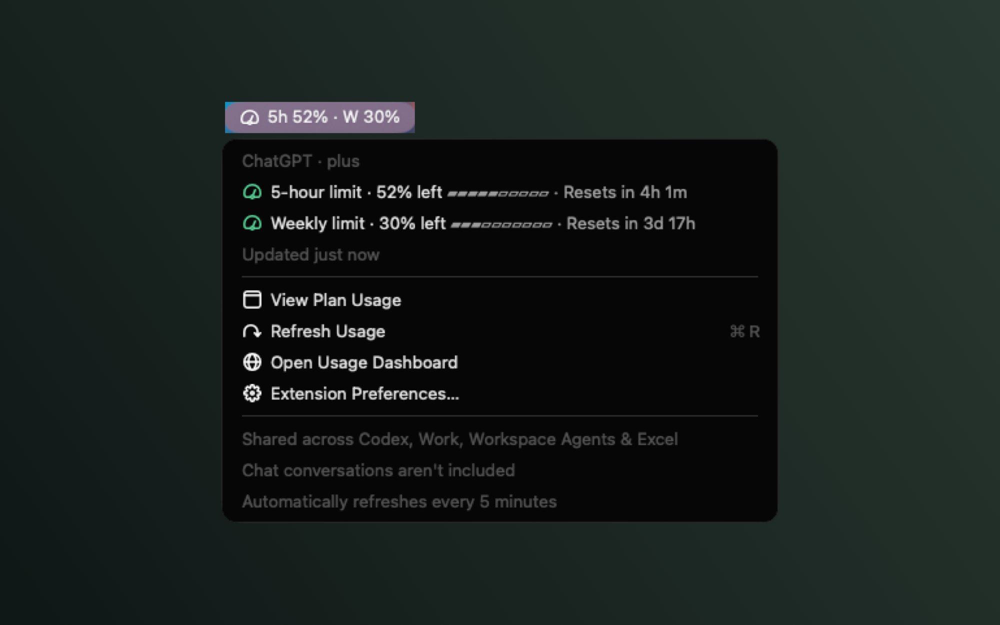

# ChatGPT Usage for Raycast and Tinycast

Your shared ChatGPT plan allowance in the macOS menu bar:

```text
◴ 5h 71% · W 44%
```

Click it to see remaining percentages, quota-window reset times, last update time, and shortcuts to refresh or open the usage dashboard. The title always shows **remaining**, not consumed, usage. Select both limits, either limit, or icon-only in extension preferences.

Enable **Hide Dial Icon** in extension preferences for a text-only menu-bar item. It only hides the menu-bar dial, not the icons inside the menu. **Icon Only** mode keeps the dial visible so the item remains accessible, and error indicators are always shown.



Run **View Plan Usage** in the launcher to see both limits inline, with progress bars, reset times, and plan/update details. You can also open this view from the menu-bar item's **View Plan Usage** action. Press **⌘R** to refresh. Both commands share cached readings and show errors without hiding the last successful result.

All dashboard links open [ChatGPT's usage overview](https://chatgpt.com/settings/usage?tab=overview).

These are the limits shared across **Codex, Work, Workspace Agents, and ChatGPT for Excel**. Regular ChatGPT conversations are not included.

## Install in Tinycast

1. Run `codex login` in Terminal and sign in with ChatGPT.
2. Build the extension:

   ```sh
   npm install
   npm run build:tinycast
   ```

3. In Tinycast, enable **Settings → Extensions → Enable extensions**.
4. Choose **Install → Add from folder** and select this project's **`dist`** folder, not the source folder.
5. Run **Show Plan Usage** once in the Tinycast palette to activate its menu-bar item and five-minute refresh schedule.

Alternatively, run **View Plan Usage** for the inline view without activating a menu-bar item. To update an existing Tinycast installation, build again and re-import the `dist` folder; Tinycast uses its own copy of the extension.

If already built for Raycast, **Install → Import from Raycast** works too. Tinycast copies the built command and `assets/`, including the native helper. It needs neither Node.js nor Swift to run the extension itself; your Codex installation may require Node.js.

### Tinycast compatibility

This follows Tinycast's [compatibility documentation](https://tinycast.dev/docs/extensions/compatibility/):

- Uses supported `MenuBarExtra`, `Detail` with metadata, `ActionPanel`, `Action`, preferences, `Cache`, `environment.assetsPath`, `Icon`, `Color`, `Keyboard.Shortcut.Common`, `open`, `launchCommand`, and `openExtensionPreferences` APIs.
- The menu-bar command uses the manifest's `5m` interval, with no persistent JavaScript engine or continuously running process.
- Uses supported buffered `child_process.execFile`, filesystem, path, OS, stream, utility, and crypto modules. It does **not** use JavaScript `readline`, interactive `spawn` output, WebSocket, `net`, or `tls`.
- A small bundled **universal macOS Swift helper (Apple Silicon + Intel)** performs the interactive Codex protocol and returns one complete JSON response. This avoids Tinycast's buffered-process limitation. Its full source is included at `assets/codex-usage-helper.swift`.
- Resolves the helper through `environment.assetsPath`, so it still works after Tinycast copies the extension into its own Application Support directory.

## Install in Raycast

1. Install [Raycast](https://www.raycast.com/) and [Codex CLI](https://developers.openai.com/codex/cli).
2. Run `codex login` in Terminal and sign in with the ChatGPT account you want to monitor. API-key authentication cannot read subscription usage.
3. In this directory, run:

   ```sh
   npm install
   npm run dev
   ```

4. In Raycast, run **Show Plan Usage** under **ChatGPT Usage**. Enable background refresh if Raycast prompts you. It refreshes every five minutes and when you open the menu.
5. For a local production install, stop the development server and run `npm run build`. The Raycast build command installs the extension locally; nothing is published to the Store.

Your launcher must stay running for the menu-bar item to be available. macOS can hide it if your menu bar is full.

### Codex cannot be found

Your launcher's environment can differ from your terminal. The extension checks common Homebrew, npm, Vite+, and local installation locations. If necessary, run `which codex` in Terminal and paste that absolute path into **Codex Executable** in extension preferences. Node.js must also be available for npm-installed versions of Codex.

If you installed Node using a version manager whose directory is not available to GUI apps, use a Homebrew Node installation or make Node available alongside Codex.

### Unavailable or stale usage

- Check your connection and refresh. If authentication expired, run `codex login` again.
- Update Codex if your version does not support `account/rateLimits/read`.
- A failed refresh preserves the last successful reading, marks it as **last known usage**, and adds `!` to the menu-bar title. It never substitutes invented percentages.
- After a quota reset time passes, a cached window shows `—` until a successful refresh confirms the new allowance.
- Some plans report only a weekly window, different window lengths, or no fixed windows. The extension labels windows using their reported duration rather than assuming every account has a five-hour limit.

## How it works

Each refresh starts the native helper, which starts a short-lived `codex app-server` process, performs the initialization handshake, checks ChatGPT authentication, and requests `account/rateLimits/read`. Both processes stop after the response, on cancellation, or after a 20-second timeout. It never starts a model turn or consumes an inference request.

Authentication is handled by Codex using its existing local login. The extension does not read, copy, or store credentials. Only normalized usage percentages, reset timestamps, plan type, and last update time are cached locally by your launcher. It does not access chats, transmit telemetry, or log raw account responses.

The protocol is documented in the [Codex App Server documentation](https://developers.openai.com/codex/app-server#6-rate-limits-chatgpt). No private ChatGPT REST endpoints or separately billed OpenAI API keys are used.

## Development checks

```sh
npm test
npm run lint
npm run build
npm run build:tinycast
npm run check:usage
npm run test:tinycast
```

`check:usage` verifies your actual Codex connection and prints only normalized usage, not credentials or your email. You can pass an explicit executable path: `npm run check:usage -- /path/to/codex`.

`test:tinycast` builds the distribution and loads it inside the **installed Tinycast JavaScript runtime** with a buffered process bridge. It tests native-helper integration, both command views, refresh and recovery, cached errors, signed-out guidance, expired/missing limits, icon-only preferences, dashboard URLs, and menu-to-view navigation. Install Tinycast or set `TINYCAST_RUNTIME_PATH` to its `RaycastRuntime.generated.js` resource to run these checks. These are runtime/render-tree tests, not a visual UI test of the launcher itself.

The bundled icon can be regenerated on macOS with `swift scripts/generate-icon.swift`.

The native helper is bundled, so normal builds don't require a Swift compiler. After modifying its source, run `npm run build:helper` with Xcode Command Line Tools installed to rebuild and ad-hoc sign the universal binary. Commit the helper binary together with its source when distributing the extension.

Linting checks all source and test files with ESLint and Prettier. Before publishing to the Store, set `author` in `package.json` to your registered Raycast Store handle, then run `npm run lint:store` for full manifest and metadata validation. A Store account isn't needed for local installation.

Store screenshot CI is stricter than `lint:store`: it checks Raycast window detection, approximately 12.5% symmetric padding, and consistent backgrounds. Use Raycast **Window Capture → Save to Metadata** when available, and validate the complete image set with [`scripts/check_metadata_images.py`](https://github.com/raycast/extensions/blob/main/scripts/check_metadata_images.py) in the Raycast extensions repository before submitting. Menu-bar-only captures belong in `media/` for documentation, not in Store `metadata/`.
