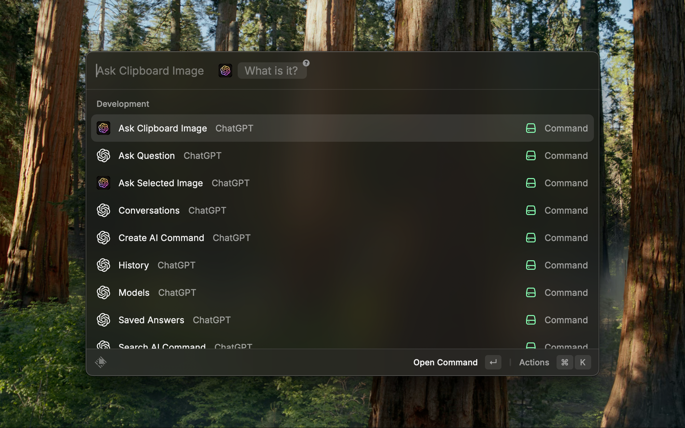
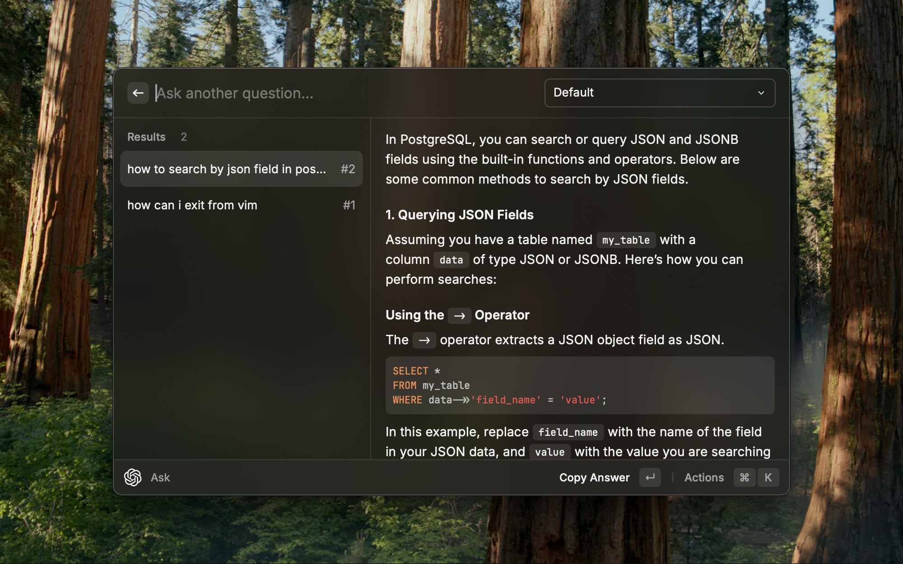
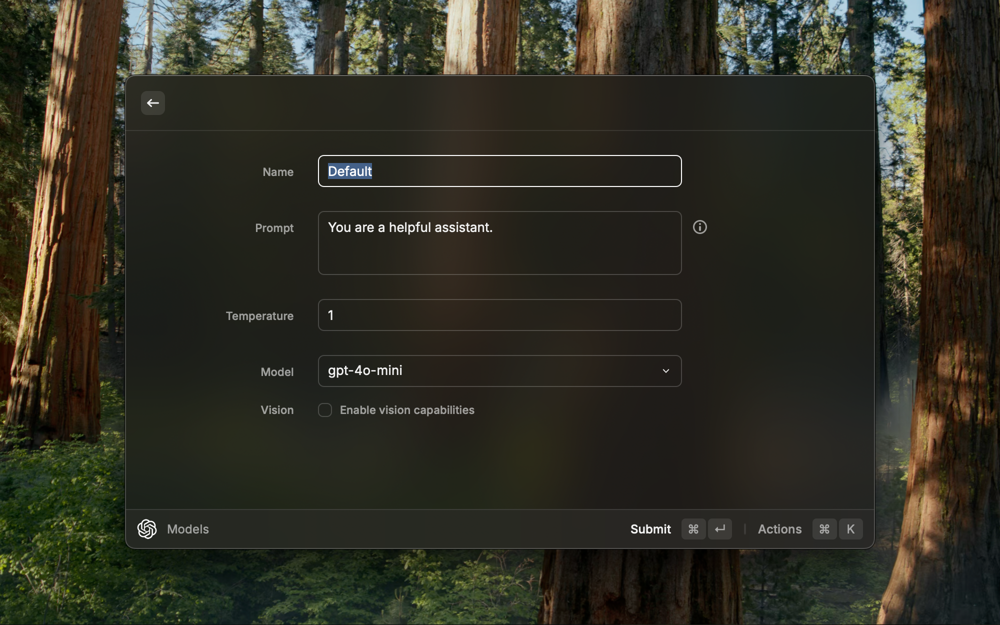
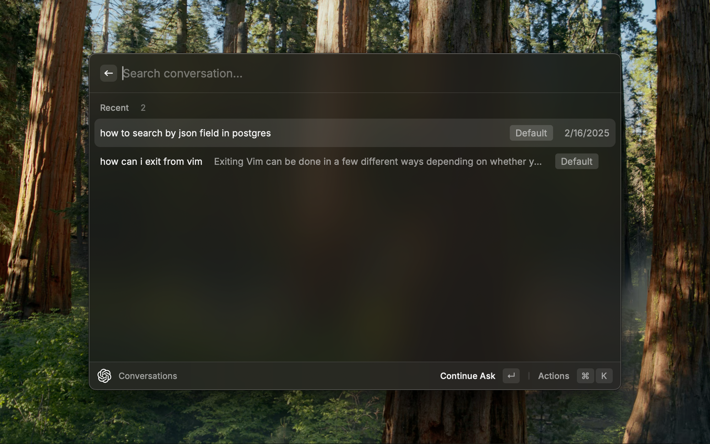
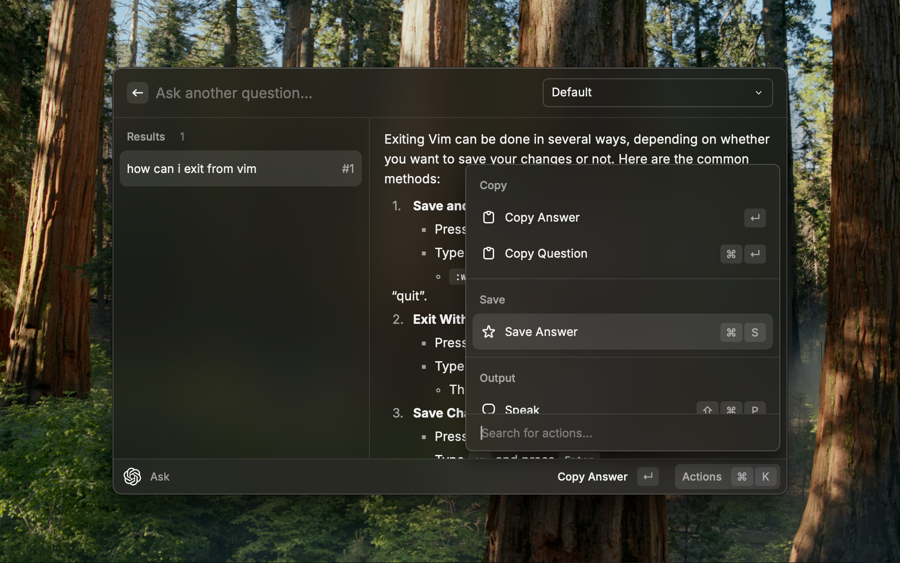
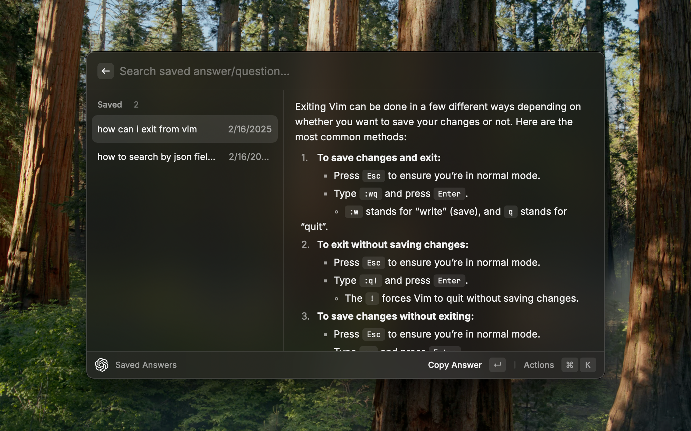
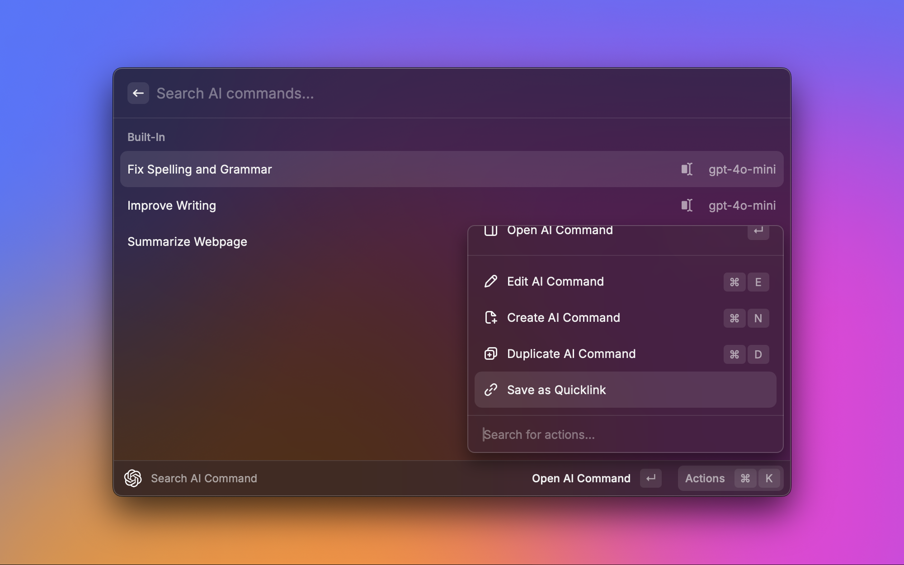
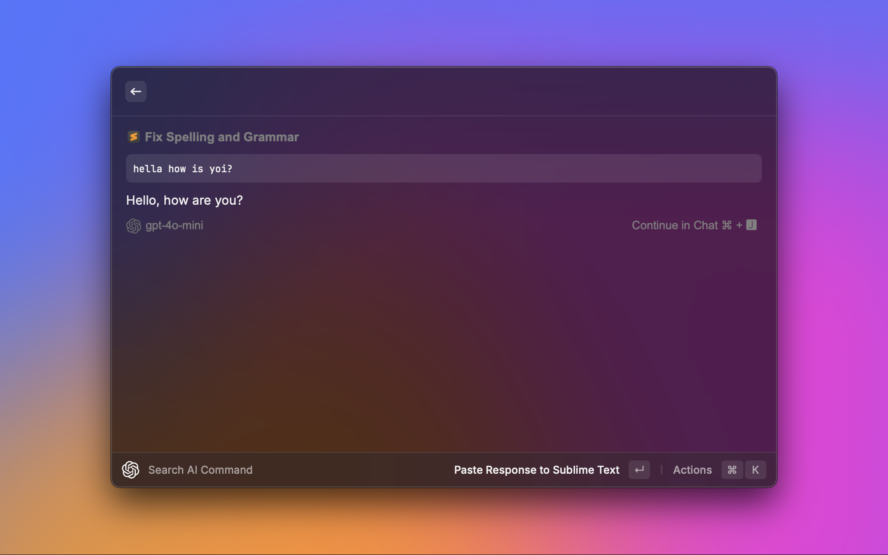
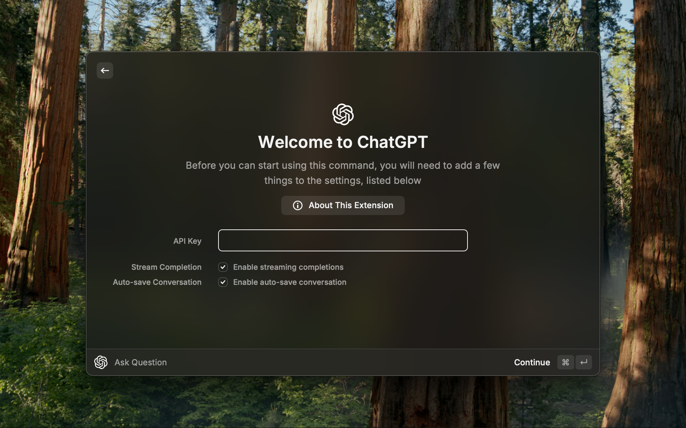

<h1 align="center">ChatGPT</h1>

<h3 align="center">
Interact with OpenAI's ChatGPT right from your command bar
</h3>

# Features

### Ask anything, from your favourite thing

Straight from your command bar, ask anything that you wanted and get an AI-generated answer without any effort.

### Personalized for you, really

Customize the model to your liking. Create and edit custom engines beyond your creativity.

### Keep continue, with you

Continue talking about everything right where you left off. Be pro without from zero.

### Save the answer, for later

Got the answer that you wanted? Great. Now you can save it without asking again.

### Look-up your past, fast

Automatically save all the question and answer so you can go back digging for the answer you're looking, quickly.

### Use AI commands and create your own

Process text taken from anywhere (selected text, clipboard text, opened web page) and
insert the result into the frontmost application or copy it to the clipboard.

> Windows 11+ is supported. For vision commands, selected images are read from the active File Explorer window or from the clipboard (both platforms).

# Authentication

The extension supports two authentication modes:

- `API key`: Uses the OpenAI API directly for chat, commands, summarize, and vision/image understanding commands.
- `ChatGPT sign-in`: Uses OpenAI Codex `app-server` for authentication and text chat flows.

### What happens during ChatGPT sign-in

- The extension starts a local Codex `app-server` runtime.
- It sends `account/login/start` and opens the returned browser URL.
- After sign-in completes, the extension uses `account/read`, `thread/start`, `thread/resume`, and `turn/start` through the app-server.
- Auth state is cached briefly to reduce repeated startup checks.

### Bundled Codex runtime

The release build bundles a Codex runtime archive inside the extension assets for the build platform. On first use, the extension extracts that runtime into Raycast's support directory and reuses it for later requests.

If the bundled runtime asset is unavailable for a given install, the extension falls back to downloading the matching Codex runtime package once and stores it in the same support directory.

# Models

The extension now exposes a fixed set of supported text models for both API key and ChatGPT sign-in:

- `gpt-5.4`
- `gpt-5.2-codex`
- `gpt-5.1-codex-max`
- `gpt-5.4-mini`
- `gpt-5.3-codex`
- `gpt-5.2`
- `gpt-5.1-codex-mini`

Default model: `gpt-5.4-mini`

You can also enable per-model reasoning control in the model form and set the `Effort` (`none`, `low`, `medium`, `high`).
By default, reasoning effort override is disabled. When it is enabled and set to anything except `none`, the extension sends `reasoning_effort` in Chat Completions requests.

### Vision

Image understanding commands remain available only with API key sign-in.

### Custom Models

Modify the preferences properties to configure the API Endpoint and use custom models.

# Conversations

ChatGPT-backed conversations are mapped to Codex app-server threads.

- Follow-up messages in the same conversation reuse the same thread.
- Saved conversations persist the associated Codex thread id.
- Reopening a saved conversation resumes the existing thread instead of rebuilding the full context from scratch.

This reduces request overhead and makes continued conversations faster than starting a new thread for every prompt.

# How to use

You can use the extension in either of these ways:

1. Add an OpenAI API key from [OpenAI](https://platform.openai.com/account/api-keys).
2. Or sign in with ChatGPT from the extension UI.

If you use the API key path, standard OpenAI pricing and account limits apply.

If you use ChatGPT sign-in, text chat requests go through the bundled Codex app-server flow and use your ChatGPT/Codex limits for that account.

> All the preferences value will be stored locally using [Preferences API](https://developers.raycast.com/api-reference/preferences)

# Preferences

All preferences properties list that can be customize through `Raycast Settings > Extensions > ChatGPT`

| Properties               | Label                  | Value                               | Required | Default | Description                                                                                                      |
| ------------------------ | ---------------------- | ----------------------------------- | -------- | ------- | ---------------------------------------------------------------------------------------------------------------- |
| `apiKey`                 | API Key                | `string`                            | `false`  | `empty` | Your personal OpenAI API key. Optional when using ChatGPT sign-in for text chat.                                |
| `useStream`              | Stream Completion      | `boolean`                           | `true`   | `true`  | Stream the completions of the generated answer                                                                   |
| `isAutoSaveConversation` | Auto-save Conversation | `boolean`                           | `true`   | `true`  | Auto-save every conversation that you had with the model                                                         |
| `isHistoryPaused`        | Pause History          | `boolean`                           | `false`  | `false` | Pause the history of the conversation                                                                            |
| `isAutoLoadText`         | Auto-load              | `boolean`                           | `false`  | `false` | Load selected text from your frontmost application to the `question bar` or `full text input form` automatically |
| `isAutoFullInput`        | Use Full Text Input    | `boolean`                           | `false`  | `false` | Switch to `full text input form` from `question bar` automatically whenever you want to ask or type a question   |
| `isAutoTTS`              | Text-to-Speech         | `boolean`                           | `false`  | `false` | Enable auto text-to-speech everytime you get a generated answer                                                  |
| `useApiEndpoint`         | Use API Endpoint       | `boolean`                           | `false`  | `false` | Change the OpenAI's default API endpoint to custom endpoint                                                      |
| `apiEndpoint`            | API Endpoint           | `string`                            | `false`  | `empty` | Custom API endpoint                                                                                              |
| `useProxy`               | Use Proxy              | `boolean`                           | `false`  | `false` | Each question request will be passed through the proxy                                                           |
| `proxyProtocol`          | Proxy Protocol         | `http`, `https`, `socks4`, `socks5` | `false`  | `http`  | Proxy protocol option                                                                                            |
| `proxyHost`              | Proxy Host             | `string`                            | `false`  | `empty` | Proxy host value                                                                                                 |
| `proxyUsername`          | Proxy Username         | `string`                            | `false`  | `empty` | Proxy username value                                                                                             |
| `proxyPassword`          | Proxy Password         | `string`                            | `false`  | `empty` | Proxy password value                                                                                             |
| `useAzure`               | Use Azure OpenAI       | `boolean`                           | `true`   | `false` | Use Azure OPENAI rather than OPENAI                                                                              |
| `azureEndpoint`          | Azure Endpoint         | `string`                            | `false`  | `empty` | Azure OpenAI resource endpoint                                                                                   |
| `azureDeploymentName`    | Azure Deployment       | `string`                            | `false`  | `empty` | Azure OpenAI resource deployment                                                                                 |

### How to use Azure OpenAI

1. Copy and paste your Azure OpenAI's `KEY` value to the `API key` field
2. Copy and paste your Azure OpenAI `Endpoint` value to the `Azure Endpoint` field. Then, Tick the `Use Azure OpenAI` checkbox

3. Copy and paste your Azure OpenAI `Model deployment name` value to the `Azure Deployment` field

# Support

Donate to support the development of this extension. Thank you!

---

Made with ♥ from Indonesia

