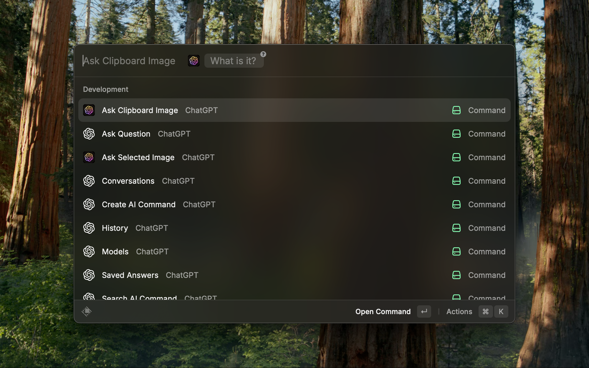
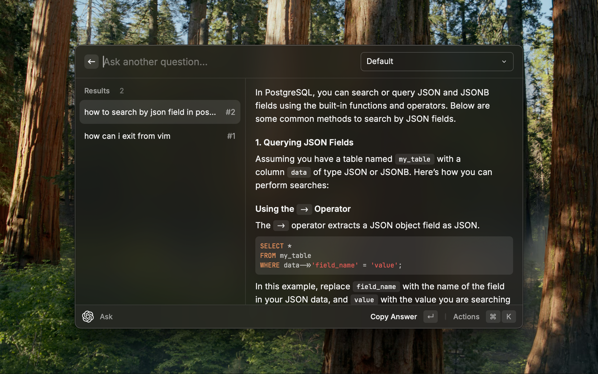
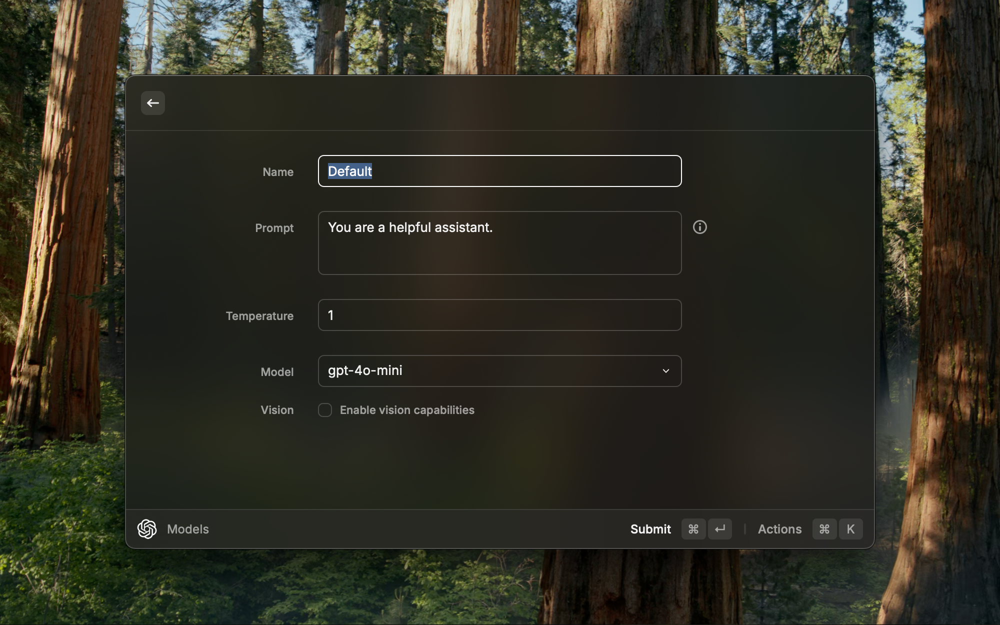
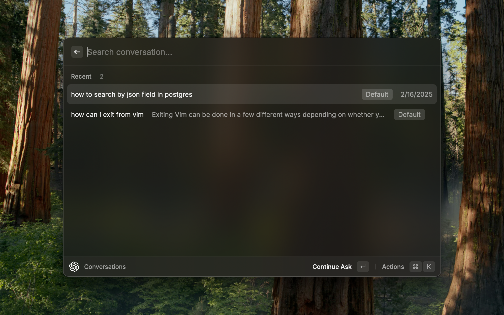
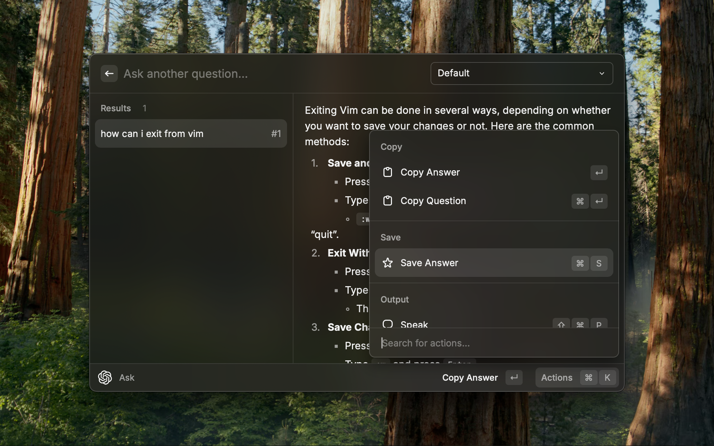
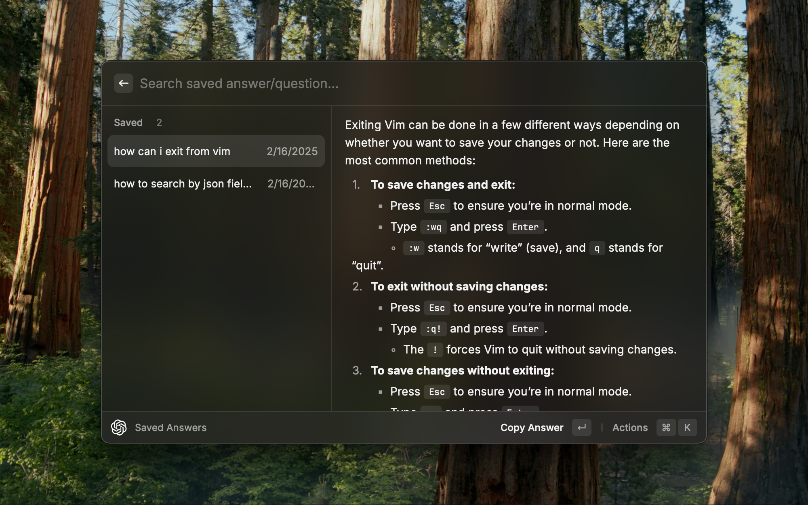
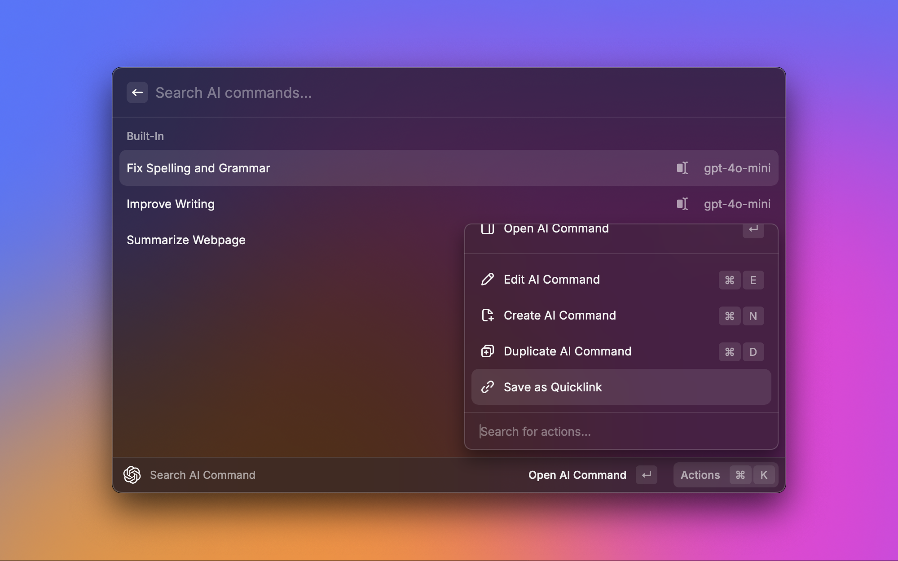
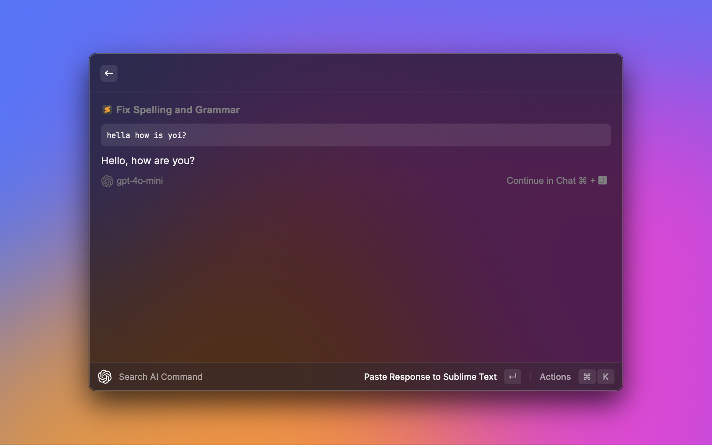

<h1 align="center">ChatGPT</h1>

<h3 align="center">
Interact with OpenAI's ChatGPT right from your command bar
</h3>

# Features

### Ask from your command bar

Ask a question from Raycast and get an answer without leaving your current app.

### Customize your models

Create presets and AI commands with your own prompts and settings.

### Continue conversations

Return to previous conversations and continue where you left off.

### Save answers

Save useful answers for later.

### Search history

Find earlier questions and answers in your history.

### Use AI commands and create your own

Process text taken from anywhere (selected text, clipboard text, opened web page) and
insert the result into the frontmost application or copy it to the clipboard.

> Windows 11+ is supported. For vision commands, selected images are read from the active File Explorer window or from the clipboard (both platforms).

# Models

**Ask Question** and Full Text Input list the models available to your chosen connection, along with saved presets. New configurations start with GPT-6 Luna. The picker reads model IDs from the OpenAI API or Codex app-server, so new models appear without an extension update. A model may still reject a request if it does not support chat or image input.

Use **Models** to edit presets and AI commands. Commands can have independent settings or inherit a preset; overrides replace the corresponding preset setting. Existing commands and saved conversations remain available. Create a command from a preset using **Create AI Command from This Model**.

# Authentication

Add an OpenAI API key in Raycast preferences or use **Sign in with ChatGPT** in the extension. API-key requests use the Responses API and API billing. ChatGPT sign-in uses Codex app-server. Both connections support image input: the API sends image data, while Codex receives local image paths. Choose **Preferred Connection** in extension preferences when both are configured. The API key is preferred by default; if the preferred connection is unavailable, the other is used. Sign out of ChatGPT from the action menu.

# Local development

Run `npm run build`, then `npm run dev`. Open a ChatGPT command under **Development** in Raycast. On first ChatGPT sign-in, the extension downloads the platform's Codex runtime from the official npm registry, checks its pinned SHA-256 hash, and installs it in Raycast's support directory. The API-key path does not require Codex.

# Support

Donate to support the development of this extension. Thank you!

---

Made with ♥ from Indonesia

