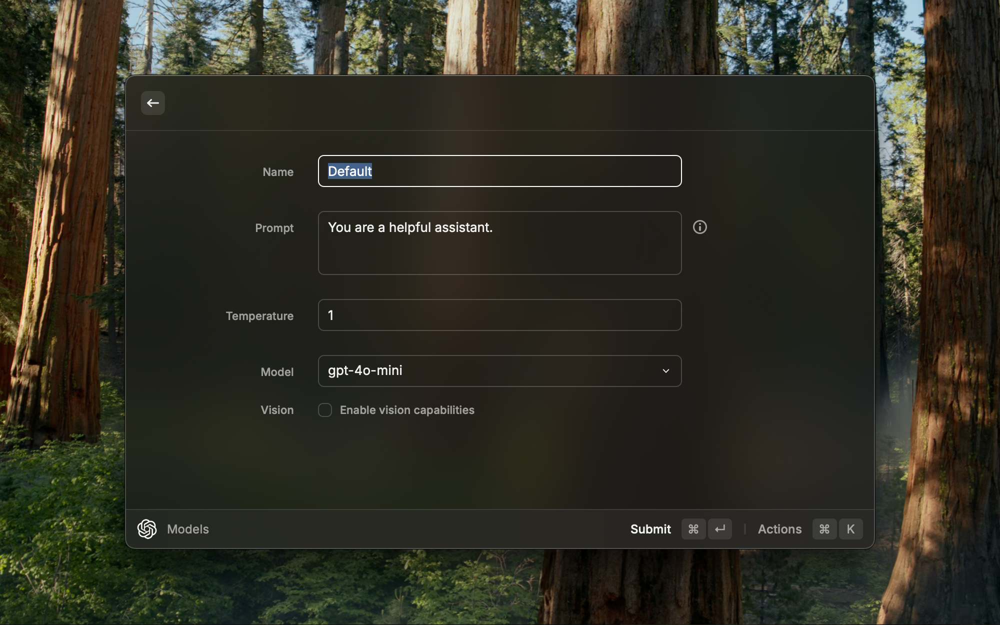

<h1 align="center">ChatGPT</h1>

<h3 align="center">
Interact with OpenAI's ChatGPT right from your command bar
</h3>

# Features

### Ask anything, from your favourite thing

Straight from your command bar, ask anything that you wanted and get ChatGPT's generated answer without opening any browser app.

### Well-designed, undistracted

Read through AI-generated answer in a clean and nice-looking markdown view without losing ongoing conversation.

### Save the answer, for later

Got the answer that you wanted? Great. Now you can save it in your collection locally and here you have it! No need to reask again.

### Look-up your past, fast

Automatically save all the asked questions and its generated answer locally, so you can go back digging for the answer you're looking for without any internet connection!

# How to use

This package requires a valid session token from ChatGPT to access it's unofficial REST API by [transitive-bullshit/chatgpt-api](https://github.com/transitive-bullshit/chatgpt-api).

To get a session token:

1. Go to https://chat.openai.com/chat and log in or sign up.
2. Open dev tools.
3. Open `Application` > `Cookies`.

   

4. Copy the value for `__Secure-next-auth.session-token` and paste in the initialization set-up!

> Session token will be stored locally using [Preferences API](https://developers.raycast.com/api-reference/preferences)

---

Made with ♥ from Indonesia

