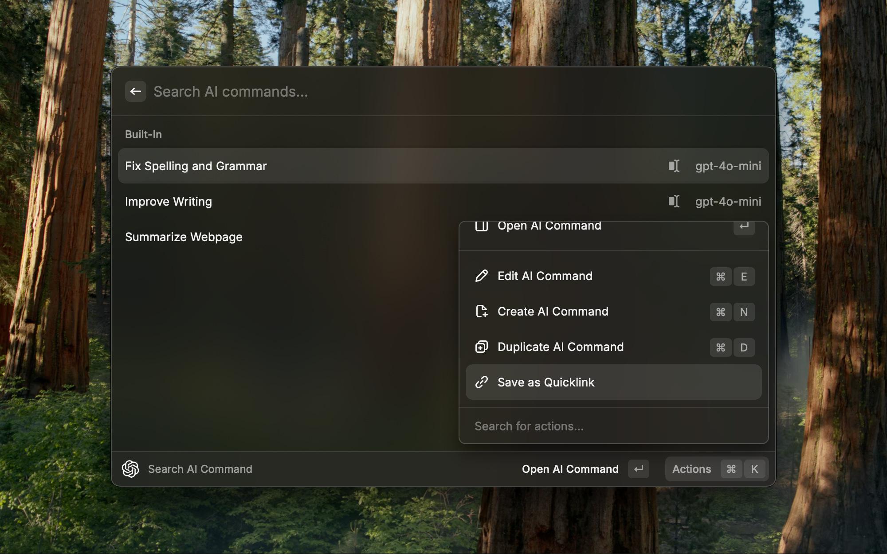

<h1 align="center">ChatGPT</h1>

<h3 align="center">
Interact with OpenAI's ChatGPT right from your command bar
</h3>

# Features

### Ask anything, from your favourite thing

Straight from your command bar, ask anything that you wanted and get an AI-generated answer without any effort.

### Personalized for you, really

Customize the model to your liking. Create and edit custom engines beyond your creativity.

### Keep continue, with you

Continue talking about everything right where you left off. Be pro without from zero.

### Save the answer, for later

Got the answer that you wanted? Great. Now you can save it without asking again.

### Look-up your past, fast

Automatically save all the question and answer so you can go back digging for the answer you're looking, quickly.

### Use AI commands and create your own

Process text taken from anywhere (selected text, clipboard text, opened web page) and 
insert the result into the frontmost application or copy it to the clipboard.

# Models

GPT-4o model supports vision capabilities, which can be enabled in the Models Command when creating or editing a model.

### Custom Models

Modify the preferences properties to configure the API Endpoint and use custom models.

# How to use

This extension requires a valid `Secret Key` as your API Key from [OpenAI](https://platform.openai.com/account/api-keys) with a `pay-as-you-go` plan account (**you'll get a `429` error if you're on a `free-tier` account**).

> All the preferences value will be stored locally using [Preferences API](https://developers.raycast.com/api-reference/preferences)

# Preferences

All preferences properties list that can be customize through `Raycast Settings > Extensions > ChatGPT`

| Properties               | Label                  | Value                               | Required | Default                     | Description                                                                                                      |
| ------------------------ | ---------------------- | ----------------------------------- | -------- | --------------------------- | ---------------------------------------------------------------------------------------------------------------- |
| `apiKey`                 | API Key                | `string`                            | `true`   | `empty`                     | Your personal OpenAI API key                                                                                     |
| `useStream`              | Stream Completion      | `boolean`                           | `true`   | `true`                      | Stream the completions of the generated answer                                                                   |
| `isAutoSaveConversation` | Auto-save Conversation | `boolean`                           | `true`   | `true`                      | Auto-save every conversation that you had with the model                                                         |
| `isHistoryPaused`        | Pause History          | `boolean`                           | `false`  | `false`                     | Pause the history of the conversation                                                                            |
| `isAutoLoadText`         | Auto-load              | `boolean`                           | `false`  | `false`                     | Load selected text from your frontmost application to the `question bar` or `full text input form` automatically |
| `isAutoFullInput`        | Use Full Text Input    | `boolean`                           | `false`  | `false`                     | Switch to `full text input form` from `question bar` automatically whenever you want to ask or type a question   |
| `isAutoTTS`              | Text-to-Speech         | `boolean`                           | `false`  | `false`                     | Enable auto text-to-speech everytime you get a generated answer                                                  |
| `useApiEndpoint`         | Use API Endpoint       | `boolean`                           | `false`  | `false`                     | Change the OpenAI's default API endpoint to custom endpoint                                                      |
| `apiEndpoint`            | API Endpoint           | `string`                            | `false`  | `empty`         | Custom API endpoint                                                     |
| `useProxy`               | Use Proxy              | `boolean`                           | `false`  | `false`                     | Each question request will be passed through the proxy                                                           |
| `proxyProtocol`          | Proxy Protocol         | `http`, `https`, `socks4`, `socks5` | `false`  | `http`                      | Proxy protocol option                                                                                            |
| `proxyHost`              | Proxy Host             | `string`                            | `false`  | `empty`                     | Proxy host value                                                                                                 |
| `proxyUsername`          | Proxy Username         | `string`                            | `false`  | `empty`                     | Proxy username value                                                                                             |
| `proxyPassword`          | Proxy Password         | `string`                            | `false`  | `empty`                     | Proxy password value                                                                                             |
| `useAzure`               | Use Azure OpenAI       | `boolean`                           | `true`   | `false`                     | Use Azure OPENAI rather than OPENAI                                                                              |
| `azureEndpoint`          | Azure Endpoint         | `string`                            | `false`  | `empty`                     | Azure OpenAI resource endpoint                                                                                   |
| `azureDeploymentName`    | Azure Deployment       | `string`                            | `false`  | `empty`                     | Azure OpenAI resource deployment                                                                                 |

### How to use Azure OpenAI

1. Copy and paste your Azure OpenAI's `KEY` value to the `API key` field
   
2. Copy and paste your Azure OpenAI `Endpoint` value to the `Azure Endpoint` field. Then, Tick the `Use Azure OpenAI` checkbox

3. Copy and paste your Azure OpenAI `Model deployment name` value to the `Azure Deployment` field

# Support

Donate to support the development of this extension. Thank you!

---

Made with ♥ from Indonesia

