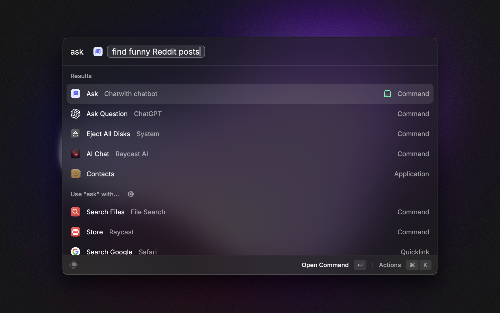
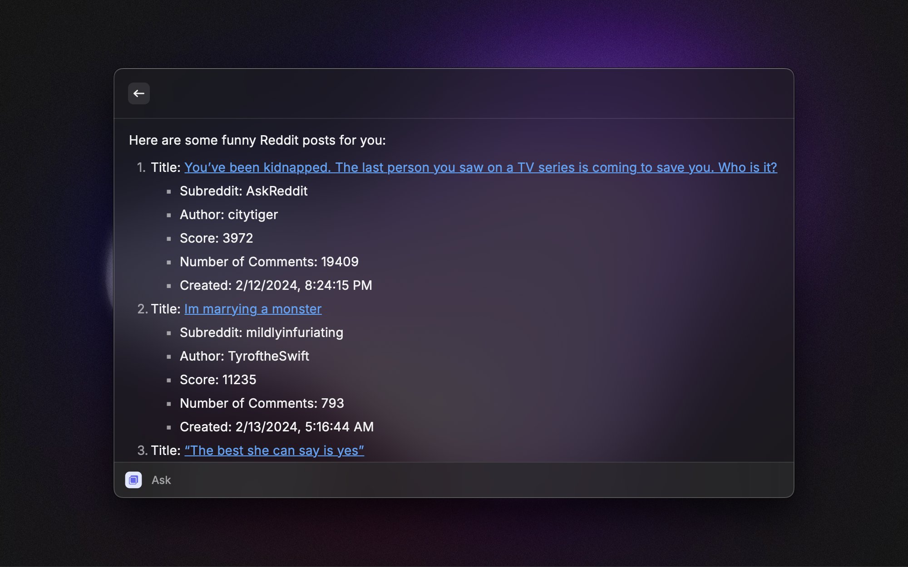
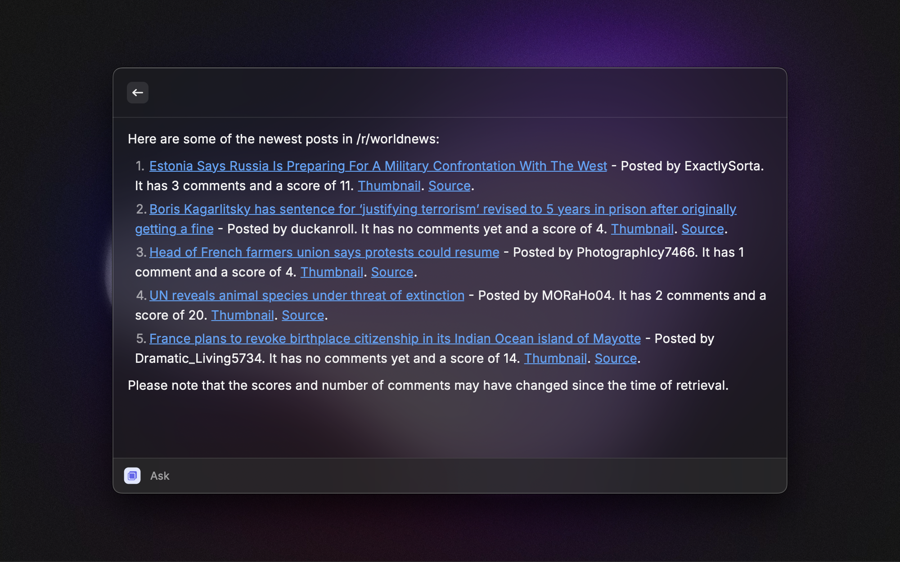
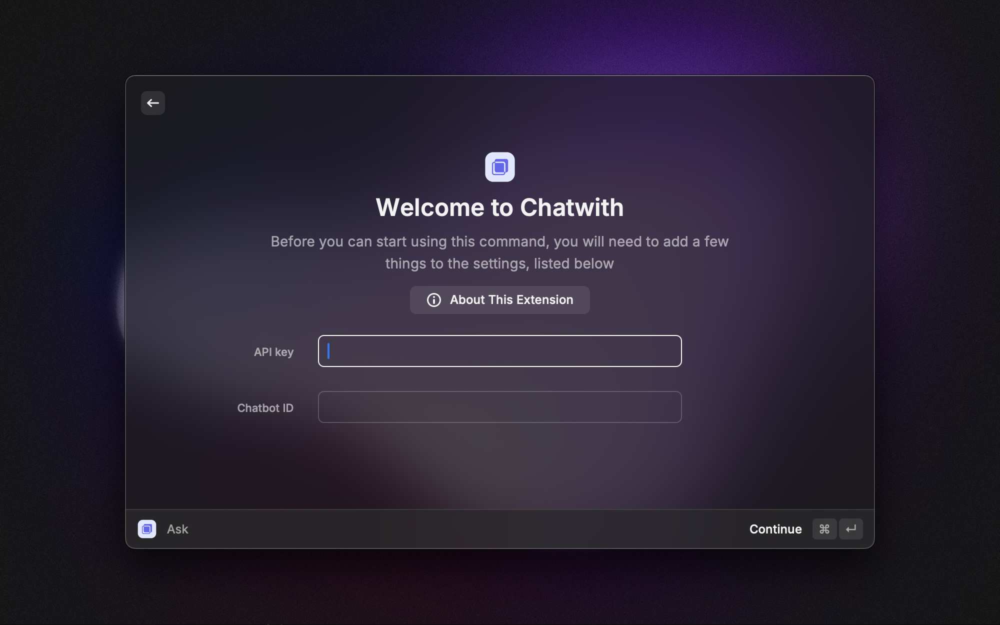

# Chatwith

Create a chatbot trained on any website or documentation, and with access to automations. Get answers and trigger actions right in your command bar.

 
 

 <h1 align="center">Chatwith</h1>

 <h3 align="center">
 AI chatbot trained on your data and with access to automations.
 </h3>

# Features

### Get instant answers

Train a custom ChatGPT chatbot on any website content or documentation, then query it from your command bar.

### Call automations

Connect your chatbot to automation apps like Zapier, ActivePieces, Make.com or APIs and ask your chatbot to trigger the automations for you.

# How to use

This extension requires you to have a [Chatwith](https://chatwith.tools) account and API key to query your trained chatbot(s). You can get your API key from your [account page](https://chatwith.tools/app/account).

Once you have this, you'll need to add your API key and Chatbot ID in the extension settings.

> All the preferences value will be stored locally using the [Raycast Preferences API](https://developers.raycast.com/api-reference/preferences)

# Preferences

All preferences properties list that can be customized through `Raycast Settings > Extensions > Chatwith`

| Properties  | Label      | Value    | Required | Default | Description                                |
| ----------- | ---------- | -------- | -------- | ------- | ------------------------------------------ |
| `apiKey`    | API key    | `string` | `true`   | `empty` | Your Chatwith API key                      |
| `chatbotId` | Chatbot ID | `string` | `true`   | `empty` | ID for the chatbot you would like to query |

# Author

Created by [Rafal Zawadzki](https://github.com/rafalzawadzki)
