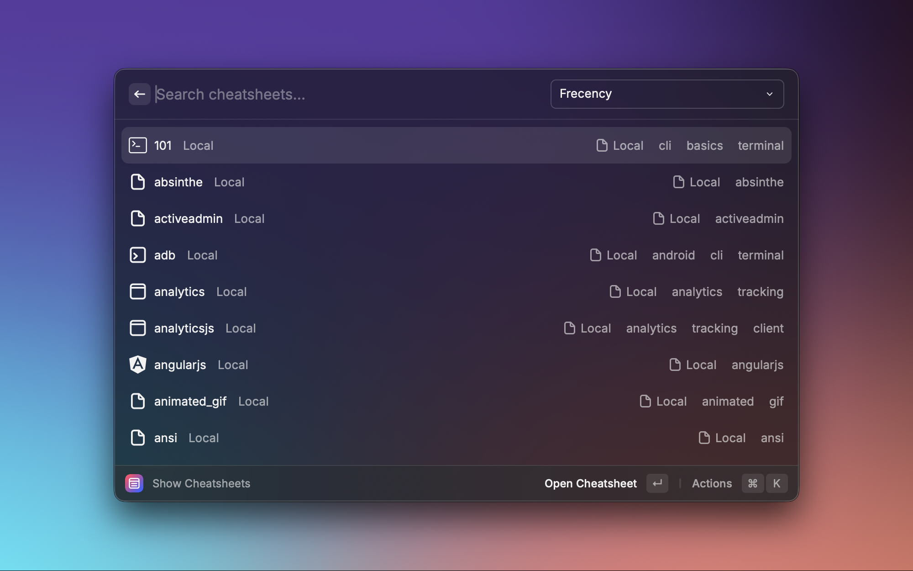

<!-- TOP ROW OF BADGES -->

[![Contributors][contributors-shield]][contributors-url]
[![Forks][forks-shield]][forks-url]
[![Stargazers][stars-shield]][stars-url]
[![Issues][issues-shield]][issues-url]
[![MIT License][license-shield]][license-url]

<a name="readme-top"></a>

<!-- PROJECT LOGO -->
<br />
<div align="center">
  <a href="https://github.com/smcnab1/cheatsheets-remastered">
    
  </a>

<h3 align="center">Cheatsheets Remastered</h3>

  <p align="center">
    A remastered Cheatsheets extension with enhanced functionality, custom sheet creation, and an improved browsing experience.
    <br />
    <a href="./ROADMAP.md"><strong>Explore the roadmap »</strong></a>
    <br />
    <br />
    <a href="https://github.com/smcnab1/cheatsheets-remastered/issues/new?template=bug_report.yml">Report Bug</a>
    ·
    <a href="https://github.com/smcnab1/cheatsheets-remastered/issues/new?template=cheatsheet_request_update.yml">Request Cheatsheet/Update</a>
    ·
    <a href="https://github.com/smcnab1/cheatsheets-remastered/issues/new?template=feature_request.yml">Request Feature</a>

  </p>
</div>

<details>
  <summary>Table of Contents</summary>

_Last Updated 2025-08-16_
<!-- toc -->

- [About The Project](#about-the-project)
  - [Features](#features)
  - [Built with](#built-with)
- [Getting started](#getting-started)
  - [Prerequisites](#prerequisites)
  - [Install](#install)
  - [Usage](#usage)
- [Back Matter](#back-matter)
  - [Roadmap](#roadmap)
  - [Contributing](#contributing)
  - [License](#license)

<!-- tocstop -->
  
</details>

<!-- ABOUT THE PROJECT -->
## About The Project
<div align="center">
  <a href="https://github.com/smcnab1/cheatsheets-remastered">
    
  </a>
  </div>
  
**Cheatsheets Remastered** is a modern [Raycast extension](https://github.com/raycast/extensions) to quickly search, create, and manage cheatsheets. It ships with curated [DevHints](https://devhints.io/) content and lets you keep your own sheets locally. Perfect for fast recall without leaving your keyboard.

<p align="right">(<a href="#readme-top">back to top</a>)</p>

### Features

- Search across custom and DevHints cheatsheets with fast filtering and tags
- Create, edit, copy, and organise markdown cheatsheets
- Local-first storage for your custom content.
- Large base of sheets integrated out of the box
- Rich tagging and favouriting with icon mapping for quick discovery

### Built with

- Raycast API
- TypeScript + React
- Node.js / npm

<p align="right">(<a href="#readme-top">back to top</a>)</p>

## Getting started

### Prerequisites

- macOS with Raycast installed

### Install

#### From Raycast Store (production):
Install via [Raycast Store](https://www.raycast.com/smcnab1/cheatsheet-remastered)

#### From source (development):

```bash
npm install
npm run dev
```

Build locally:

```bash
npm run build
```

### Usage

- Show Cheatsheets: browse all
- Search Cheatsheets: search with filters and tags
- Create Custom Cheatsheet: compose new markdown
- Manage Custom Cheatsheets: edit, duplicate, delete, export
- Copy Cheatsheet: quick search and copy to clipboard

<p align="right">(<a href="#readme-top">back to top</a>)</p>

## Back Matter

<!-- ROADMAP -->
### Roadmap

See [ROADMAP.md](./ROADMAP.md) for planned work.

<p align="right">(<a href="#readme-top">back to top</a>)</p>

<!-- CONTRIBUTING -->

<a name="contributing"></a>

### Contributing

Contributions welcome — especially to expand and improve the default cheatsheets.

- Add/Update default cheatsheets: edit markdown under `assets/cheatsheets/`
- Tag updates: map new tags in `src/default-tags.ts`
- Icons: add topic icons under `assets/` and optionally run `npm run normalize:icons`
- Bugs & ideas: [open an Issue](https://github.com/smcnab1/cheatsheets-remastered/issues)

PRs should briefly state:
- What changed and why
- Which cheatsheets were added/updated
- Any new tags introduced

1. Fork the Project
2. Create your Feature Branch (`git checkout -b feature/AmazingFeature`)
3. Commit your Changes (`git commit -m 'Add some AmazingFeature'`)
4. Push to the Branch (`git push origin feature/AmazingFeature`)
5. Open a Pull Request

### License

This project is licensed under the [MIT License](LICENSE).

<p align="right">(<a href="#readme-top">back to top</a>)</p>

<!-- MARKDOWN LINKS & IMAGES -->

[contributors-shield]: https://img.shields.io/github/contributors/smcnab1/cheatsheets-remastered.svg?style=for-the-badge
[contributors-url]: https://github.com/smcnab1/cheatsheets-remastered/graphs/contributors
[forks-shield]: https://img.shields.io/github/forks/smcnab1/cheatsheets-remastered.svg?style=for-the-badge
[forks-url]: https://github.com/smcnab1/cheatsheets-remastered/network/members
[stars-shield]: https://img.shields.io/github/stars/smcnab1/cheatsheets-remastered.svg?style=for-the-badge
[stars-url]: https://github.com/smcnab1/cheatsheets-remastered/stargazers
[issues-shield]: https://img.shields.io/github/issues/smcnab1/cheatsheets-remastered.svg?style=for-the-badge
[issues-url]: https://github.com/smcnab1/cheatsheets-remastered/issues
[license-shield]: https://img.shields.io/github/license/smcnab1/cheatsheets-remastered.svg?style=for-the-badge
[license-url]: https://github.com/smcnab1/cheatsheets-remastered/blob/main/LICENSE
[product-screenshot]: metadata/cheatsheets-remastered-1.png
