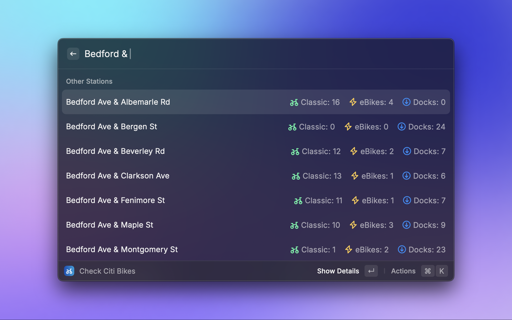
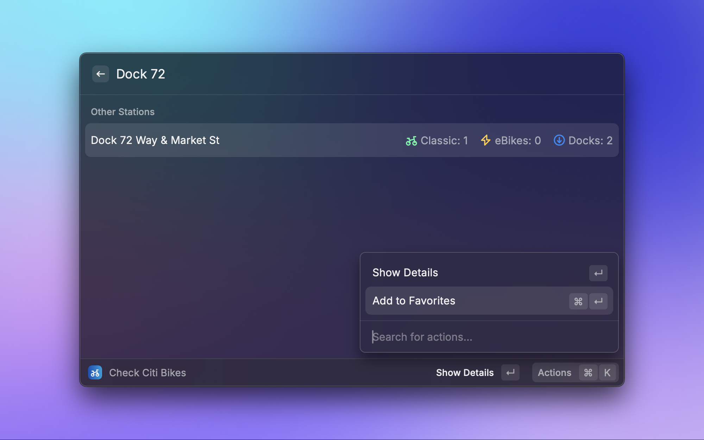
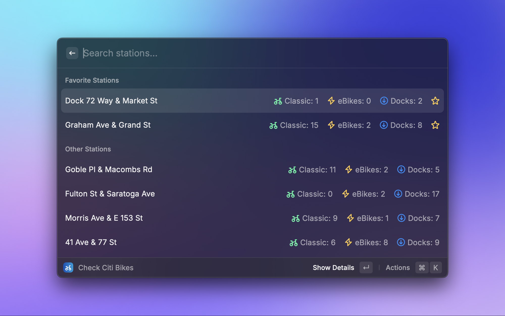

# Citi Bike Checker

Check the availability of bikes/e-bikes at Citi Bike NYC stations from Raycast.

| Description                       | Preview                                                                              |
| --------------------------------- | ------------------------------------------------------------------------------------ |
| Searching for stations            |         |
| Adding stations to favorites      |   |
| Viewing favorite station statuses |  |

---

This extension is **not** affiliated with or supported by Citi Bike / Lyft, Inc. It is made available on an "as is" basis and provided without express or implied warranties of any kind.

---

## Features

- Query real-time classic bike and eBike availability at Citi Bike stations across NYC.
- Save and manage favorite stations for quick access.
- Display detailed information about each station, including when availability data was most recently updated.

## API Endpoints

This extension uses the following publicly-accessible Citi Bike NYC API endpoints:

- Station Status: `https://gbfs.citibikenyc.com/gbfs/en/station_status.json`
- Station Information: `https://gbfs.citibikenyc.com/gbfs/en/station_information.json`

## Notes

Built with love for NYC by [@kcole93](https://github.com/kcole93) / [Ainslie Digital](https://github.com/ainslie-digital).
