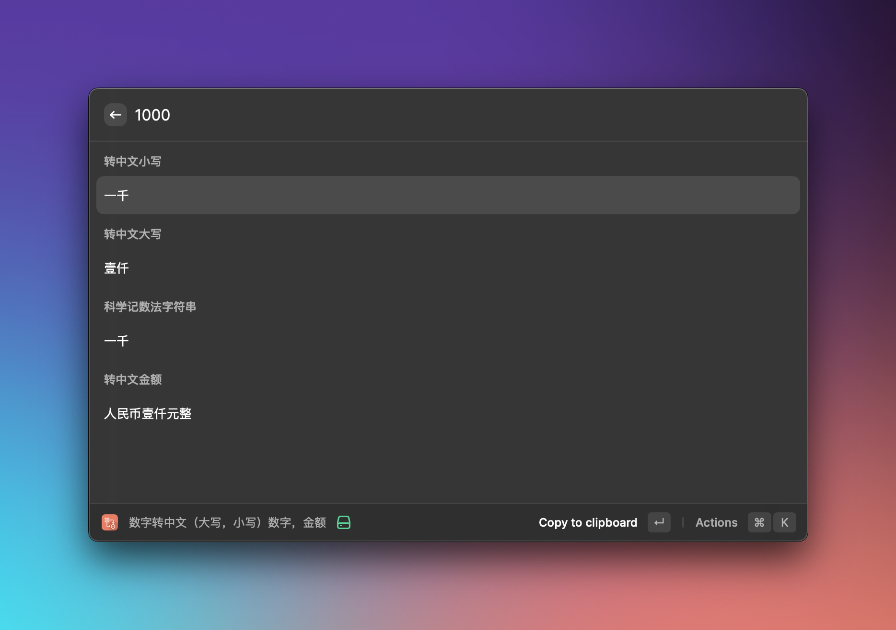

# Chinese Numbers

Chinese Numbers is a Raycast Extension to Convert Arabic numbers to Chinese numbers.

作为企业负责人，我经常处理合同，填写金额，非常麻烦，所以写了这个插件。

特点如下:

- 阿拉伯数字转中文小写
  > 十万零一百一十一
- 阿拉伯数字转中文大写
  > 壹拾万零壹佰壹拾壹
- 科学记数法字符串
  > 十二万三千四百五十六万万七千八百九十万亿
- 阿拉伯数字转中文金额
  > 人民币壹拾万零壹佰壹拾壹元壹角壹分

## Thanks

Thanks to the [nzh](https://github.com/cnwhy/nzh) library.

## License

[MIT](https://github.com/Jax0rz/chinese-capitalizated/blob/main/LICENSE)
