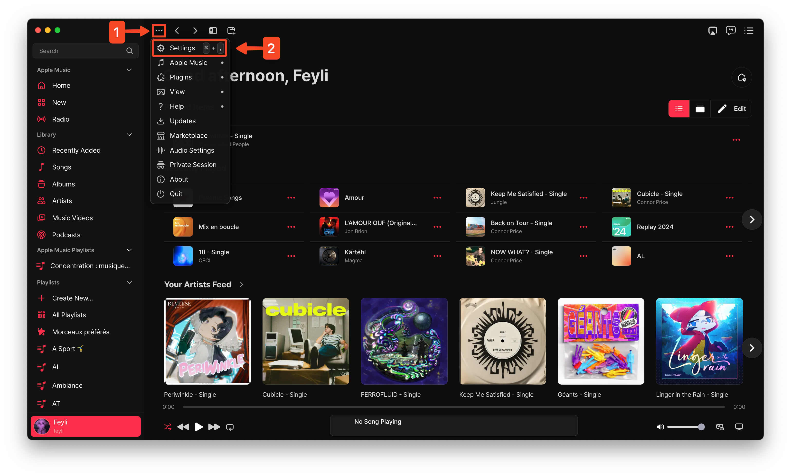
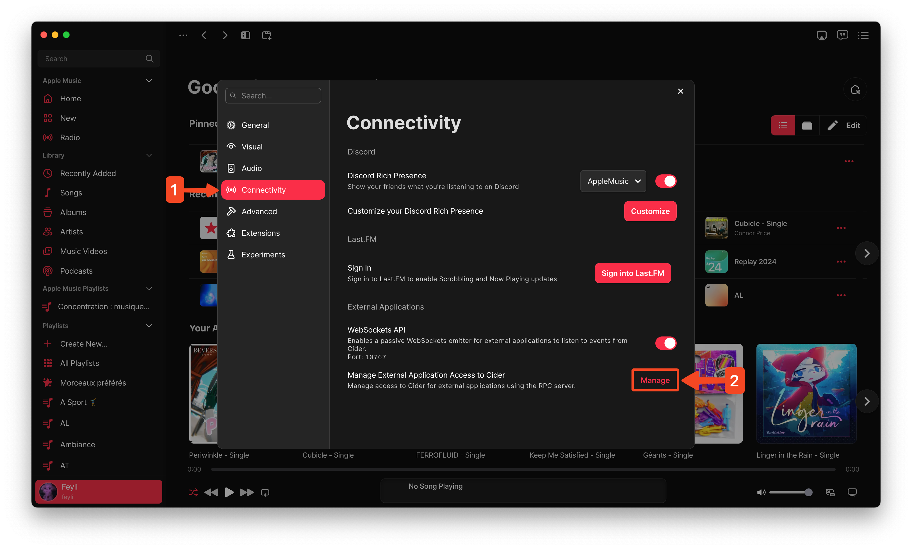
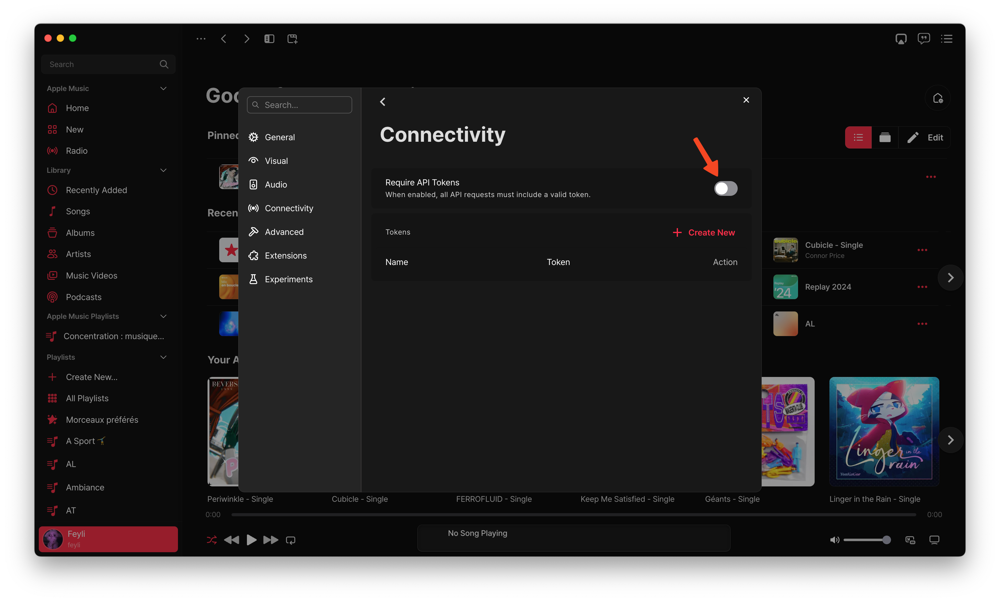

# Cider

Interact with Cider through Raycast

## Overview

This extension allows you to interact with Cider through Raycast. Cider is an Apple Music client.

## Configuration

Don't worry, this will not take more than 2 minutes. However, it is essential to follow these steps to get the extension working.

First, you need to access Cider's settings:

Then, hop into the Connectivity section and click "Manage":

By default, Cider requires a token to interact with the API. You can generate one by clicking "Create New", or you can disable "Require API Tokens".
Your configuration should look like one of these two:

###### *Cider is set to require API tokens and one was generated. This token needs to be copied and pasted into this extension's configuration.*

###### *Cider is set to not require API tokens. This means that the extension will work out of the box and its configuration's token field will be ignored.*

#### Notes
- The token field can be found in the extension settings. Additionally, you will be redirected to the extension settings if an authentication error is detected when triggering a command (if the token is invalid and required).
- If you disable/enable "Require API Tokens", you need to exit the menu for it to be effective.
- You may customize the token's name and/or value as you wish.
